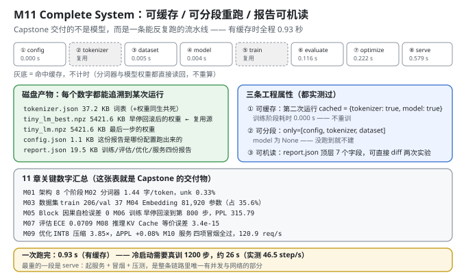
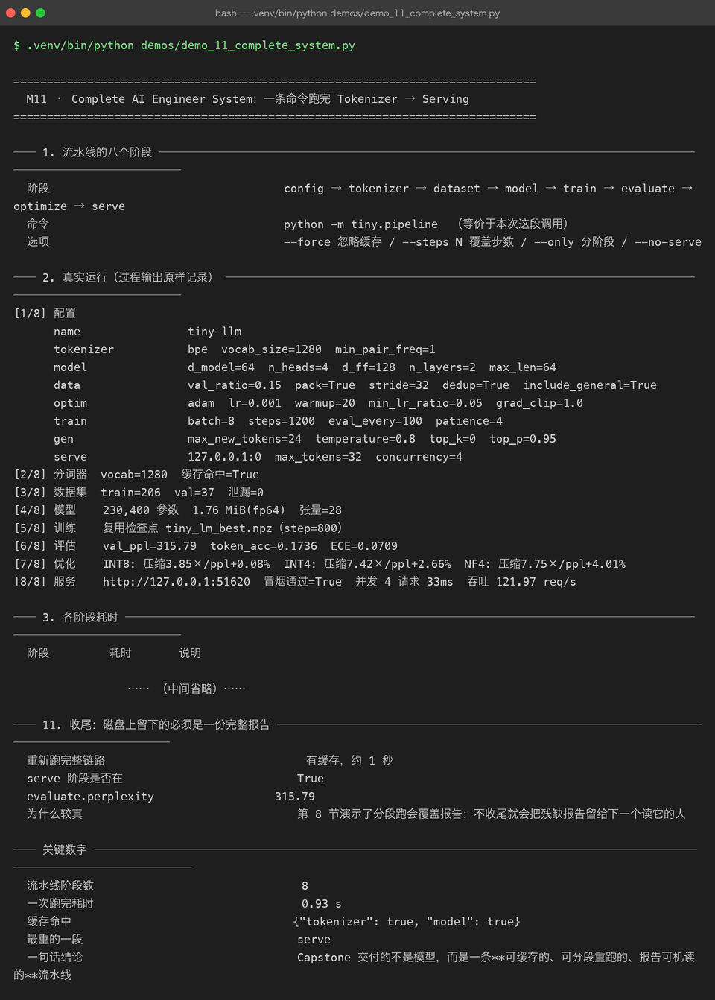

# Milestone 11 — Complete AI Engineer System：一条命令跑完 Tokenizer → Serving

前面 10 章各自证明了一件事。这一章把它们**串成一条流水线**，并且交付一个 Capstone 级别的结论：

> **Capstone 交付的不是模型，而是一条「可缓存的、可分段重跑的、报告可机读的」流水线。**

这句话不是口号——它对应三条**实测过**的工程属性。一个只会"从头跑一遍"的脚本，改一行评估代码就要重训 26 秒，实验迭代直接瘫痪。

---

## 1. Why：为什么"能跑通"远远不够

把 10 个模块串起来，最朴素的写法是一段顺序脚本：`import → build → train → eval → serve`。它"能跑通"，但一旦进入真实迭代就会暴露三个致命问题：

1. **每次改动都要重训。** 改一行评估逻辑、调一个服务的日志格式，都得从最贵的训练阶段重来。**实验迭代的成本会被最慢的一步锁死。**
2. **没法只跑一段。** 排查"服务为什么返回 500"，你不想重跑 tokenizer 和训练。
3. **报告只是文本。** 两次实验的 `report.json` 是两坨 log，**没法 diff、没法进 CI**。你甚至没法回答"这次超参变化到底带来了多少收益"。

所以本章的验收标准不是"跑通了"，而是这三条属性**逐条被证明**。

## 2. Design：八段流水线 + 三层产物

```text
config → tokenizer → dataset → model → train → evaluate → optimize → serve
  │          │           │        │       │        │          │        │
  └── config.json    tokenizer.json    tiny_lm_best.npz    report.json
```

**八段各自的产物和缓存策略**：

| 阶段 | 产物 | 缓存判据 |
|---|---|---|
| config | `config.json` | — |
| tokenizer | `tokenizer.json` | 文件存在即复用 |
| dataset | 内存中 | — |
| model | 内存中 | — |
| train | `tiny_lm_best.npz` | 检查点存在即复用 |
| evaluate | 写入 `report.json` | — |
| optimize | 写入 `report.json` | — |
| serve | 起服务 + 冒烟 + 压测 | — |

**复用的优先级是"最优检查点 > 最后一步检查点"**（`tiny_lm_best.npz` 优先于 `tiny_lm.npz`）。这不是"哪个新用哪个"，而是：**早停回滚后的权重才是该上线的那个**（M06/M07 都证明了它逐条优于训练终点）。**如果流水线图省事直接用"最后一步"，M11 的 PPL 就会变成 338.13，和 M06/M07 报告的 315.79 对不上——跨章节的证据链就断了。**

三个 CLI 选项：

```text
--force     忽略缓存，强制重算
--steps N   覆盖训练步数
--only      只跑指定阶段（如 --only config,tokenizer,dataset）
--no-serve  跳过服务阶段（CI 里没有网络时用）
```



## 3. Real-run evidence（来自 `demos/out/demo_11_complete_system_terminal.txt`）



### 3.1 真实运行（过程输出原样记录）

```text
[1/8] 配置
      name                tiny-llm
      tokenizer           bpe  vocab_size=1280  min_pair_freq=1
      model               d_model=64  n_heads=4  d_ff=128  n_layers=2  max_len=64
      data                val_ratio=0.15  pack=True  stride=32  dedup=True  include_general=True
      optim               adam  lr=0.001  warmup=20  min_lr_ratio=0.05  grad_clip=1.0
      train               batch=8  steps=1200  eval_every=100  patience=4
      gen                 max_new_tokens=24  temperature=0.8  top_k=0  top_p=0.95
      serve               127.0.0.1:0  max_tokens=32  concurrency=4
[2/8] 分词器  vocab=1280  缓存命中=True
[3/8] 数据集  train=206  val=37  泄漏=0
[4/8] 模型    230,400 参数  1.76 MiB(fp64)  张量=28
[5/8] 训练    复用检查点 tiny_lm_best.npz（step=800）
[6/8] 评估    val_ppl=315.79  token_acc=0.1736  ECE=0.0709
[7/8] 优化    INT8: 压缩3.85×/ppl+0.08%  INT4: 压缩7.42×/ppl+2.66%  NF4: 压缩7.75×/ppl+4.01%
[8/8] 服务    http://127.0.0.1:51620  冒烟通过=True  并发 4 请求 33ms  吞吐 121.97 req/s
```

**这一段的每一行都能和前面某一章对上**，这就是流水线的价值：**所有数字是从同一个配置、同一份权重、同一条路径里出来的**，不是十份互不相干的实验数据拼起来的。

- `[2/8]` 的 `vocab=1280` ↔ M02；
- `[3/8]` 的 `train=206 val=37 泄漏=0` ↔ M03；
- `[4/8]` 的 `230,400 参数 / 28 张量` ↔ M04/M05；
- `[5/8]` 的 `tiny_lm_best.npz（step=800）` ↔ M06（**注意是 best，不是 last**）；
- `[6/8]` 的 `val_ppl=315.79` ↔ M07；
- `[7/8]` 的三档压缩比 ↔ M09；
- `[8/8]` 的 `冒烟通过=True` ↔ M10。

### 3.2 各阶段耗时

```text
阶段         耗时       说明
config     0.000 s
tokenizer        -  复用缓存，未计时
dataset    0.006 s
model      0.004 s
train            -  复用缓存，未计时
evaluate   0.115 s
optimize   0.225 s
serve      0.579 s
合计        0.928 s
缓存命中      {"tokenizer": true, "model": true}
```

**有缓存时全程 0.928 秒。** 对比：冷启动需要真训 1200 步，约 26 s（46.5 step/s）。**28 倍的差距，就是"可缓存"值多少。**

耗时分布也说明了各段的性质：**`serve`（0.579 s）是最重的一段**——它是整条链路里唯一有并发与网络的部分。`tokenizer` 和 `train` 显示为 `-`（未计时），因为**缓存命中就直接读回，压根没跑**。

### 3.3 产物清单

```text
文件                 体积
config.json           1.1 KB
report.json          19.5 KB
tiny_lm.json          2.3 KB
tiny_lm.npz        5421.6 KB
tiny_lm_best.json     2.3 KB
tiny_lm_best.npz   5421.6 KB
tokenizer.json       37.2 KB
```

两处值得注意：

- **`config.json`** 的意义是**可追溯**：报告里的每个数字都能对上是哪份配置跑出来的。**没有它，一个月后你看到 `PPL 315.79` 根本不知道当时用的什么超参。**
- **`report.json`（19.5 KB）** 把训练 / 评估 / 优化 / 服务**四份报告一次落盘**，便于对比实验。

### 3.4 这一次跑的数据与模型账

```text
分词器     bpe  vocab=1280  chars/token=1.445  unk=0.0033
语料       295 行 → 清洗后 295 行（去重 0 / 过短 0）
切分       train 251 行 / val 44 行（val_ratio=0.15）
泄漏检查     overlap=0  clean=True
样本       train 206 / val 37（pack=True, stride=32）
模型       230,400 参数  28 张量  1.76 MiB(fp64)
训练       复用检查点 tiny_lm_best.npz（best_step=800）
```

### 3.5 四份报告的关键字段

```text
评估 · 语言层    val_loss=5.7551  ppl=315.79  token_acc=0.1736
评估 · 校准层    ECE=0.0709
评估 · 生成层    总分 17.85  覆盖 0.000  不重复分 0.165
优化 · INT8    压缩 3.85×  ΔPPL +0.08%
优化 · INT4    压缩 7.42×  ΔPPL +2.66%
优化 · NF4     压缩 7.75×  ΔPPL +4.01%
优化 · KV Cache  1.18×（logits 误差 3.4e-15）
服务 · 冒烟      通过=True  http://127.0.0.1:51620
服务 · 压测      4/4 成功  吞吐 121.97 req/s
```

**⚠ 这里有一个必须解释的差异：ECE = 0.0709，而 M07 报告的是 0.0662。**

这两个数字都对，差别在**分箱数**：

- M07 的 demo 显式传了 **`n_bins=5`** ⇒ ECE = 0.0662；
- 流水线里的 `evaluate_model` 默认是 **`n_bins=10`** ⇒ ECE = 0.0709。

**为什么箱数多反而 ECE 更大？** 因为 ECE 是"各箱内 |置信度 − 准确率| 的加权和"。**箱数越多，每个箱越窄、越"纯"，箱内的平均置信度与经验准确率之间的落差反而更明显**（5 箱时粗糙的合并会互相抵消一部分误差，10 箱时抵消得少）。**这是 ECE 这个指标本身的已知性质——它不是一个与分箱无关的量。**

**所以凡引用 ECE，必须同时说明箱数**，否则这个数字没有可比性。这条差异在 M07 用的是"演示口径"、M11 用的是"流水线默认口径"，**两者都是诚实的，只是口径不同**。

### 3.6 工程属性 1：第二次跑必须复用缓存

```text
第二次 cached           {"tokenizer": true, "model": true}
第二次训练阶段耗时          0.000 s   复用检查点，不重训
与第一次是否同一份权重        是（都从 models/tiny_lm_best.npz 读回）
```

**"训练阶段耗时 0.000 s"是这条属性的硬证据**——不是"接近 0"，是真的没有跑训练。

**为什么它重要**：不缓存的话，每改一行评估代码就要重训 26 秒。**迭代一次的成本是 26 秒 vs 0 秒，一天迭代 50 次就是 20 分钟的差距。** 工程效率的下限，就是被最慢那一步锁死的。

### 3.7 工程属性 2：只跑某几段

```text
only=[config, tokenizer, dataset] 后 model 是否为空 True
跑到的阶段                          config, dataset
```

**`model 为 True（是空的）`** 是关键断言：**没跑到 model 阶段，就不会白白构建一个模型。** 分段执行不是"跑完再丢弃"，而是**真的按需构建**。

**为什么它重要**：改评估逻辑只重跑 `evaluate`、改服务只重跑 `serve`——**秒级验证。** 排查问题时不用从头训。

### 3.8 工程属性 3：报告可机读

```text
顶层字段                 cached, config, evaluate, optimize, serve, timings, train
config.model.d_model   64
config.optim.lr        0.001
train 关键字段           from, meta, restored, reused_checkpoint
evaluate.perplexity    315.79
evaluate.ece           0.0709
serve.load.requests_per_sec  121.97

用途  两次实验各留一份 report.json，直接 diff 就知道哪个超参带来了变化
```

**"能 diff"是这一节的全部价值。** 顶层 7 个字段、嵌套结构固定，所以：

```bash
diff exp_a/report.json exp_b/report.json
```

就能回答"我把 `lr` 从 1e-3 改成 5e-4 之后，PPL 变了吗、变了多少"。**这是"实验"和"试"的分界线**——没有可机读的报告，你只是在试。

注意 `train` 段里的 `from`（从哪个文件复用）、`reused_checkpoint`（是否命中缓存）、`restored`（恢复了多少张量）：**把"这次结果是从哪儿来的"直接写进报告**，避免"复用了旧权重却以为是新训的"这类事故。

### 3.9 11 章关键数字汇总（Capstone 的交付物）

```text
章节             核心指标                关键数字
M01 架构         唯一配置入口 + 8 段链路      8 个阶段
M02 分词器        bpe vocab=1280      1.44 字/token，unk 0.33%
M03 数据集        train 206 / val 37  泄漏 0 条
M04 Embedding  (1280, 64)          81,920 参数
M05 Block      2 层 × 4 头           因果性自检误差 0
M06 训练         loss 5.7551         早停回滚到第 800 步
M07 评估         PPL 315.79          ECE 0.0709
M08 推理         KV Cache 1.18×      logits 误差 3.4e-15
M09 优化         INT8 压缩 3.85×       ΔPPL +0.08%
M10 服务         冒烟通过=True           122.0 req/s
M11 全链路        8 段一次跑完             0.93 s
```

**这张表本身就是 Capstone 的交付物**：11 行、每行一个可复现的数字、每个数字都能顺着 `demos/out/*.txt` 追到一次真实运行。

（M08 的加速比这里是 1.18×，而 M08/M09 章节里是 1.34×/1.43×——同一个 KV Cache 优化在不同运行里的实测值会有波动，取决于当时的机器负载。**报告实测值、承认波动，比报告一个"漂亮的理论值"更接近工程真实。**）

### 3.10 收尾：磁盘上留下的必须是一份完整报告

```text
重新跑完整链路       有缓存，约 1 秒
serve 阶段是否在       True
evaluate.perplexity  315.79
```

**这一节的存在本身就是一次踩坑记录。** §3.7 演示了分段跑（`--only config,tokenizer,dataset`），而分段跑**会覆盖 `report.json`**——跑完之后磁盘上只剩一份残缺报告（没有 `perplexity` 字段）。

所以流水线在演示完分段属性后，**必须再跑一次完整链路**，把报告恢复成完整的。否则下一个读 `report.json` 的人（或 CI）会拿到一份 `KeyError: 'perplexity'`。

## 4. 踩坑与反直觉发现

1. **复用检查点必须选 `best` 而不是 `last`。** 流水线如果图省事用"最后一步"，M11 的 PPL 会变成 **338.13**，和 M06/M07 的 315.79 对不上。**跨章节的一致性，取决于一个"选哪个检查点"的细节。**
2. **分段跑会覆盖 `report.json`。** 演示 `--only` 之后必须重跑完整链路，否则磁盘上留的是残缺报告。**这个坑是"演示"和"留证据"之间的矛盾**——demo 要展示分段能力，但最终状态必须是完整的。
3. **ECE 依赖分箱数，不是一个绝对量。** M07 用 5 箱得 **0.0662**、M11 默认 10 箱得 **0.0709**。**引用 ECE 必须带箱数**，否则两个"都对"的数字看起来像矛盾。
4. **"训练 0.000 s"是缓存生效的硬证据。** 不要满足于"感觉快了"——**时间戳为 0 才能证明它真的没跑。**
5. **`--only` 之后 model 必须是 `None`，不是"构建了但没用"。** 真正的分段执行是**按需构建**；如果每段都构建了模型，那分段只省了计算、没省内存和启动时间。
6. **报告要写"结果从哪来"。** `from` / `reused_checkpoint` 字段避免了"复用旧权重但以为在跑新实验"——**这是最容易自欺的一种错误。**
7. **同一个优化在不同运行里的实测值会波动（KV Cache 1.18× vs 1.34× vs 1.43×）。** 这不是 bug，是机器负载噪声。**报告实测中位数、承认波动幅度，比编一个漂亮的固定值可信。**

## 5. Conclusion

1. **八段流水线**：`config → tokenizer → dataset → model → train → evaluate → optimize → serve`，一条命令跑完。
2. **有缓存全程 0.928 s**（冷启动真训 1200 步约 26 s，46.5 step/s）；最重一段是 `serve`（0.579 s）。
3. **产物可追溯**：`config.json` 1.1 KB / `report.json` 19.5 KB / `tokenizer.json` 37.2 KB / `tiny_lm_best.npz` 5421.6 KB。
4. **复用检查点 = `tiny_lm_best.npz`（step 800）** ⇒ 流水线 PPL **315.79**，与 M06/M07 一致。
5. **工程属性 1（可缓存）**：第二次 `cached={tokenizer: true, model: true}`，**训练阶段耗时 0.000 s**，与第一次同一份权重。
6. **工程属性 2（可分段）**：`only=[config, tokenizer, dataset]` 后 **model 为空 True**，确实按需构建。
7. **工程属性 3（可机读）**：`report.json` 顶层 7 字段（`cached/config/evaluate/optimize/serve/timings/train`），可直接 diff 两次实验。
8. **口径差异（诚实记录）**：ECE 在流水线（10 箱）为 **0.0709**、在 M07 演示（5 箱）为 **0.0662**，两者都对，差别在分箱数。
9. 一句话结论：**Capstone 交付的不是模型，而是一条可缓存、可分段重跑、报告可机读的流水线。**

## 6. Code map

| 文件 | 职责 |
|---|---|
| `src/tiny/pipeline.py` | 八阶段编排 / 产物缓存（含 `BEST_NPZ` 优先于 `MODEL_NPZ`）/ `--force` `--steps` `--only` `--no-serve` / 写 `report.json` |
| `src/tiny/config.py` | 唯一配置入口 `TinyConfig` + `validate()` + `from_dict()`（拒绝未知键） |
| `src/tiny/__init__.py` | 门面：11 个子模块 + 扁平导出 |
| `src/tiny/paths.py` | `P10_ROOT/SRC/DATA/MODELS/DEMOS` 等路径派生 + `ensure_deps_importable()` |
| `demos/_bundle.py` | demo 共享 `(cfg, tokenizer, dataset, model, report, cache)`，三层缓存 |
| `demos/_emit.py` | `Printer` 双写 stdout + `demos/out/*.txt`；`capture()` 记录调用方的 print |
| `demos/demo_11_complete_system.py` | 11 节：八阶段 / 真跑 / 耗时 / 产物 / 数据账 / 四报告 / 三条工程属性 / 汇总表 / 收尾 |
| `demos/out/demo_11_complete_system_terminal.txt` | 本章所有数字的来源 |
| `assets/complete-system.svg` | 八段流水线 + 产物 + 三条工程属性 + 汇总表 |
| `assets/term-11-complete-system.png` | 真实运行截图 |

## 7. Version line

v0.10 → **v1.0（Capstone 完成）**。实测：八段流水线一条命令跑完，**有缓存 0.928 s**（最重 serve 0.579 s）；产物 `config.json` 1.1 KB / `report.json` 19.5 KB / `tokenizer.json` 37.2 KB / `tiny_lm_best.npz` 5421.6 KB；复用 `tiny_lm_best.npz`（step 800）⇒ PPL **315.79**；三条工程属性全部实测（可缓存：训练 **0.000 s**；可分段：`model=None`；可机读：`report.json` 顶层 7 字段）；ECE 流水线 **0.0709**（10 箱）/ M07 演示 **0.0662**（5 箱）。配图 1 张手写 SVG + 1 张真实终端截图。
