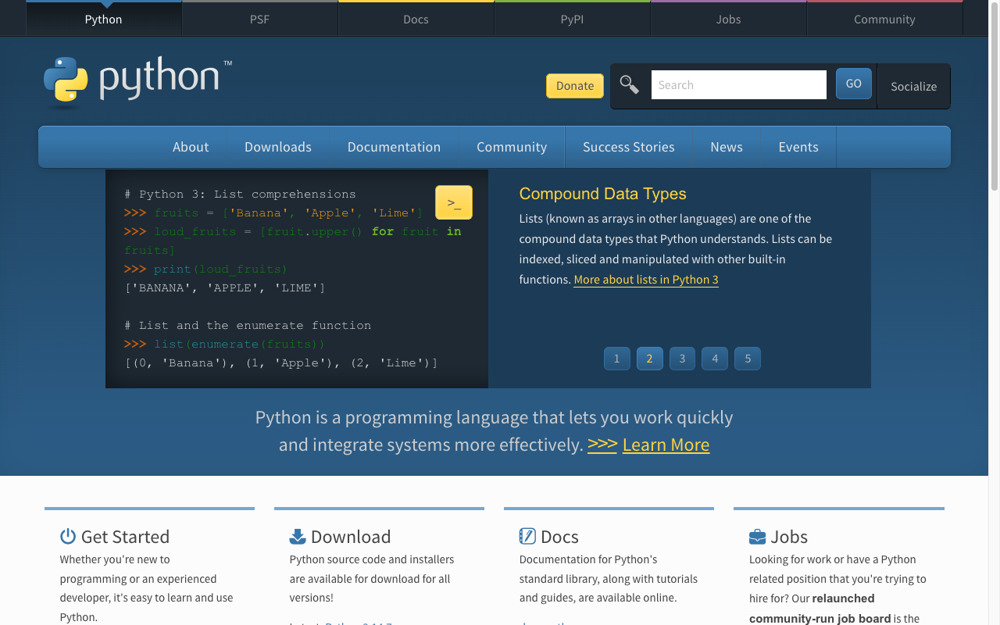
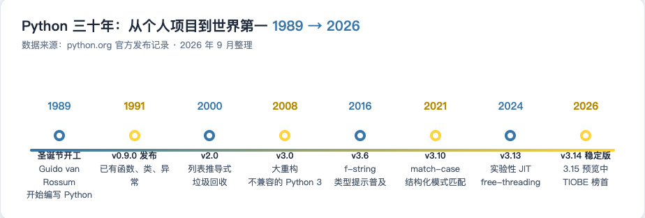
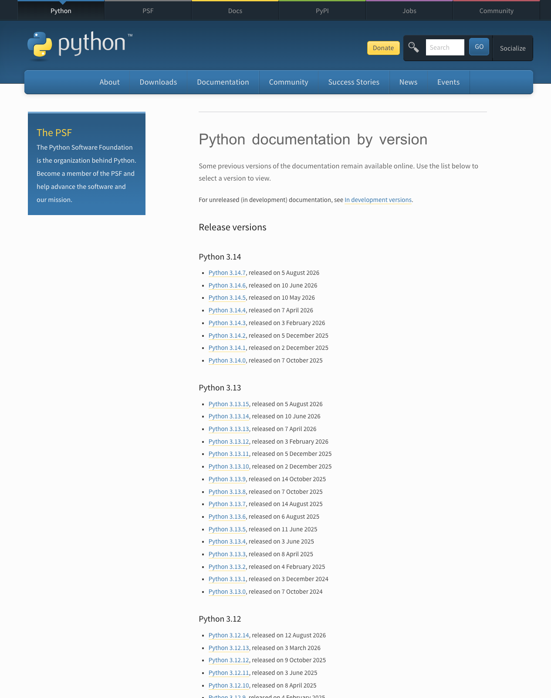
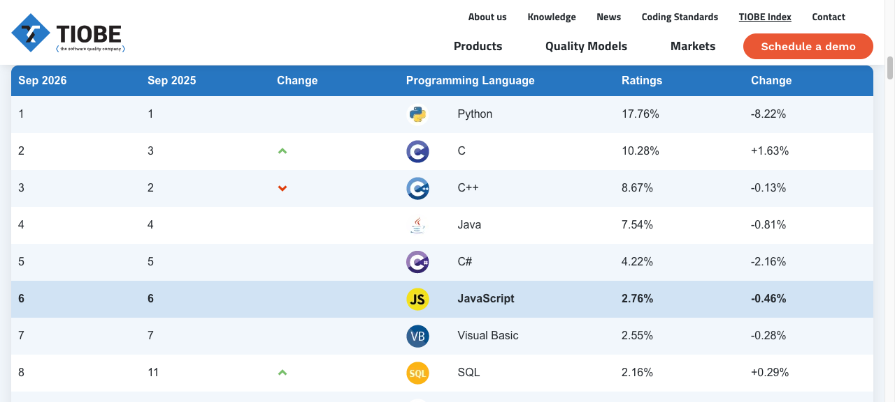
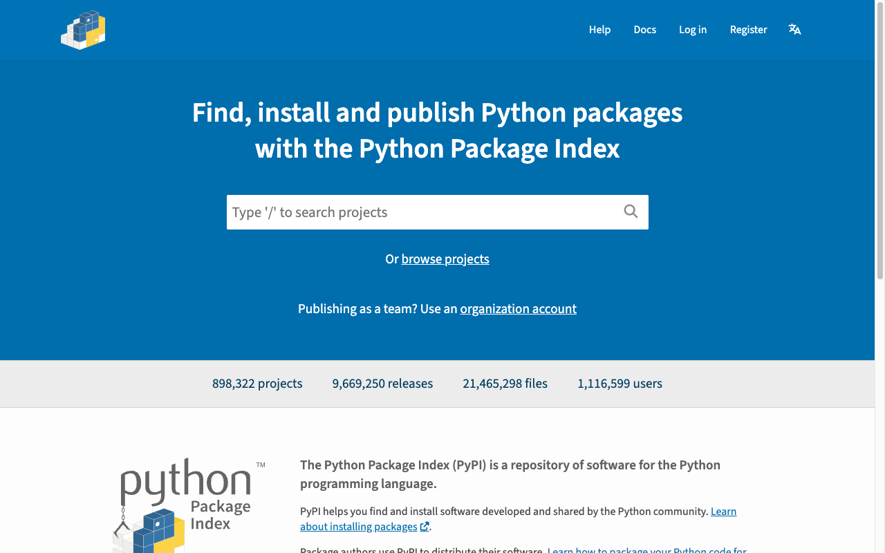
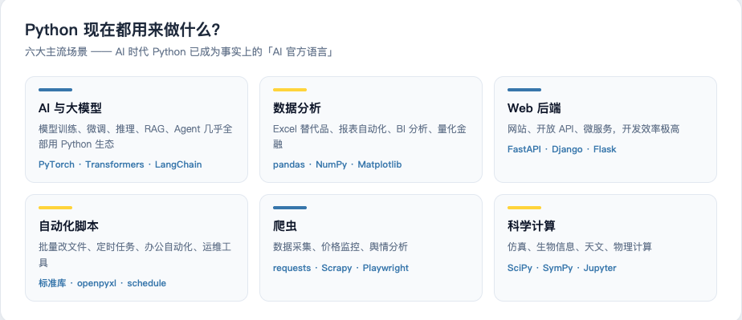
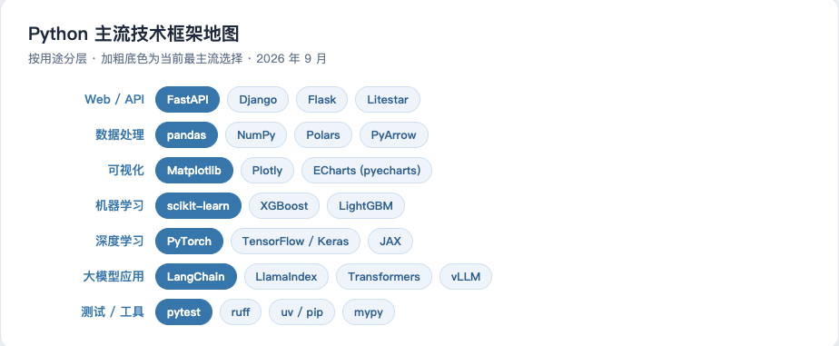
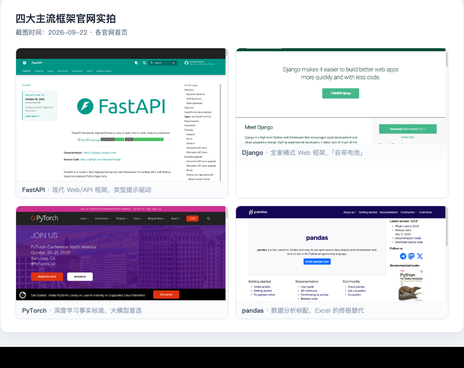

# Python 从哪里来，凭什么这么火？

> AI Engineer Journey / 图文教程 01
> 写给和我一样有 Java / 前端基础、但 Python 零基础的开发者。
> 本文所有数据截图均来自官方网站实拍，截图时间：2026-09-22。



## 写在前面

我写了多年 Java，最近决定系统学 AI 工程。动身之前我给自己补了一课：

**Python 到底是怎么来的？凭什么 AI 时代它是第一语言？**

这篇文章就是我的调研笔记。搞清楚这两件事，后面学语法才有动力、有方向。

---

## 一、起源：一个圣诞节的语言

1989 年底，荷兰阿姆斯特丹 CWI 研究所的程序员 **Guido van Rossum**（吉多·范罗苏姆）在圣诞假期闲得没事，决定写一个新脚本语言，作为 ABC 语言（他此前参与的项目）的改良版。

三个有意思的事实：

1. **名字来自喜剧**：Python 不是蟒蛇的意思，Guido 是英国喜剧团体 **Monty Python**（巨蟒剧团）的粉丝，于是拿它给语言命名了。
2. **第一个版本只有几千行 C 代码**：1991 年 2 月发布的 v0.9.0，就已经包含了函数、类、异常处理——这个语言从出生起就把「好读好写」刻在骨子里。
3. **设计哲学**：Guido 在 Python 里写了一行著名的彩蛋，打开解释器输入 `import this` 就能看到《Python 之禅》：

```text
Beautiful is better than ugly.          # 优美胜于丑陋
Explicit is better than implicit.       # 明了胜于晦涩
Simple is better than complex.          # 简单胜于复杂
Readability counts.                     # 可读性很重要
```

用 Java 的话说：这是一门把「代码是写给人看的」当成最高原则的语言。

## 二、历史发展：三十年三级跳



结合官方发布记录（python.org），关键节点其实只有三个：

| 阶段 | 时间 | 发生了什么 |
|------|------|-----------|
| 萌芽 | 1989-2000 | 0.9 → 1.0（1994）→ 2.0（2000，引入列表推导式、垃圾回收），在脚本圈站稳脚跟 |
| 分裂 | 2000-2008 | Python 2 统治了十几年，但历史包袱越来越重 |
| 重生 | 2008 至今 | **Python 3.0 大重构（不兼容 Python 2）**，经历近十年的痛苦迁移，最终成为唯一标准 |



**Python 2 → 3 的故事特别值得 Java 开发者听一听**：因为 3.0 不兼容 2.0，社区分裂了近十年，大量库迁移缓慢。直到 2020 年 1 月 Python 2 彻底停止维护，官方直接「拔线」，社区才真正统一。

给我的启发：**语言生态的兼容性包袱有多可怕**。Java 从 1.4 到 21 几乎一直是平滑升级，这方面 Python 是反面教材——但狠心重构换来的，是 3.x 时代更干净的语法基础。

几个我会频繁用到、随版本演进的语法，先混个脸熟：

- **3.6（2016）**：f-string 格式化字符串 → `f"Hello, {name}!"`
- **3.10（2021）**：match-case 结构化分支（终于有了类似 switch 的东西）
- **3.13（2024）**：实验性 JIT、free-threading（去掉 GIL 的尝试）
- **3.14（2025）**：当前的稳定版系列（官网最新为 3.14.7）

## 三、有多流行：TIOBE 榜首 + GitHub 第一



TIOBE 2026 年 9 月的榜单：**Python 排名第一，份额 17.76%**，第二名 C（10.28%），而 **Java 排第四（7.54%）**。

另一个维度更贴近我们开发者：GitHub 官方的 **Octoverse 报告**显示，Python 在 2024 年首次超越 JavaScript 和 Java，成为 GitHub 上使用量最大的语言，此后一直稳居第一——推动力主要就是 AI 开发。

我的 Java 视角解读：Java 的流行靠的是企业级后端的存量市场，Python 的流行靠的是 **AI 时代的增量市场**。这两者的含量不一样。

## 四、生态规模：89 万个第三方包



PyPI（Python Package Index，Python 包索引）是 Python 的「Maven Central」。首页的实时统计：

- **898,322 个项目**（近 90 万个第三方包）
- 9,669,250 个发布版本
- 1,116,599 个用户/组织

对比一下我的老本行：Maven Central 大约有 60 多万个构件（含大量历史版本碎片）。Python 生态的活跃度由此可见——**你想要的功能，几乎一定有人写好了包**。

`pip install 包名` 一条命令装好，相当于 `mvn install` + 自动 import。

## 五、现在都用来做什么



对我冲击最大的是第一格：**AI 与大模型**。

- PyTorch、Transformers、LangChain、vLLM……整个大模型工具链全是 Python 生态
- DeepSeek、OpenAI 等厂商的官方 SDK 都是 Python 优先
- 论文复现、微调脚本、RAG Demo，GitHub 上清一色 `.ipynb` 和 `.py`

换句话说：**不懂 Python，就看不懂 AI 时代的源代码。** 这就是我学它的全部理由。

其余场景（数据分析、Web 后端、自动化、爬虫、科学计算）对 Java 开发者来说是「顺便白送」的技能——尤其自动化脚本，学会 Python 后写起来比 Java 舒服太多了。

## 六、主流技术框架地图



用 Java 的框架对照一遍，秒懂：

| 用途 | Python 框架 | 类比的 Java 框架 |
|------|------------|-----------------|
| Web / API | FastAPI | Spring Boot（注解驱动、自动文档、依赖注入，神似） |
| Web / API | Django | Spring 全家桶（ORM、Admin、Auth 全自带） |
| 数据处理 | pandas / NumPy | ——（Java 无直接对应，接近 Excel + SQL 的合体） |
| 深度学习 | PyTorch | ——（AI 时代必须会） |
| 大模型应用 | LangChain / LlamaIndex | ——（RAG / Agent 开发框架） |
| 测试 | pytest | JUnit |



挑两个重点说：

- **FastAPI**：Java 开发者学 Python Web 的最佳切入点。类型提示驱动，写法和 Spring Boot 的 Controller 像极了，还自动生成 OpenAPI 文档。
- **PyTorch**：大模型训练推理的事实标准，后面 Phase 5 起我们会重度使用。

## 七、小结

1. Python 1989 年诞生，设计哲学是「可读性优先」，2026 年位居 TIOBE 榜首、GitHub 第一语言。
2. 生态近 90 万个包，AI 时代它是事实上的「AI 官方语言」。
3. 对 Java 开发者：FastAPI ≈ Spring Boot，pip ≈ Maven，pytest ≈ JUnit——经验可以大量复用，但动态类型的坑要重新学。

> 下一篇：《Python 安装与上手：从装环境到跑通第一个 AI 项目》，我会真实安装环境、逐条命令验证。

---

*本文是 AI Engineer Journey（github.com/beiluoL/ai-engineer-journey）的图文教程系列。所有截图均为官方页面实拍，数据以截图时点为准。*
