# Python 安装与上手：从装环境到跑通第一个 AI 项目

> AI Engineer Journey / 图文教程 02
> 写给和我一样有 Java / 前端基础、但 Python 零基础的开发者。
> 本文所有终端截图均为本机真实运行结果（macOS + Python 3.13），命令可直接照抄。

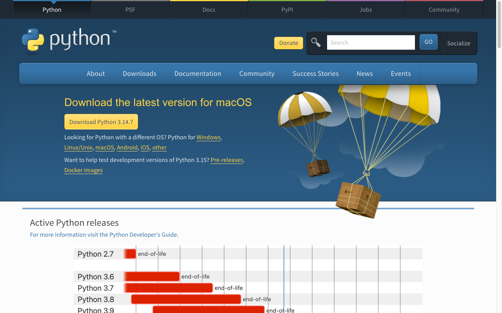

## 写在前面

上一篇搞清楚了 Python 的来历和生态（[没看的先看这篇](01-python-origin-history-ecosystem.md)）。

这篇解决最实际的问题：**怎么装、怎么跑、怎么学、练什么项目。**

我会像Java 里配 JDK + Maven 那样，把 Python 的环境一次性配明白，每个步骤都留了真实运行截图。

---

## 一、安装：四种方式怎么选

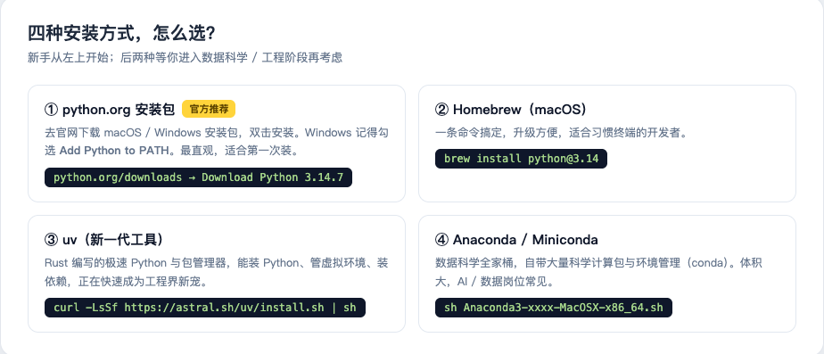

新手建议：**Windows / macOS 都直接用官网安装包**，别一上来就整 Anaconda。

具体步骤（macOS 为例）：

1. 打开 [python.org/downloads](https://www.python.org/downloads/)，点黄色大按钮下载（截图中是 Python 3.14.7，带 .pkg 安装包）
2. 双击安装，一路下一步
3. Windows 用户注意：第一屏务必勾选 **"Add Python to PATH"**（不勾 = 命令行里找不到 python，新手第一大坑）
4. 验证安装 ↓

```bash
python3 --version
```

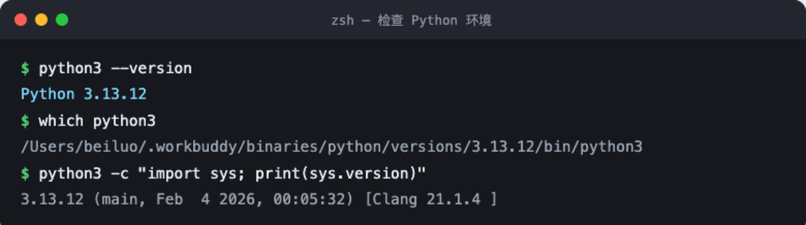

`--version` 正常输出版本号，就等于 Java 里 `java -version` 成功了。顺手用 `which python3` 看看它装在哪，相当于确认 `JAVA_HOME`。

> 小知识：macOS 自带一个老版本 Python 是系统内部用的，别去动它。装完新版后用 `python3` 命令调用的就是你自己的版本。

## 二、第一次运行：三种打开方式

### 方式一：交互式解释器（REPL）—— Python 的 jshell

```bash
python3
```

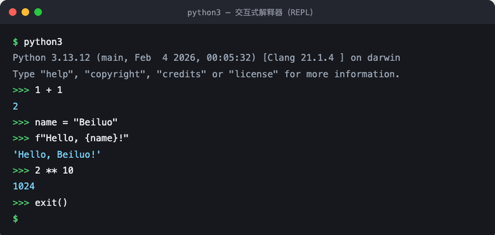

输入 `exit()` 或按 `Ctrl+D` 退出。适合随手验证一行代码，我学语法时天天开。

### 方式二：脚本文件—— 正式的运行方式

新建 `hello.py`：

```python
# 我的第一个 Python 程序
print("Hello, AI Engineer Journey!")

name = "Beiluo"
year = 2026
print(f"{name} 开始学 Python 的年份: {year}")
```

运行：

```bash
python3 hello.py
```

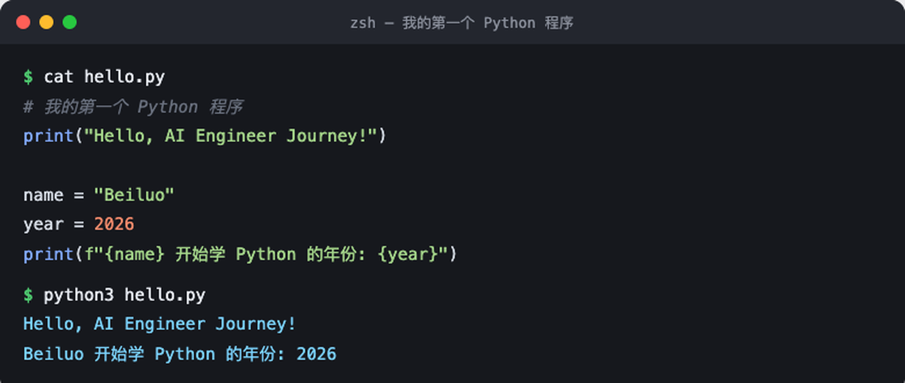

### Java 对照：最大的体验差异在这里

| | Java | Python |
|---|------|--------|
| 编译 | 需要 `javac` 编译成 .class | **无需编译**，直接跑源码 |
| 入口 | 必须 main 方法 | 脚本从上往下执行，没有入口仪式 |
| 变量 | 必须声明类型 | 直接赋值，类型跟着值走 |
| 输出 | `System.out.println()` | `print()` |

Python 也有 `.pyc` 字节码缓存（在 `__pycache__` 目录），机制上和 JVM 有相通之处，但它把编译步骤隐藏了。

## 三、直接上真实场景：list + dict

光 print 不过瘾。AI 项目里最高频的数据结构是 **list + dict 组合**——LLM 的对话历史就是这样的结构：

```python
history = []
history.append({"role": "user", "content": "什么是 Token？"})
history.append({"role": "assistant", "content": "模型处理文本的最小单位。"})
history.append({"role": "user", "content": "那 Embedding 呢？"})

for i, m in enumerate(history, start=1):
    print(f"{i}. [{m['role']:9s}] {m['content']}")

# 列表推导式：一行提取所有用户提问（Java Stream 的极简版）
questions = [m["content"] for m in history if m["role"] == "user"]
```

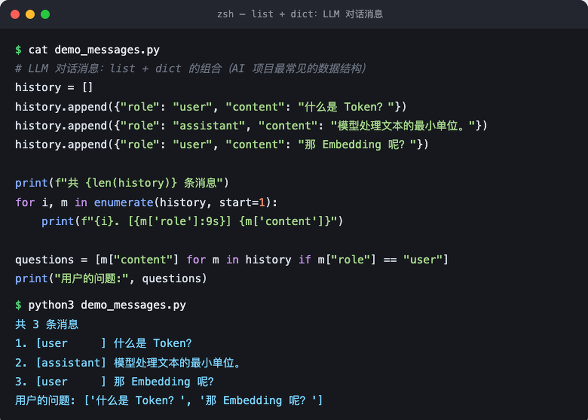

Java 对照：`list` ≈ `ArrayList`，`dict` ≈ `HashMap`，列表推导式 ≈ `stream().filter().map().toList()`。**记住一个事实：LLM API 的请求体就是「一个 dict，里面套一个 list of dict」**，看懂这个，AI 代码就祛魅了一半。

## 四、venv 与 pip：把 Maven 那套经验搬过来

Java 里每个项目有独立的 `pom.xml` 依赖集，Python 里对应的是**虚拟环境（venv）**：

```bash
python3 -m venv demo-venv        # 创建（相当于初始化一个项目级依赖目录）
source demo-venv/bin/activate    # 激活（Windows: demo-venv\Scripts\activate）
pip list                         # 查看已装的包（相当于 mvn dependency:list）
deactivate                       # 退出
```

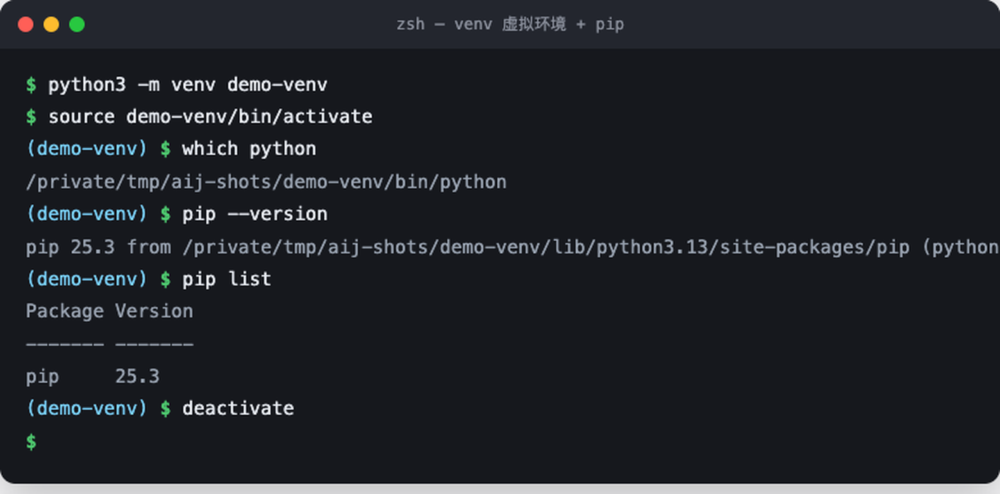

三个关键对应关系：

| Java | Python | 备注 |
|------|--------|------|
| Maven Central | PyPI | 近 90 万个包 |
| `pom.xml` | `requirements.txt` | 依赖清单 |
| `mvn install` | `pip install -r requirements.txt` | 一键还原依赖 |
| JDK 版本切换 | venv 可指定不同 Python 版本 | |

新手规则只有一条：**每个项目都建 venv，别往全局装包。**

## 五、学习路线：从 Python 到 AI Engineer

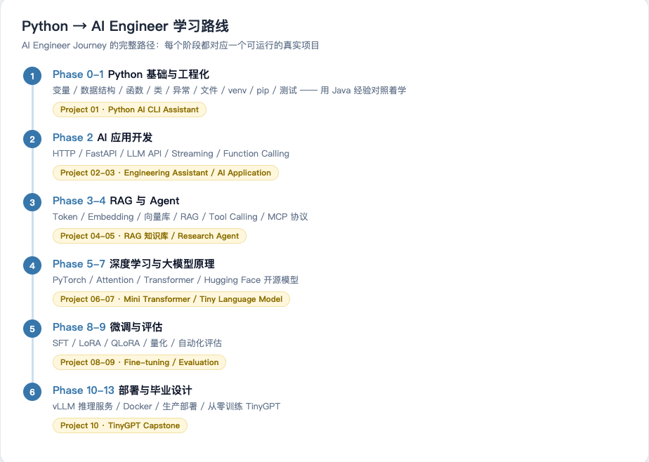

这是我自己在走的路线（本仓库 README 有完整版），核心思路是 **Project First**：

1. **Phase 0-1**：Python 基础 + 工程化 —— 不单独背语法，直接在项目里学
2. **Phase 2**：AI 应用开发 —— HTTP、FastAPI、LLM API、流式输出
3. **Phase 3-4**：RAG 与 Agent —— Embedding、向量库、Tool Calling、MCP
4. **Phase 5-7**：深度学习 —— PyTorch、Attention、Transformer 原理
5. **Phase 8-9**：微调与评估 —— LoRA / QLoRA、量化
6. **Phase 10-13**：部署与毕业设计 —— vLLM、Docker、从零训练 TinyGPT

给 Java 同行的学习建议：

- **别抱着语法书啃**。有编程基础的人，Python 语法两周就能上手感，重点是尽快进入项目
- **盯紧动态类型的坑**：`"1" + 1` 会报错（强类型）、变量可以随便换类型（动态类型）、`True/False/None` 首字母大写、缩进就是语法块
- **每学一个知识点就跑一个 Demo**，用 REPL 随手验证

## 六、练什么项目：从入门到 AI

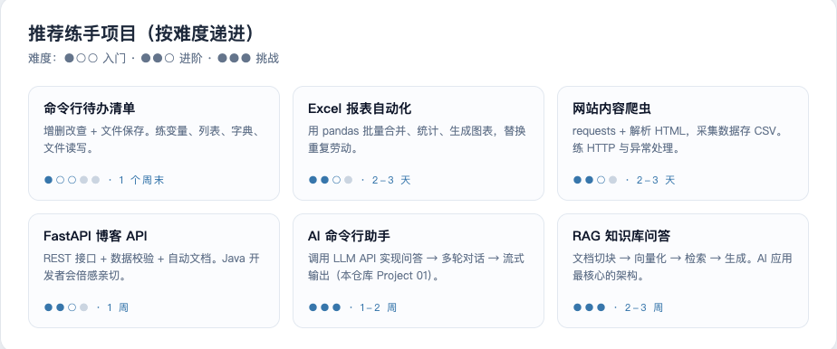

我自己正在做的第一个真项目就是图里的第五个：**AI 命令行助手**（输入问题 → 调用 LLM API → 输出答案）。整个仓库就是按这个项目驱动的方式组织的：

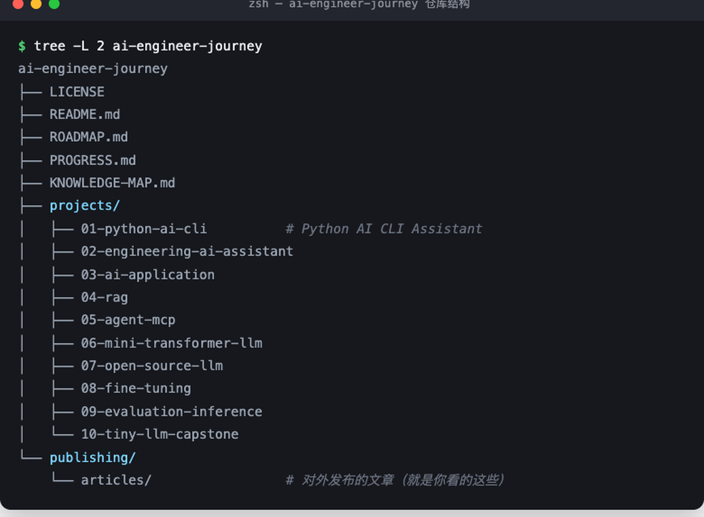

它已经能真实跑起来了——下面是我本机真实运行的结果（调用 DeepSeek API）：

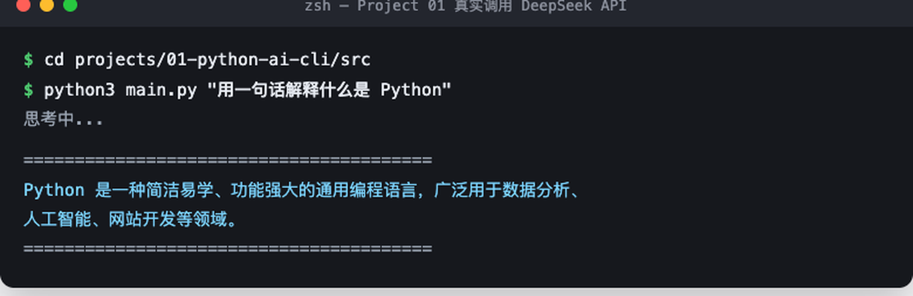

从「输入一个问题」到「AI 回答」，核心只涉及：dict 构造请求体 + JSON 序列化 + HTTP POST + 异常处理。**这些恰好就是 Python 入门知识点的全集**——所以它能当第一个项目。

## 七、新手常踩的坑（我踩过的）

1. **Windows 没勾 Add to PATH** → 重装，勾上
2. **`python` 命令不存在**：macOS/Linux 用 `python3`
3. **pip 装错环境**：装包前先激活 venv，用 `which pip` 确认指向 venv 内
4. **Tab 和空格混用** → `IndentationError`，全用 4 空格（交给编辑器）
5. **中文输出乱码**：读文件时显式 `encoding="utf-8"`

## 八、小结

1. 装环境：官网安装包 → `python3 --version` 验证，10 分钟搞定
2. 跑代码：REPL 随手试 + 脚本文件正式跑，无需编译
3. 管依赖：venv 隔离 + pip 安装，Maven 经验直接平移
4. 学路线：Project First，别脱离项目背语法
5. 练项目：从 CLI 小工具一路练到 AI 命令行助手、RAG 知识库

> 本系列下一篇计划：《从 0 手写一个 AI 命令行助手》（Project 01 全过程实录）。
> 仓库：github.com/beiluoL/ai-engineer-journey —— 每个阶段都是可运行的真实项目。

---

*本文是 AI Engineer Journey 的图文教程系列。所有终端截图均为本机真实运行结果，环境：macOS 15 + Python 3.13。*
