# 第一次微调实战 Day1：从 0 到跑通 Qwen + LLaMA-Factory + 第一份 Java 面试训练数据

> 写给有 Java / 后端基础、想上手大模型微调的开发者。
> 本文是「第一次微调实战」系列第一篇：**今天不训练，只把整条链路的环境搭通、把数据备好、把流程真正看懂。**
> 所有终端截图均为**本机实机运行结果**（macOS + Python 3.13 + LLaMA-Factory 0.9.6）；其中 GPU 检查与 git clone 两步附有 **Colab 真实运行截图**（T4 实机）；Colab 其余内部界面以「操作指引卡」呈现，GPU 预期输出保留「参考卡」并与真实截图对照。抓取时间：2026-09-22。

---

## 我为什么要学这个

会调 API 不等于会大模型。Prompt 解决不了「让模型稳定用某种口吻、某种格式回答」的问题——那需要**微调**。而微调的第一道门槛从来不是算法，是**环境、工具、数据**这三座山。Day1 的目标就是把这三座山搬完：

```text
Google Colab GPU 环境
        ↓
LLaMA-Factory 微调框架
        ↓
Qwen 基础模型
        ↓
Java 面试训练数据集
        ↓
第一次训练准备完成
```

---

## Day1 总览

| 任务 | 预计时间 |
| ---- | ----: |
| 注册 Google Colab | 10 分钟 |
| 开启 GPU | 5 分钟 |
| 测试环境 | 10 分钟 |
| 安装 LLaMA-Factory | 30 分钟 |
| 下载 Qwen 模型 | 20 分钟 |
| 准备训练数据 | 1 小时 |
| 理解流程 | 30 分钟 |

**总计：约 3 小时。** 其中大部分时间在等下载——正好用来看懂每一步在干什么。

---

## 第一部分：准备 Google Colab

### 1.1 为什么用 Colab，不用自己的 Mac

微调需要 NVIDIA GPU（显存以 GB 计）。Mac 的 M 系列芯片没有 CUDA，主流训练工具链跑不动——我本机实测 `nvidia-smi` 直接报错（见 2.2）。Colab 免费提供一张 T4（16GB 显存），浏览器里就能用，是零成本练手的最短路径。

### 1.2 打开 Colab

浏览器访问：**https://colab.research.google.com/**

你会看到这样的首页（中文界面）：

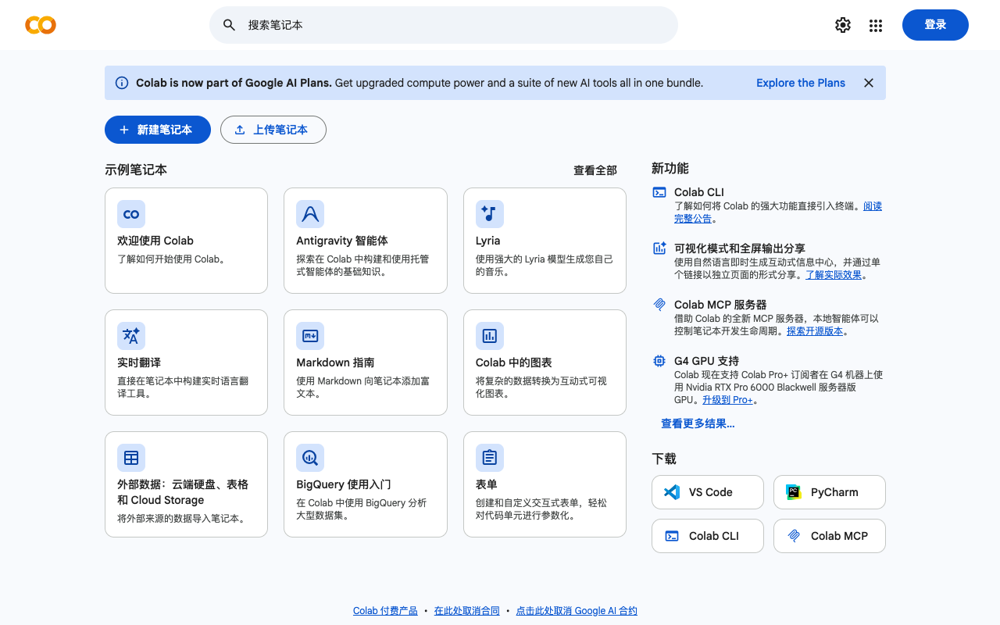

*Colab 首页实拍（2026-09-22）——登录 Google 账号后，点左上角「+ 新建笔记本」*

### 1.3 新建笔记本

按下面的指引操作：

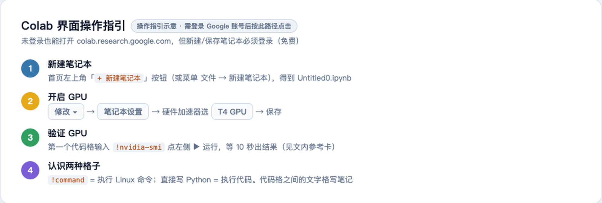

*操作指引卡：新建笔记本 → 开 GPU → 验证 → 认识代码格。Colab 界面需登录后操作，故以指引卡呈现*

新建后会得到一个 `Untitled0.ipynb`——这就是你的训练环境，一个跑在 Google 服务器上的 Jupyter 笔记本。

> **Java 视角**：`.ipynb` ≈ 一个可以一段一段执行并保留内存状态的交互式运行台，类似 IDEA 里可以单行求值的 Evaluate 窗口，但整个文件就是程序本身。

---

## 第二部分：开启 GPU

Colab 默认 **不带 GPU**（CPU 模式），必须手动切换。

### 2.1 操作路径

```text
修改（Runtime）
 ↓
笔记本设置（Notebook settings）
 ↓
硬件加速器 → 选择 T4 GPU
 ↓
保存
```

### 2.2 检查 GPU：你的第一行代码

在代码格里输入并运行：

```python
!nvidia-smi
```

`!` 开头表示执行 Linux 命令（不是 Python）。如果一切正常，你会看到 T4 显卡的信息表（见下方参考卡）。

**如果没有 GPU，你看到的会是这样的报错**——我在自己 Mac 上实机复现了这个错误，让你先认清它：

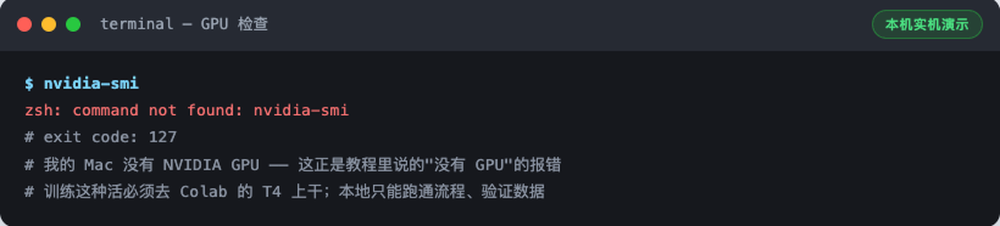

*本机实机演示：没有 GPU 的机器上 `nvidia-smi` 直接 `command not found`（exit 127）。在 Colab 上看到它 = GPU 没开*

**GPU 正常时，预期输出长这样：**

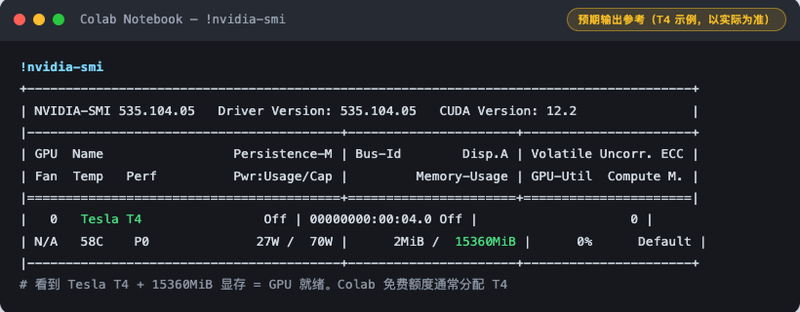

*预期输出参考卡（T4 示例，以实际为准）：看到 `Tesla T4` + `15360MiB` 显存 = GPU 就绪*

**Colab 真实运行截图**（2026-09-22 实机，可与参考卡逐项对照）：

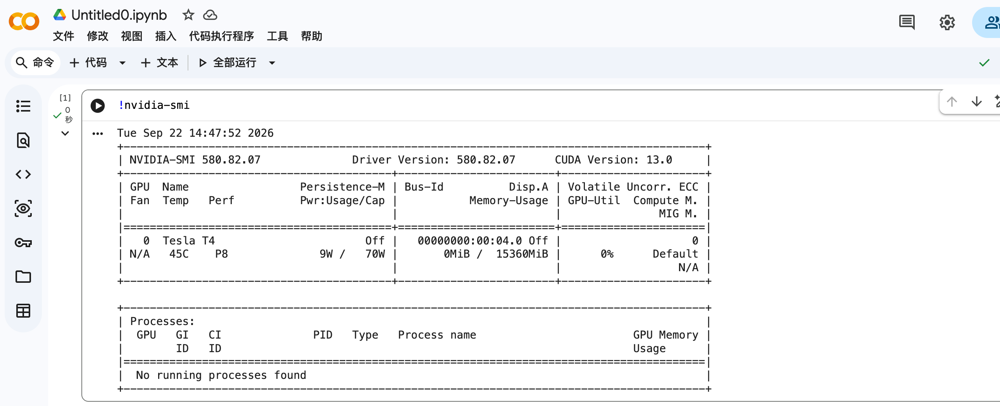

*Colab T4 实机截图：Tesla T4 / 15360MiB / CUDA 13.0 / Driver 580.82.07——和参考卡对上了*

> 如果报 `command not found`，回到 `修改 → 笔记本设置` 确认真选了 GPU，保存后**重新运行**第一格代码。

---

## 第三部分：理解 Colab——你现在拥有一台「云电脑」

这一步值得花 5 分钟想清楚架构，后面所有操作才不会迷路：

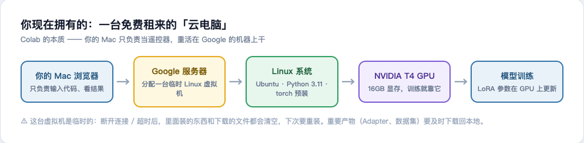

*你的 Mac 只是遥控器；训练发生在 Google 的 Linux 虚拟机上*

关键认知：

1. **你的 Mac 不参与训练**，只负责发代码、看输出；
2. 那台 Linux 虚拟机是**临时的**——断开连接或闲置超时后，装的东西、下载的模型**全部清空**；
3. 所以 Day2 训练出的 LoRA Adapter 要**及时下载回本地**，不然就没了。

> **Java 视角**：相当于租了台按小时计费的云服务器（ECS），只不过 Colab 免费给你几小时，而且浏览器即开即用。

---

## 第四部分：安装 Python 环境

Colab 自带 Python，不用装，只需要确认版本 + 升级 pip：

```python
!python --version
!pip install --upgrade pip
```

本机实机演示（Colab 上是 Python 3.11.x，版本号不同不影响任何操作）：

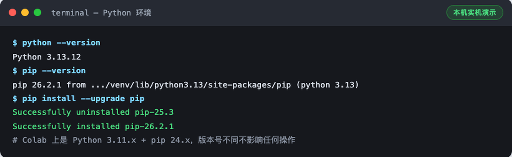

*本机实机演示：`python --version` + `pip --version` + 升级 pip 的真实输出*

> **Java 视角**：`pip` ≈ Maven——声明依赖、从仓库拉包。区别是 pip 装在「当前虚拟环境」里，相当于每个项目一个独立的本地 `.m2` 仓库。

---

## 第五部分：安装 LLaMA-Factory

### 5.1 什么是 LLaMA-Factory？

微调一个模型，裸写需要：数据读取、模型加载、LoRA 配置、训练循环、保存恢复……几百行代码。LLaMA-Factory（GitHub 75k star）把这些全部封装成「数据 + 配置 + 一条命令」：

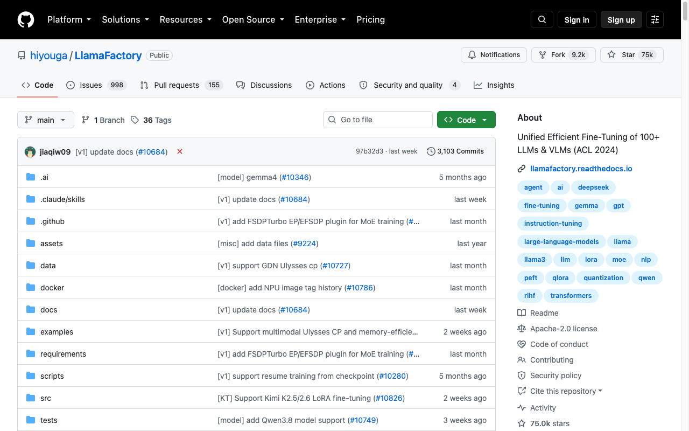

*github.com/hiyouga/LLaMA-Factory 实拍（2026-09-22）：75k stars，支持 Qwen/LLaMA 等 100+ 模型*

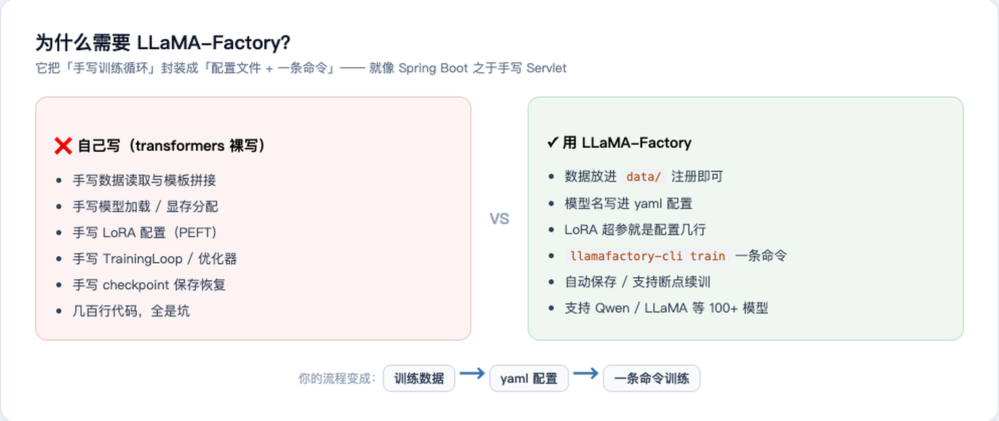

*裸写训练 vs LLaMA-Factory：就像手写 Servlet vs Spring Boot*

### 5.2 克隆仓库

```python
!git clone https://github.com/hiyouga/LLaMA-Factory.git
%cd LLaMA-Factory
```

**先看一个真实踩坑**：国内网络直连 GitHub HTTPS 经常超时，我在本机实测就挂了：

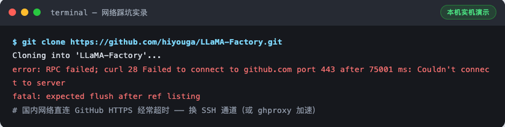

*本机实机演示：HTTPS 直连 75 秒超时。这是国内网络最常见的坑*

**解决办法**：换 SSH 通道（或 ghproxy 等加速前缀）。换 SSH 后成功：

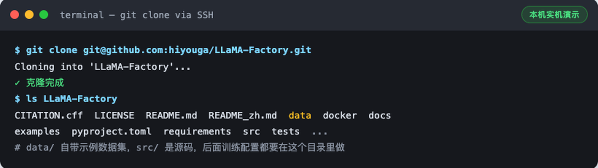

*本机实机演示：SSH 通道克隆成功。注意仓库里的 `data/` 目录——Day2 注册数据集要用*

> 本机练习时遇到 HTTPS 超时就换 SSH；Colab 到 GitHub 的网络一般很好，直接 `!git clone https://...` 即可。

**Colab 里实际克隆的样子**（2026-09-22 实机：28,386 个对象 / 13.80 MiB / 21.41 MiB/s，一次成功无需换通道）：

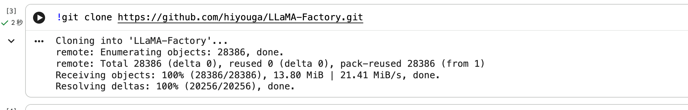

*Colab 实机截图：`git clone` 直连成功。注意 cloned 仓库就落在 notebook 工作目录里，`%cd LLaMA-Factory` 进入*

### 5.3 安装

```python
!pip install -e .
```

`-e` 表示可编辑安装（源码模式），装完后 `llamafactory-cli` 命令全局可用。**需要下载 torch 等 130+ 个包，5~20 分钟**，去接杯水：

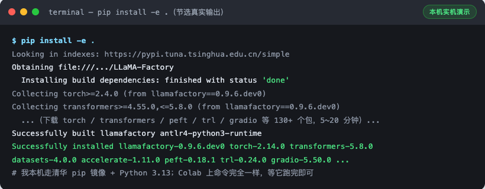

*本机实机演示（节选）：`Looking in indexes` 显示我配了清华 pip 镜像加速；Colab 上命令完全一致*

> **踩坑提示**：如果中途报错，九成是网络（换镜像：`pip config set global.index-url https://pypi.tuna.tsinghua.edu.cn/simple`）或 Python 版本（LLaMA-Factory 要求 ≥3.11）。重跑一次 `!pip install -e .` 会接着装，不用清缓存。

---

## 第六部分：检查 LLaMA-Factory

安装完必须验证，一条命令：

```python
!llamafactory-cli version
```

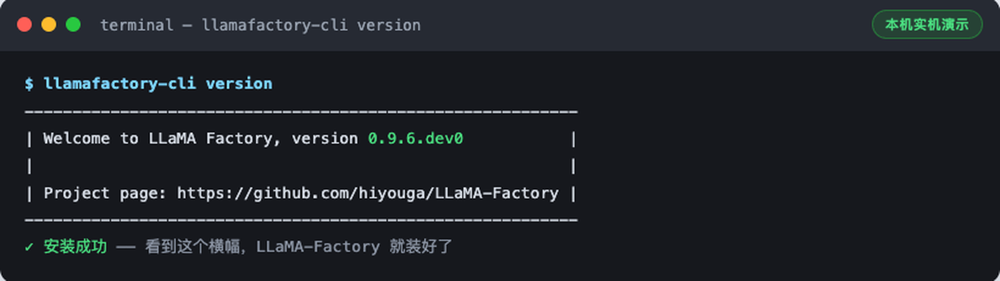

*本机实机演示：看到这个横幅 = 安装成功（版本号可能略有差异）*

看到 `Welcome to LLaMA Factory` 横幅就是成了。**没看到横幅之前，不要继续后面的步骤**——后面每一步都依赖它。

---

## 第七部分：安装模型依赖

```python
!pip install transformers datasets accelerate peft bitsandbytes sentencepiece
```

如果你严格按顺序执行，`pip install -e .` 其实已经把大部分装好了，输出会是这样的 `already satisfied`：

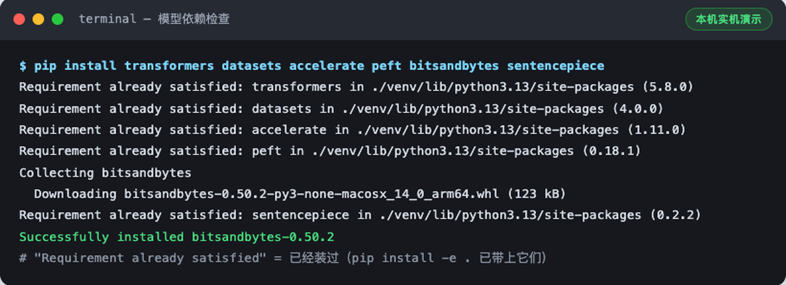

*本机实机演示：5 个 already satisfied + 补装 bitsandbytes。这是正常且正确的输出*

每个组件干什么，一张表说清：

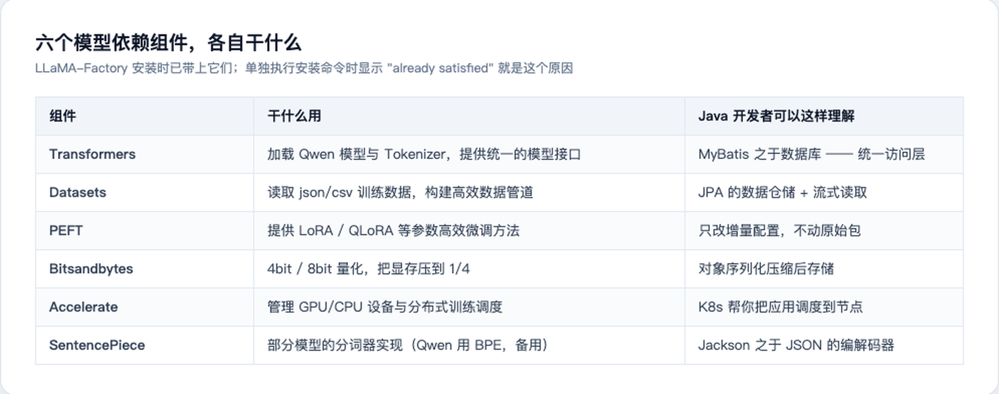

*六个依赖的职责 + Java 视角类比*

> **为什么显式再装一遍？** 教学上这一步是让你知道每个库的存在；工程上它保证这些库的版本不低于 LLaMA-Factory 的要求。重复执行 pip install 是幂等的，不会装坏。

---

## 第八部分：下载第一个 Qwen 模型

### 8.1 为什么第一次不要 7B

第一次微调的目标是**跑通链路**，不是刷效果。3B（30 亿参数）在 T4 16GB 上 LoRA 微调绰绰有余：

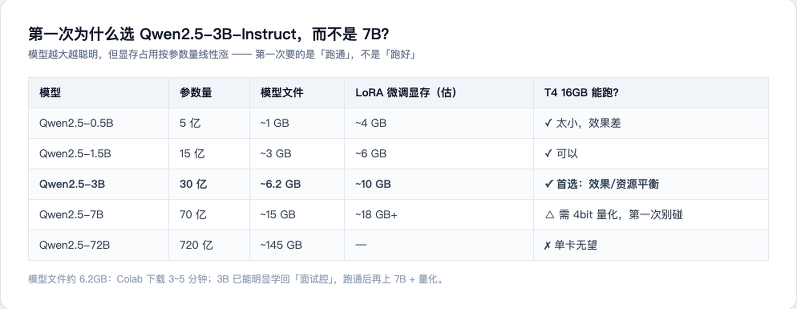

*为什么选 Qwen2.5-3B-Instruct：效果/资源平衡点*

### 8.2 在哪里找它

Qwen 全系列在 Hugging Face 和魔搭 ModelScope 都有官方发布（国内访问魔搭更快）：

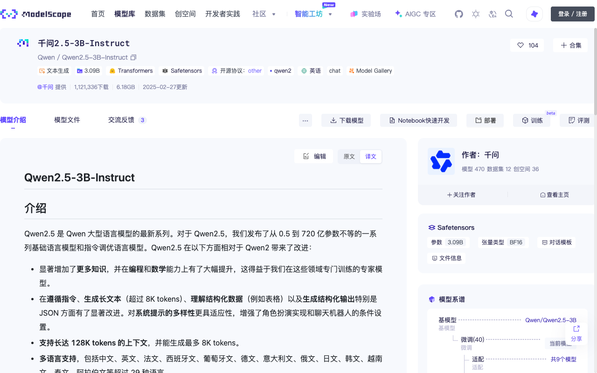

*modelscope.cn/models/Qwen/Qwen2.5-3B-Instruct 实拍（2026-09-22）：模型文件 6.18GB，下载量 121 万+*

### 8.3 第一次只下载 Tokenizer 验证通路

完整模型 6GB+，第一次先下载**分词器**（几 MB）验证「模型仓库 → 你的机器」这条路是通的：

```python
from transformers import AutoTokenizer

model_name = "Qwen/Qwen2.5-3B-Instruct"
tokenizer = AutoTokenizer.from_pretrained(model_name)
print("下载成功")
```

本机实机运行（顺手多演示一步——看看 Tokenizer 到底把文本变成了什么）：

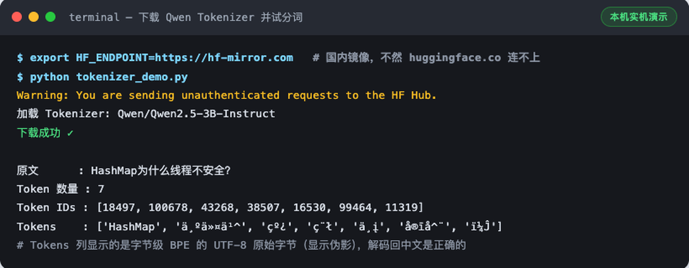

*本机实机演示：注意 `HF_ENDPOINT=https://hf-mirror.com`——国内直连 huggingface.co 经常失败，走镜像是我的实测解法*

看输出：一句「HashMap为什么线程不安全？」被切成了 **7 个 token**，每个 token 对应一个数字 ID。这就是训练链路的第二环——**模型真正吃的从来不是文字，是这些 ID**。

> **踩坑提示**：Colab 上直接跑通常没问题；本机/国内服务器跑 `from_pretrained` 超时的话，加环境变量 `HF_ENDPOINT=https://hf-mirror.com`（魔法上网稳定的话忽略此条）。

---

## 第九部分：准备你的第一份训练数据

**现在开始最重要的部分。**

### 9.1 核心认知：训练「行为」，不是训练「知识」

不要在数据里塞知识问答（「HashMap 是什么」），而要训练**回答的方式**（「用 Java 高级面试的方式回答 HashMap」）。一张图说清 SFT 数据的结构：

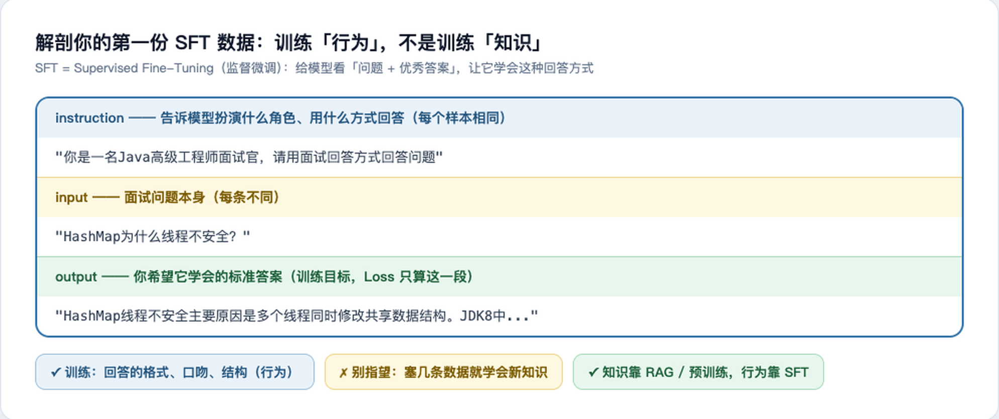

*SFT = Supervised Fine-Tuning：instruction 定角色与格式，input 是问题，output 是你要它学会的标准答案*

### 9.2 创建数据文件

在 Colab 新建一个文本文件（左侧文件面板 → 右键 → 新建文件），命名为 `java_interview.json`，内容：

```json
[
  {
    "instruction": "你是一名Java高级工程师面试官，请用面试回答方式回答问题",
    "input": "HashMap为什么线程不安全？",
    "output": "HashMap线程不安全主要原因是多个线程同时修改共享数据结构。JDK8中HashMap采用数组+链表+红黑树结构，但没有加锁。在并发put时可能导致数据覆盖、链表结构异常等问题。因此多线程环境应该使用ConcurrentHashMap。"
  },
  {
    "instruction": "你是一名Java高级工程师面试官，请用面试回答方式回答问题",
    "input": "ConcurrentHashMap JDK8如何保证线程安全？",
    "output": "JDK8 ConcurrentHashMap取消Segment分段锁设计，采用CAS+synchronized实现。空桶插入使用CAS，非空桶锁住头节点，通过Node链表或者TreeBin保证并发安全。同时支持扩容迁移。"
  }
]
```

这就是 **Alpaca 格式**——LLaMA-Factory 默认认识的三字段格式。正式训练建议扩到 100~1000 条，风格越一致越好。

> **Java 视角**：`instruction` 像 Javadoc 上的角色约定，`input` 是方法入参，`output` 是期望返回值——一套「带期望输出的测试用例集」，训练就是让模型对这些用例的「实现」无限逼近期望输出。

---

## 第十部分：创建数据目录并检查

在 LLaMA-Factory 目录下建 `data/` 目录，把 `java_interview.json` 放进去（Colab 里可以直接拖拽上传到文件面板）：

```python
!mkdir -p data
# 上传 java_interview.json 到 data/ 目录
!ls data
```

放好后做两个**必须的检查**（都真实跑过）：

**检查 1：JSON 合法性**

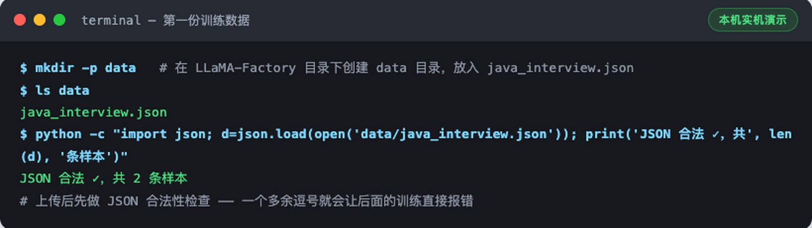

*本机实机演示：一个多余的逗号就会让 Day2 的训练当场报错，先花 10 秒验证*

**检查 2：用 datasets 库真实加载**

```python
from datasets import load_dataset

ds = load_dataset("json", data_files="data/java_interview.json", split="train")
print(ds)
```

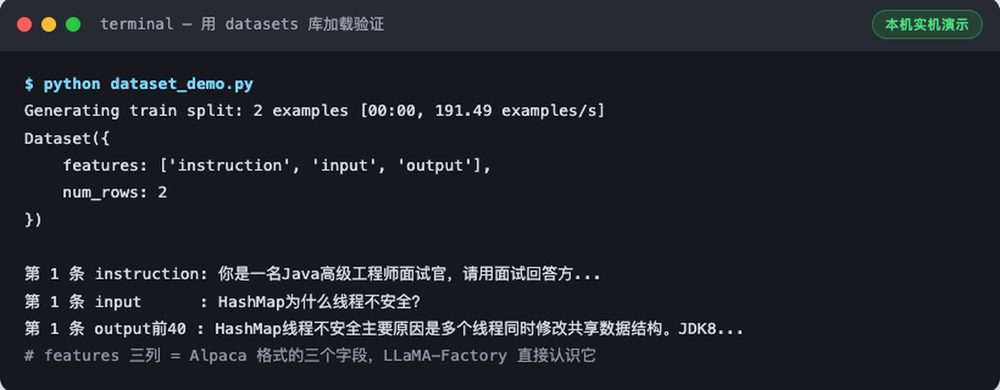

*本机实机演示：`features` 三列 = Alpaca 三字段，`num_rows: 2` = 两条样本都读进来了*

`Dataset({features: ['instruction', 'input', 'output'], num_rows: 2})` 出现 = 数据完全就绪。

---

## 第十一部分：今天先不要训练

环境和数据都好了，为什么忍住不练？因为第一次训练前必须先看懂这条链路——Day2 你敲的每个配置，都对应链路上的一环：

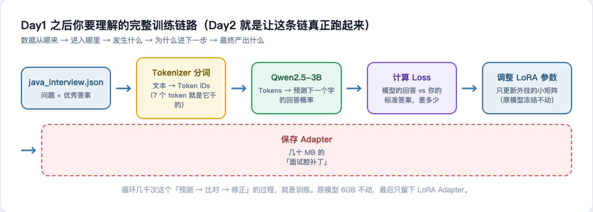

*数据 → Tokenizer → 模型 → Loss → LoRA 参数 → Adapter。每一步「发生什么、为什么进下一步」*

一图一段话：

1. **数据**：你的 2 条「问题+优秀答案」从 JSON 读入；
2. **Tokenizer**：把文字变成 Token IDs（第八部分那 7 个 ID 就是它干的）；
3. **Qwen 模型**：根据上文预测下一个 token 的概率分布；
4. **Loss**：模型预测 vs 你的标准答案，算差多少（Loss 只在 output 段计算——instruction 和 input 不参与）；
5. **调 LoRA 参数**：只更新外挂的小矩阵（几千万参数），原模型 60 亿参数**全程冻结**；
6. **保存 Adapter**：循环几千次后，把学到的「面试腔」存成几十 MB 的补丁文件。

> **Java 视角**：LoRA Adapter ≈ 不修改原始 jar 包、只外挂一个增强切面——原类（基础模型）只读，增量逻辑（Adapter）独立打包部署，随时可挂可摘。

---

## Day1 完成标准

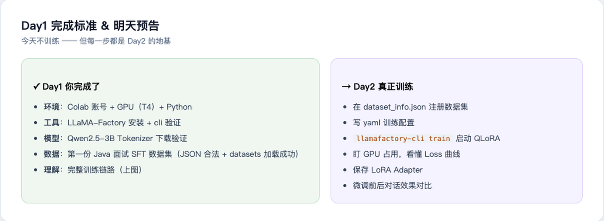

**环境**：✅ Colab 账号　✅ GPU（T4）　✅ Python 环境
**工具**：✅ LLaMA-Factory 安装并验证　✅ 六个模型依赖就位
**模型**：✅ Qwen2.5-3B Tokenizer 下载验证（6GB 模型文件 Day2 训练前拉取即可）
**数据**：✅ 第一份 Java 面试 SFT 数据集（JSON 合法 + datasets 加载成功）
**理解**：✅ 完整训练链路的每一环

---

## 明天 Day2

进入真正训练：

**《第一次 QLoRA 微调实战 Day2：配置 LLaMA-Factory → 训练 Qwen → 查看 Loss → 保存 LoRA → 第一次让模型学会 Java 面试回答》**

1. 在 `dataset_info.json` 注册数据集
2. 写 yaml 训练配置
3. `llamafactory-cli train` 启动训练
4. 盯 GPU 占用
5. 理解 Loss 曲线
6. 保存 LoRA Adapter
7. 测试微调前后区别

不过在进入 Day2 前，请先把 **Day1 的环境搭建**亲手跑一遍——每个命令的输出和本文截图对得上，再往下走。

---

## 本篇踩坑速查

| 坑 | 现象 | 解法 |
| ---- | ---- | ---- |
| GitHub HTTPS 超时 | `curl 28 ... port 443` 连接失败 | 换 SSH 克隆或加速前缀（实测见 5.2） |
| HF 下载超时 | `from_pretrained` 卡住/报错 | `HF_ENDPOINT=https://hf-mirror.com`（实测见 8.3） |
| 忘开 GPU | `nvidia-smi: command not found` | 修改 → 笔记本设置 → T4 GPU → 重跑（实测见 2.2） |
| Colab 临时性 | 隔天回来装的东西全没了 | 正常现象；产物及时下载回本地 |
| JSON 多逗号 | Day2 训练读数据即崩 | 先跑 `json.load` 校验（实测见第十部分） |

---

*本文为 AI Engineer Journey 系列教程，代码与数据均在仓库 `publishing/tutorials/` 可查。下一篇：Day2 QLoRA 实战。*
