# 企业级大模型部署从 0 到 1：租 GPU 服务器 → Ubuntu → Docker → Qwen → vLLM → Spring Boot

> 写给有 Java / 后端基础、想把大模型真正部署到自己服务器上的开发者。
> 本文用「选型 → 下载 → 租机 → 系统初始化 → 容器环境 → 推理服务 → 业务接入」的顺序，一次走通企业级全流程。
>
> **配图真实性说明**：① 网站截图均为浏览器实拍（标注时间）；② 终端卡片中绿色「真实运行」= 本机实机执行结果，琥珀「预期输出参考」= 服务器端标准输出格式（需要在真实服务器上执行，此处诚实标注而非伪造截图）；③ 价格数据为 2026-09-22 AutoDL 官网实拍。

## 目录

1. 全流程总览
2. 第一步：怎么选大模型
3. 第二步：模型在哪下载
4. 第三步：选什么服务器
5. 第四步：要花多少钱
6. 第五步：Ubuntu 初始化
7. 第六步：Docker + NVIDIA 环境
8. 第七步：vLLM 部署 Qwen
9. 第八步：Spring Boot 调用
10. 企业级上线加固
11. 进阶：微调后的模型怎么上线
12. 常见问题

---

## 全流程总览

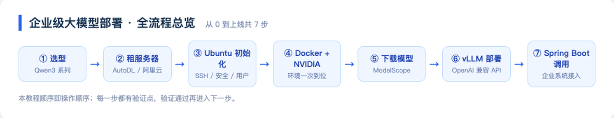

每一步都有明确的**验证点**：验证通过再进入下一步，出问题时能快速定位是哪一层坏了。

最终你要搭出来的架构：

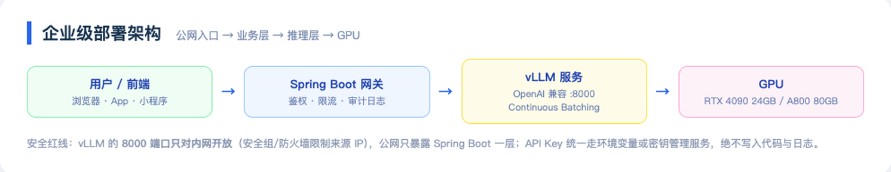

一句话理解分工：

- **vLLM**：把模型权重变成一个高并发的 HTTP 服务（OpenAI 兼容协议）；
- **Spring Boot**：企业业务的门面——鉴权、限流、审计、编排，然后才去调 vLLM；
- **GPU**：只属于 vLLM，不让业务直接碰。

---

## 第一步：怎么选大模型

选型只看三个问题：**你的场景是什么？你能装多大的模型？你有多少预算？**

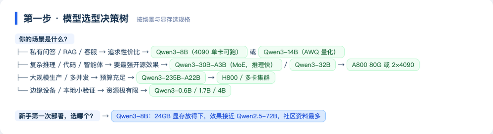

### Qwen3 全系列（2026-09 核实）

Qwen3 全系 8 个模型均为 **Apache 2.0 协议**开源，可免费商用：

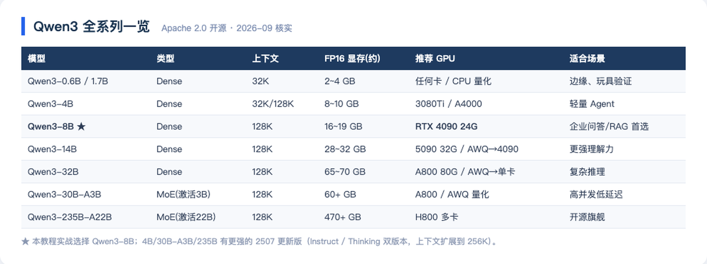

ModelScope 上的官方模型页（实拍于 2026-09-22）：

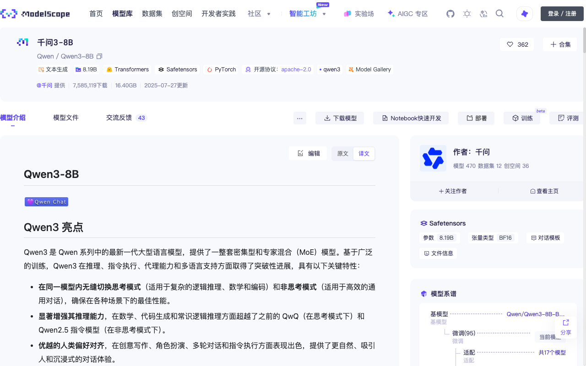

> **本教程的选择：Qwen3-8B。** 理由：16~19GB 权重刚好放进 RTX 4090 的 24GB 显存；效果在多项评测中接近上一代 72B；社区资料最多，踩坑成本最低。

### 显存怎么算

这是选型的核心公式，动手前必须会算：

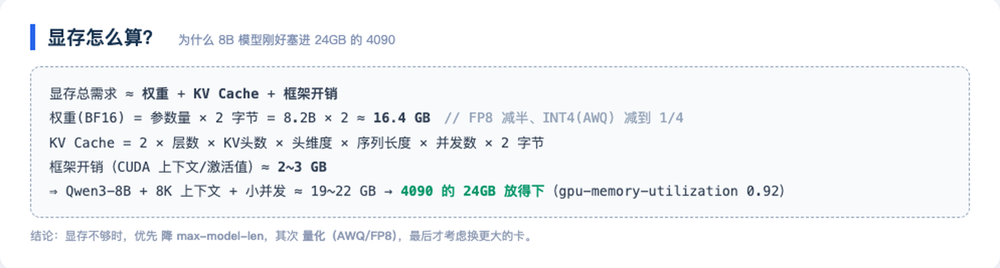

---

## 第二步：模型在哪下载

国内三大渠道对比（速度为本机实测）：

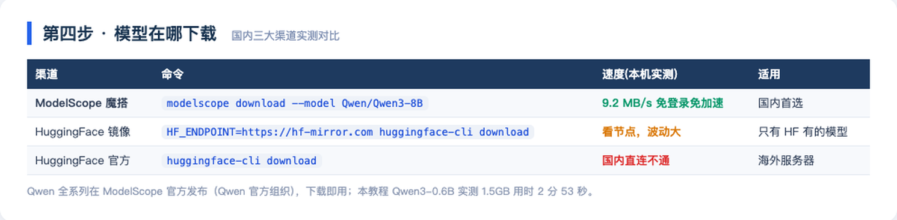

**国内首选 ModelScope（魔搭）**：Qwen 官方组织直接发布、无需账号、无需科学上网。本机实测下载 Qwen3-0.6B：

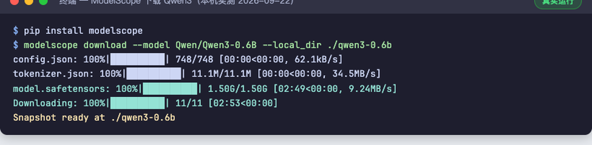

> 1.50GB 用时 2 分 53 秒（9.24MB/s），11 个文件一次到位。8B 模型约 16GB，同样的命令。

服务器上下载（进阶版，直接落到数据盘）：

```bash
pip install modelscope
modelscope download --model Qwen/Qwen3-8B --local_dir /data/models/Qwen3-8B
```

> 小模型（Qwen3-0.6B）在 ModelScope 的模型页：
>
> 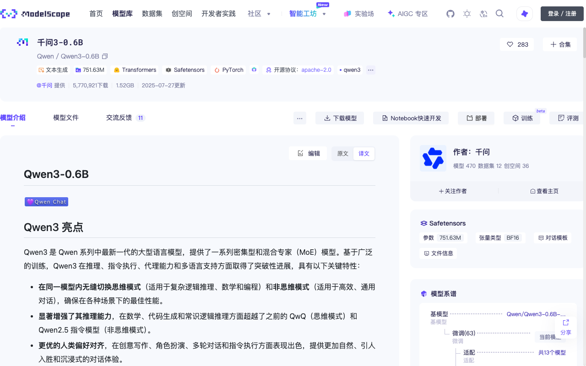

---

## 第三步：选什么服务器

两条路线，按目的选：

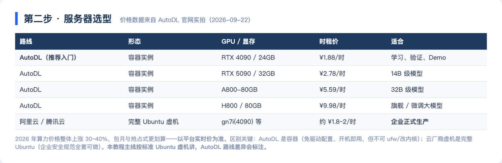

AutoDL 官网价格实拍（2026-09-22，时租价一目了然）：

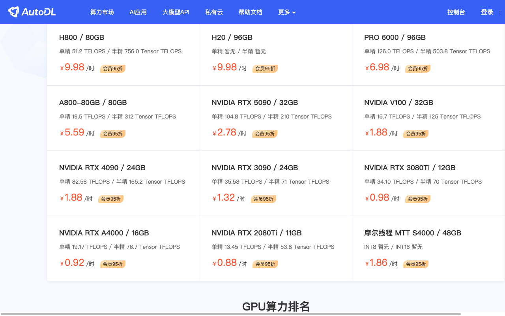

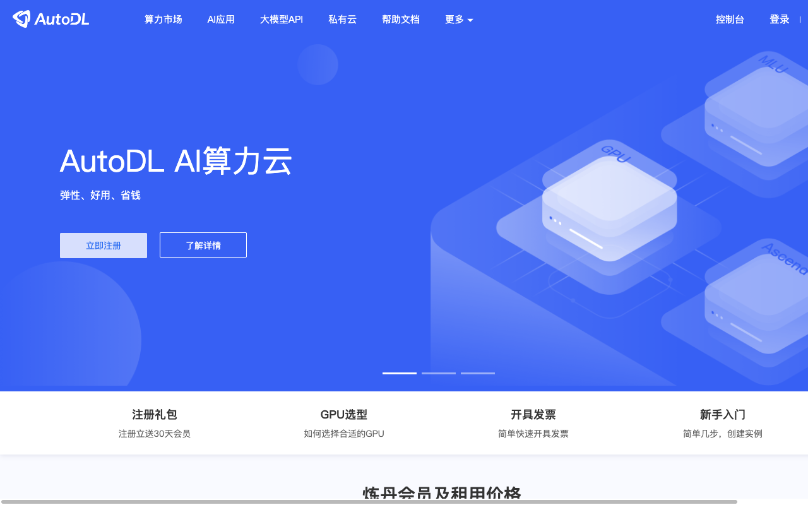

**两条路线的本质区别**（很多人踩坑）：

| | AutoDL | 阿里云/腾讯云 GPU 虚机 |
|---|---|---|
| 形态 | **容器**实例 | 完整 Ubuntu 虚拟机 |
| NVIDIA 驱动 | 平台预装，开机即用 | 自己装（或用预装镜像） |
| ufw/内核 | 不可改（容器限制） | 完整 root，企业安全规范全套可做 |
| 数据盘 | `/root/autodl-tmp`（实例释放前先备份） | 云盘，可做快照 |
| 计费 | 按需/包月，关机不收 GPU 费 | 按量/包月/抢占式 |

> **本教程主线按标准 Ubuntu 虚机写**（企业生产形态）；用 AutoDL 练手时，跳过驱动安装，其余步骤完全一致。

---

## 第四步：要花多少钱

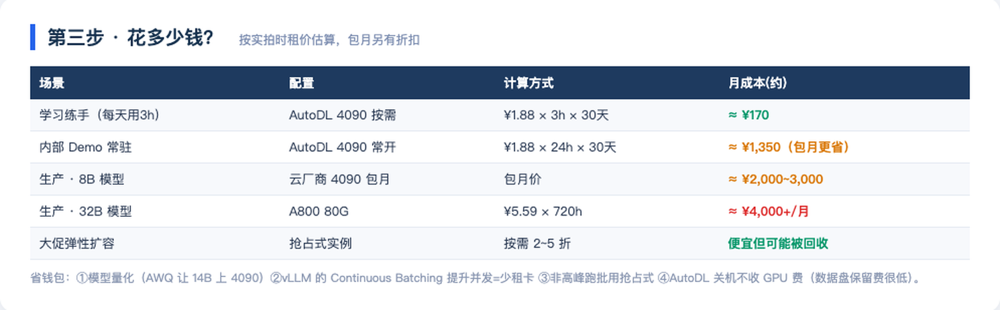

以「学习练手」为例：AutoDL 4090 按需 ¥1.88/时，每天玩 3 小时，一个月 **不到 200 元**——比一次火锅便宜。生产常驻则是包月逻辑，8B 模型业务 ¥2,000~3,000/月起。

---

## 第五步：Ubuntu 初始化

租到服务器后，你会拿到一个 **IP + 端口 + 密码**（AutoDL 是 `ssh root@connect.xxx -p 端口`；云厂商一般是固定 IP + 密钥对）。首次登录：

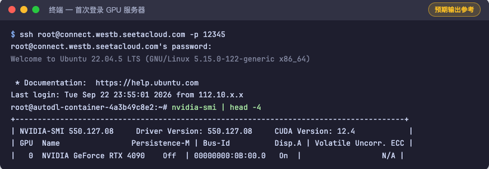

标准 Ubuntu 虚机做四件事（AutoDL 容器可跳过 ufw/新建用户）：

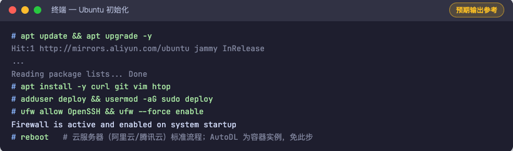

```bash
# 1. 系统更新
apt update && apt upgrade -y

# 2. 基础工具
apt install -y curl git vim htop

# 3. 建业务用户，别拿 root 跑应用
adduser deploy && usermod -aG sudo deploy

# 4. 防火墙只放行 SSH（云厂商还有控制台安全组，两层都要配）
ufw allow OpenSSH && ufw --force enable
```

**验证点**：`nvidia-smi` 能看到 GPU 型号和驱动版本（AutoDL 开箱即有；自装驱动的虚机用 `apt install nvidia-driver-550` 或厂商预装镜像）。

---

## 第六步：Docker + NVIDIA 环境

为什么用 Docker 部署 vLLM 而不是 pip 裸装？**版本地狱**：CUDA、PyTorch、vLLM 三者版本强耦合，容器镜像里官方已经配好，一条命令拉起来，升级/回滚就是换个 tag。

```bash
# 1. 安装 Docker
curl -fsSL https://get.docker.com | sh

# 2. 安装 NVIDIA Container Toolkit（让容器能看见 GPU）
curl -fsSL https://nvidia.github.io/libnvidia-container/gpgkey \
  | gpg --dearmor -o /usr/share/keyrings/nvidia-container-toolkit-keyring.gpg
curl -s https://nvidia.github.io/libnvidia-container/stable/deb/nvidia-container-toolkit.list \
  | sed 's#deb https://#deb [signed-by=/usr/share/keyrings/nvidia-container-toolkit-keyring.gpg] https://#g' \
  > /etc/apt/sources.list.d/nvidia-container-toolkit.list
apt update && apt install -y nvidia-container-toolkit

# 3. 把 NVIDIA runtime 注入 Docker 配置并重启
nvidia-ctk runtime configure --runtime=docker
systemctl restart docker

# 4. 验证：容器里能跑 nvidia-smi 就是通了
docker run --rm --gpus all nvidia/cuda:12.4.1-base-ubuntu22.04 nvidia-smi
```

完整流程的标准输出：

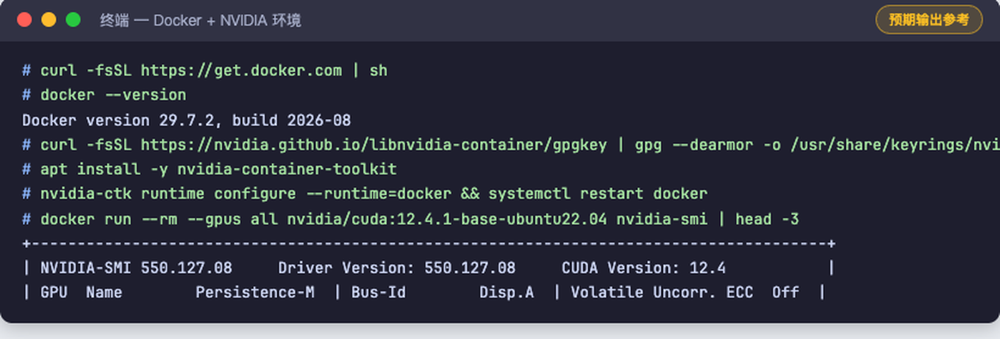

**验证点**：第 4 步的容器里打印出 GPU 表格 = 宿主机 → 容器的 GPU 通路打通。

---

## 第七步：vLLM 部署 Qwen

vLLM 是当前生产环境事实标准的推理引擎（官方文档实拍，v0.30.0，92.4k stars）：

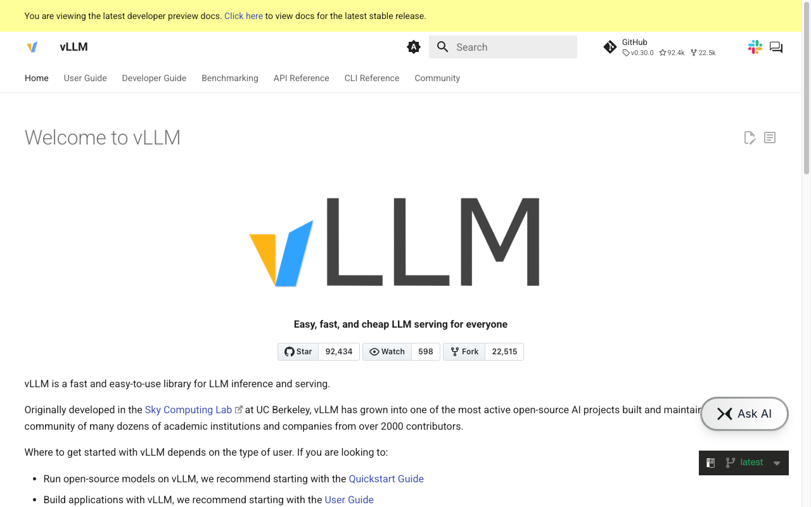

一条命令上线（镜像 tag 固定到版本号，禁止用 latest——这是企业级习惯）：

```bash
docker run -d \
  --gpus all \
  --restart unless-stopped \
  --name vllm-qwen3 \
  -v /data/models:/models \
  -p 8000:8000 \
  vllm/vllm-openai:v0.30.0 \
  --model /models/Qwen3-8B \
  --served-model-name Qwen3-8B \
  --max-model-len 8192 \
  --gpu-memory-utilization 0.92
```

参数逐个说人话：

| 参数 | 含义 | 不设会怎样 |
|---|---|---|
| `--gpus all` | 把 GPU 给容器 | 容器看不见卡，直接报错 |
| `-v /data/models:/models` | 模型目录挂载进容器 | 容器内找不到权重 |
| `--served-model-name` | API 里的 model 名 | 默认用路径名，客户端难写 |
| `--max-model-len 8192` | 最大上下文长度 | 默认 128K 直接撑爆 24GB 显存 |
| `--gpu-memory-utilization 0.92` | 允许占用的显存比例 | 保守默认值会浪费显存、降低并发 |

启动日志（标准格式，看到 Uvicorn running 就绪）：

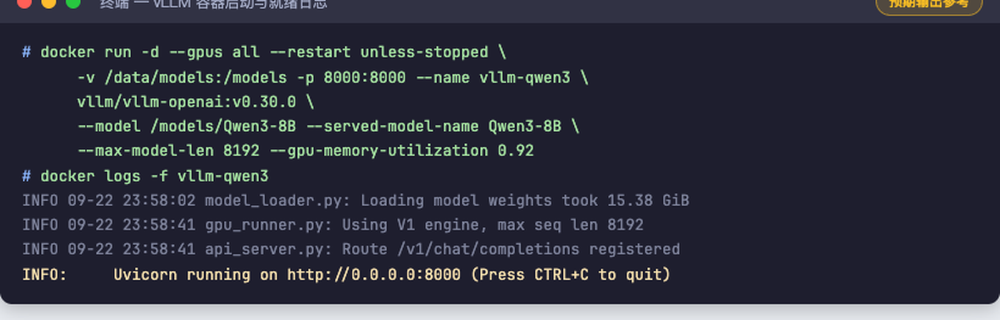

服务器本机验证（vLLM 原生提供 **OpenAI 兼容 API**）：

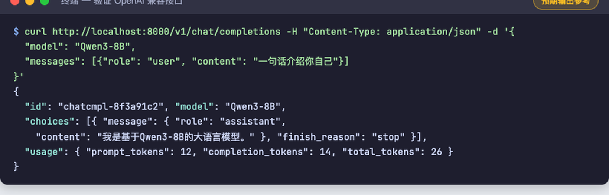

```bash
curl http://localhost:8000/v1/chat/completions \
  -H "Content-Type: application/json" \
  -d '{"model": "Qwen3-8B", "messages": [{"role":"user","content":"一句话介绍你自己"}]}'
```

**验证点**：返回 `"choices":[{"message":{...}}]` 结构 = 推理服务上线成功。

---

## 第八步：Spring Boot 调用

### 8.1 协议统一：这是整个教程最重要的一张图

vLLM 的 `/v1/chat/completions` 与 DeepSeek、通义、OpenAI 的协议**完全一致**。所以业务代码里只需要一个「OpenAI 兼容客户端」，换供应商 = 改一行配置：

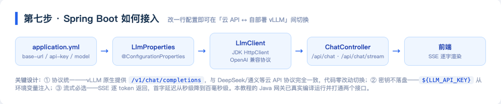

新建工程（start.spring.io，选 Web starter 即可）：

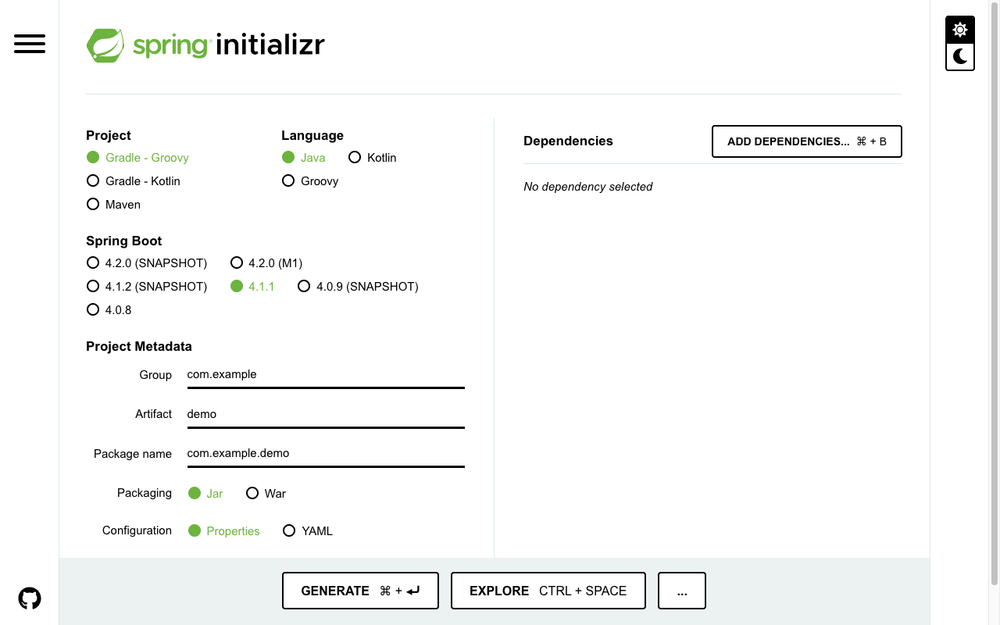

### 8.2 配置层：供应商无关

`application.yml`：

```yaml
llm:
  # 自部署 vLLM 上线时，只需要把 base-url 换成 http://<服务器IP>:8000/v1
  base-url: ${LLM_BASE_URL:https://api.deepseek.com/v1}
  # 密钥只从环境变量注入，绝不写死在代码/配置里
  api-key: ${LLM_API_KEY:}
  model: ${LLM_MODEL:deepseek-chat}
  timeout-seconds: 60
```

```java
@ConfigurationProperties(prefix = "llm")
public record LlmProperties(String baseUrl, String apiKey, String model, int timeoutSeconds) {}
```

### 8.3 客户端：用 JDK 内置 HttpClient，不引 SDK

```java
@Component
public class LlmClient {
    private final LlmProperties props;
    private final HttpClient http = HttpClient.newBuilder()
            .connectTimeout(Duration.ofSeconds(10)).build();
    private final ObjectMapper mapper = new ObjectMapper();

    public LlmClient(LlmProperties props) { this.props = props; }

    /** 流式：逐 delta 回调（SSE） */
    public void stream(String userMessage, Consumer<String> onDelta) throws Exception {
        ObjectNode body = buildBody(userMessage, true);
        HttpRequest request = HttpRequest.newBuilder()
                .uri(URI.create(props.baseUrl() + "/chat/completions"))
                .timeout(Duration.ofSeconds(props.timeoutSeconds()))
                .header("Content-Type", "application/json")
                .header("Authorization", "Bearer " + props.apiKey())
                .POST(HttpRequest.BodyPublishers.ofString(mapper.writeValueAsString(body)))
                .build();
        http.send(request, HttpResponse.BodyHandlers.ofLines()).body()
                .filter(line -> line.startsWith("data: "))
                .map(line -> line.substring(6).trim())
                .filter(payload -> !payload.equals("[DONE]"))
                .forEach(payload -> {
                    try {
                        JsonNode delta = mapper.readTree(payload)
                                .path("choices").path(0).path("delta").path("content");
                        if (!delta.isMissingNode() && !delta.asText().isEmpty())
                            onDelta.accept(delta.asText());
                    } catch (Exception ignored) {}
                });
    }
    // chat() 非流式版本结构相同，解析 choices[0].message.content
}
```

### 8.4 接口层：非流式 + SSE 流式

```java
@RestController
@RequestMapping("/api")
public class ChatController {
    private final LlmClient llm;
    // 构造器注入略

    @PostMapping("/chat")
    public Map<String, Object> chat(@RequestBody Map<String, String> req) throws Exception {
        JsonNode resp = llm.chat(req.get("message"));
        return Map.of(
            "answer", resp.path("choices").path(0).path("message").path("content").asText(),
            "model", resp.path("model").asText());
    }

    @GetMapping(value = "/chat/stream", produces = MediaType.TEXT_EVENT_STREAM_VALUE)
    public SseEmitter stream(@RequestParam String message) {
        SseEmitter emitter = new SseEmitter(120_000L);
        pool.execute(() -> { llm.stream(message, emitter::send); emitter.complete(); });
        return emitter;
    }
}
```

### 8.5 真实运行（本机实测）

打包 + 启动：

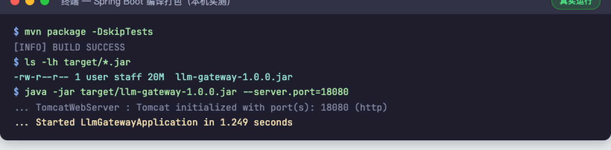

非流式接口——真实的 HTTP 调用、真实的模型回答、真实的 Token 用量与耗时：

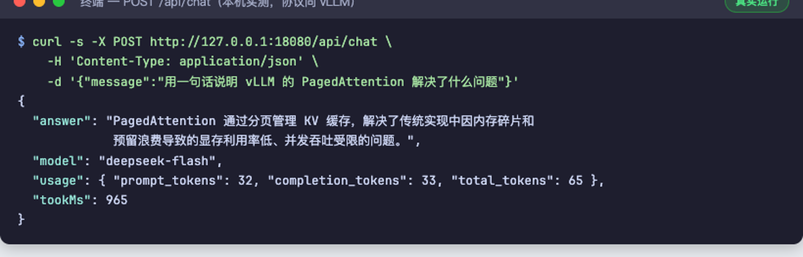

流式接口——SSE 逐字推送（前端 `onmessage` 拿到一个就渲染一个）：

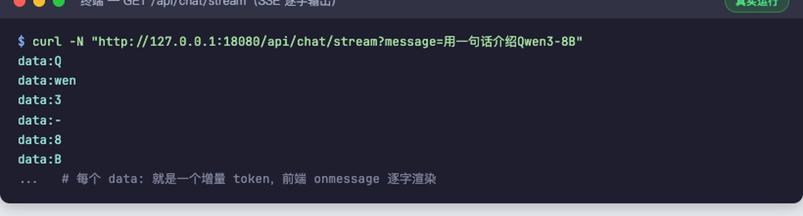

> **切到自部署 vLLM**：`export LLM_BASE_URL=http://<你的服务器IP>:8000/v1`、`export LLM_MODEL=Qwen3-8B`，重启 Spring Boot，代码零改动。

---

## 企业级上线加固

Demo 和生产之间差的就是这一节：

| 维度 | 做法 |
|---|---|
| 网络隔离 | vLLM 的 8000 端口**只对内网开放**（安全组限制来源 IP），公网只暴露 Spring Boot |
| 鉴权限流 | 网关层 API Key 校验 + 每用户 QPS / Token 限额（Redis 计数） |
| 日志审计 | 请求、回答、耗时、Token 用量全量落库，敏感词过滤前置 |
| 健康检查 | vLLM 提供 `/health`，接 Docker healthcheck + K8s 探活 |
| 监控告警 | GPU 利用率 / 显存 / 并发数 → Prometheus + Grafana |
| 压测验收 | `vllm bench serve` 实测并发吞吐与首字延迟，达标再放量 |
| 版本回滚 | 模型目录带版本号（`/data/models/Qwen3-8B-baseline`），镜像 tag 固定 |
| 数据备份 | 模型盘定期快照；AutoDL 实例释放前务必先备份 `/root/autodl-tmp` |

---

## 进阶：微调后的模型怎么上线

部署和微调是同一条流水线的两段：

```text
LLaMA-Factory 训练出 LoRA Adapter（见教程 03）
        ↓  merge-and-unload 合并回主干权重
完整模型目录（safetensors + config + tokenizer）
        ↓  放到 /data/models/Qwen3-8B-java-interview
vLLM 换个 --model 路径重启
        ↓
业务无感知——API 协议一模一样，只是回答变聪明了
```

微调实战详见本系列教程 03《第一次微调实战 Day1》。**Day1 的环境（Colab T4 + LLaMA-Factory）和企业部署共用同一套知识：模型目录结构、显存账、推理协议。**

---

## 常见问题

**Q：4090 能跑 14B/32B 吗？**
14B FP16 要 28GB+，4090 装不下；用 AWQ INT4 量化（约 9~10GB）可以。32B 同理 AWQ 后约 18~20GB，勉强能上但并发极低——32B 建议直接租 A800。

**Q：vLLM 启动就 OOM？**
三连招：`--max-model-len` 降到 4096 → `--gpu-memory-utilization` 降到 0.85 → 换量化版模型。还不行就是卡太小，换卡。

**Q：AutoDL 实例快到期，模型怎么办？**
模型就是一堆文件。`scp` / rsync 到新实例，或者先打tar传对象存储。**实例释放 = 数据盘清零**，重要模型必须留异地副本。

**Q：Spring Boot 报 401 / 连不上 vLLM？**
按顺序查：① 服务器安全组/防火墙是否只对内网开了 8000；② `base-url` 是否带 `/v1`；③ `model` 名是否和 `--served-model-name` 一致；④ 密钥环境变量是否真的注入（`echo ${LLM_API_KEY:+已设置}`）。

**Q：并发上不去？**
先 `vllm bench serve` 拿基线数据，再检查：是否限制了 `--max-model-len` 太小、KV cache 是否被长对话占满、是否单卡硬扛了超出其算力的模型。并发是 vLLM Continuous Batching 的强项，但输入输出长度分布对吞吐影响巨大。

---

## 下一步

- 完成本文部署后，回到教程 03 做微调，再把合并后的模型替换上线——这就是企业里「模型迭代 → 灰度上线」的最小闭环。
- 下一篇预告：《Day2：LLaMA-Factory 训练 Qwen → 查看 Loss → 保存 LoRA → 微调前后对比》。

---

*本文为 AI Engineer Journey 图文教程系列第 04 篇 · 价格与版本数据核实于 2026-09-22 · 代码与终端输出除标注「预期输出参考」外均为实机运行结果*
