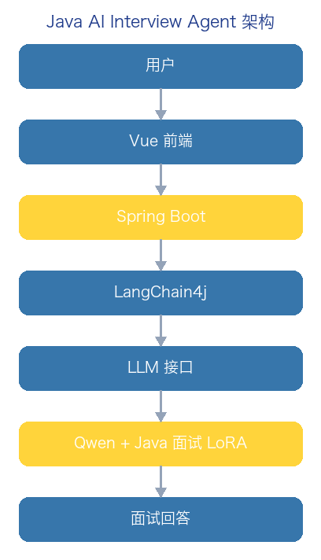
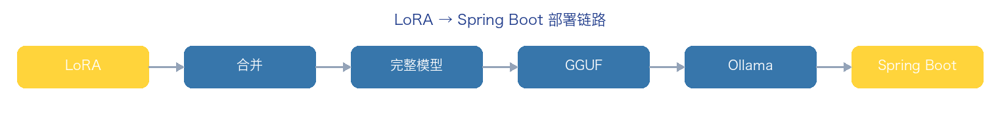

# 大模型微调实战 Day3：把 LoRA 模型接入 Ollama / Spring Boot / LangChain4j

> 写给有 Java / 后端基础、昨天刚用 LLaMA-Factory 训出一个 LoRA 适配器、今天想让它真正被自己程序调用的开发者。
> 本文用「合并 → 转 GGUF → 进 Ollama → Spring Boot 调用」的顺序，一次走通从「训练产物」到「业务可调用」的最后一公里。
>
> **配图真实性说明**：① 架构图 / 流程图均为本教程自制的示意框图（蓝黄主色）；② 文中代码块为真实可执行的片段，但终端与 Ollama 界面截图因依赖真实 Colab / 本地 GPU 环境，本教程以「预期输出」形式给出而非伪造截图；③ 涉及版本号、依赖坐标请以下载时官网为准。

## 一、今天要做出什么

昨天你只是「训练出了一个模型插件」，今天要让 Java 程序真正调用它。最终目标是做出：

**Java AI Interview Agent【Java AI 面试智能体】**

整体架构如下：



```text
用户
  ↓
Vue 前端
  ↓
Spring Boot
  ↓
LangChain4j
  ↓
LLM 接口
  ↓
Qwen + Java Interview LoRA
  ↓
面试回答
```

## 二、先搞懂：LoRA 不能直接给 Ollama

这是很多新手第一个坑。你昨天训练出来的产物叫：

```text
java-interview-lora
```

它不是完整模型，它只是：

```text
Adapter【适配器】
```

用个类比：你买了一台手机，Qwen 模型是手机本体，LoRA 是一个专业插件。两者组合，才变成「Java 面试专家模型」。

```text
Qwen
  +
Java Interview LoRA
  =
Java 面试专家模型
```

所以正确的流程是：

```text
LoRA
  ↓
合并（merge）
  ↓
完整模型
  ↓
Ollama 加载
```

> [!NOTE]
> LoRA 只保存了「相对原模型的增量权重」。没有基座模型，它自己什么都干不了。任何「直接把 LoRA 丢给 Ollama」的尝试都会失败。

## 三、Day3 整体路线

今天要按顺序走完六步：

```text
Step1  Colab 合并 LoRA
Step2  导出 HuggingFace 模型
Step3  转换 GGUF
Step4  导入 Ollama
Step5  Spring Boot 调用
Step6  LangChain4j 接入
```

完整链路如下图：



## 四、Step1：合并 LoRA（Colab）

回到昨天训练用的 Colab。假设你的训练输出在：

```text
output/java-interview-lora
```

现在需要把 `Qwen2.5-3B` 基座和这个 adapter 合并成完整模型。

先安装依赖：

```python
!pip install peft transformers accelerate
```

创建 `merge_lora.py`：

```python
from transformers import AutoModelForCausalLM, AutoTokenizer
from peft import PeftModel

base_model = "Qwen/Qwen2.5-3B-Instruct"
adapter_path = "./output/java-interview-lora"

# 加载基础模型
model = AutoModelForCausalLM.from_pretrained(
    base_model,
    device_map="auto",
)

# 加载 LoRA
model = PeftModel.from_pretrained(model, adapter_path)

# 合并（把增量权重写回基座权重）
model = model.merge_and_unload()

# 保存
model.save_pretrained("./java-interview-qwen")

tokenizer = AutoTokenizer.from_pretrained(base_model)
tokenizer.save_pretrained("./java-interview-qwen")

print("merge success")
```

运行：

```bash
python merge_lora.py
```

预期得到目录 `java-interview-qwen`，这就是合并后的完整模型。

## 五、Step2：先测试合并后的模型

别急着上 Ollama，先用 Python 验证合并没出错：

```python
from transformers import pipeline

pipe = pipeline(
    "text-generation",
    model="./java-interview-qwen",
)

result = pipe(
    "HashMap 为什么线程不安全？",
    max_new_tokens=300,
)

print(result)
```

观察输出里有没有你的「面试风格」（比如它会按 核心原理 / 源码分析 / 项目实践 / 面试话术 来组织回答）。如果还是通用口吻，说明 LoRA 没合并进去，回去检查 adapter 路径。

## 六、Step3：转成 Ollama 支持的 GGUF

Ollama 推荐用 **GGUF** 格式。原因很直接：

```text
原模型：float16，几十 GB  →  个人电脑跑不动
GGUF  ：量化后，几 GB    →  本地 Mac 就能跑
```

安装 llama.cpp（Mac 用 brew，其他平台用源码）：

```bash
brew install llama.cpp
# 或源码方式：
git clone https://github.com/ggerganov/llama.cpp
```

转换：

```bash
python convert_hf_to_gguf.py \
  java-interview-qwen \
  --outfile java-interview.gguf
```

预期得到 `java-interview.gguf`。

> [!WARN]
> GGUF 的量化等级（q4_K_M / q8_0 等）会直接影响回答质量。量化越狠文件越小，但 LoRA 学到的「面试话术」细节越容易丢。先用 q8_0 保质量，体积能接受再降档。

## 七、Step4：导入 Ollama

你的 Mac 应该已经装了 Ollama。先创建一个 `Modelfile`：

```dockerfile
FROM ./java-interview.gguf

PARAMETER temperature 0.7

SYSTEM """
你是一名 Java 高级工程师面试官。
回答需要按照：
1. 核心原理
2. 源码分析
3. 项目实践
4. 面试话术
输出。
"""
```

创建模型：

```bash
ollama create java-interviewer \
  -f Modelfile
```

查看：

```bash
ollama list
```

预期列表里出现 `java-interviewer`。

## 八、Step5：测试 Ollama

```bash
ollama run java-interviewer
```

输入：

```text
ConcurrentHashMap 为什么线程安全？
```

预期类似：

```text
JDK8 取消了 Segment。
核心：
1. CAS
2. synchronized
3. Node
4. TreeBin
面试回答：……
```

> [!NOTE]
> 这一步是「模型能力验证」。Ollama 能答对，才说明前面合并 + 转换 + 导入都对了。不要跳过直接进 Spring Boot，否则查错会非常痛苦。

## 九、Step6：Spring Boot + LangChain4j 接入

你的主场来了——Spring Boot + LangChain4j。

Maven 加依赖：

```xml
<dependency>
    <groupId>dev.langchain4j</groupId>
    <artifactId>langchain4j-ollama-spring-boot-starter</artifactId>
    <version>最新版本</version>
</dependency>
```

配置 `application.yml`：

```yaml
langchain4j:
  ollama:
    chat-model:
      base-url: http://localhost:11434
      model-name: java-interviewer
      temperature: 0.7
```

定义 AI Service 接口：

```java
public interface InterviewAssistant {
    String answer(String question);
}
```

绑定实现：

```java
@Bean
InterviewAssistant assistant(OllamaChatModel model) {
    return AiServices.create(InterviewAssistant.class, model);
}
```

调用：

```java
assistant.answer("HashMap 为什么线程不安全？");
```

完整调用链路：

```text
Spring Boot
  ↓
LangChain4j
  ↓
Ollama
  ↓
java-interviewer
  ↓
Qwen + LoRA
  ↓
答案
```

## 十、升级成真正的 AI Agent

现在你已经有「Java Interview LLM」这个能力。下一步是把它升级成 Agent——加上 **RAG**：

```text
用户问题
  ↓
Retriever
  ↓
Java 知识库
  ↓
Qwen LoRA
  ↓
回答
```

也就是 **RAG 提供企业知识 + Fine-tuning 改变模型行为**。两者不是二选一，而是叠加。

## 十一、你的最终简历项目

这套东西可以直接包装成简历项目：

**Java AI Interview Agent**

技术栈：`Spring Boot` · `LangChain4j` · `Qwen2.5` · `QLoRA` · `LoRA` · `LLaMA-Factory` · `Ollama` · `Milvus` · `RAG` · `Agent`

功能：

- 上传简历
- 自动生成面试题
- AI 模拟面试
- 评分
- 错题复习
- 个性化回答

## 十二、现实约束与部署建议

你现在的 Mac 是 `16G ARM`，能做什么、不能做什么要心里有数：

```text
✅ Ollama 运行 3B / 7B 量化模型
✅ 开发 Spring Boot
✅ 做 RAG
❌ 不适合长期运行合并后的 16bit 模型（显存不够）
```

所以生产建议是「分工」：

```text
LoRA 训练  →  云 GPU
导出 GGUF  →  Mac Ollama 测试
服务器部署  →  vLLM
```

> [!NOTE]
> 本地 Ollama 适合「验证 + 开发」，真正的并发服务交给云上的 vLLM（参考教程 04 的企业级部署路线）。

## 十三、下一步：Day4 把 RAG + LoRA 结合

因为真正的企业项目不是「训练一个模型」，而是：

> **RAG 提供企业知识 + Fine-tuning 改变模型行为**

下一步我们要做出：

```text
Java AI Interview Agent V1
  = Qwen LoRA
  + Milvus 知识库
  + LangChain4j
  + Spring Boot
```

这会直接贴近你现在的 Java + AI 求职方向。
