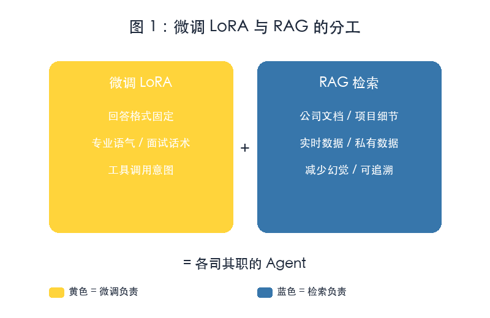
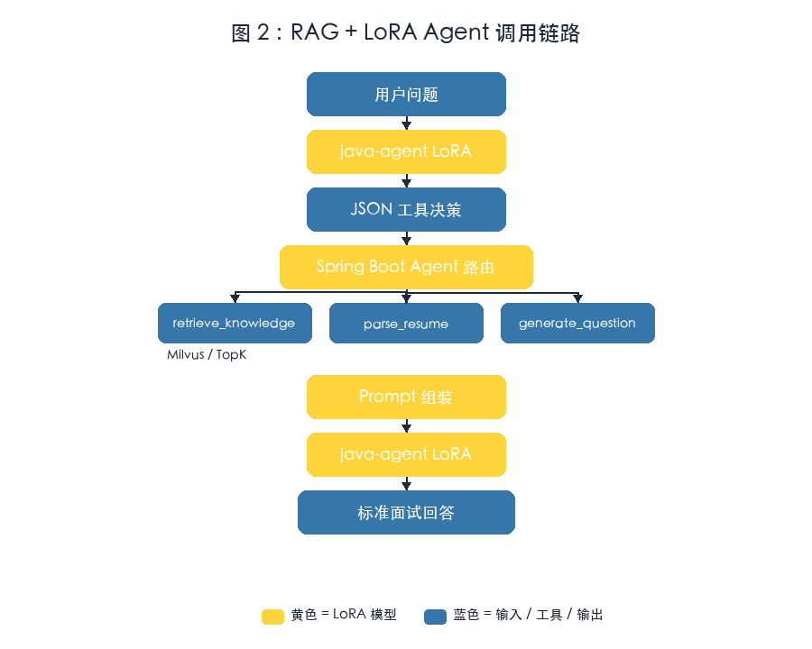

# 大模型微调实战 Day4：RAG + LoRA 结合，构建带工具调用的 Agent

> 写给有 Java / 后端基础、已经能把 LoRA 接进 Ollama 的开发者。
> 今天解决一个企业级 AI 应用的核心问题：**让模型既懂「怎么答」，又能查「答什么」。**
> 文中架构图与流程图为本教程自制示意框图；代码块为可执行片段，真实输出请在本地环境验证。

## 一、今天要做出什么

前一篇我们把 `Qwen + Java Interview LoRA` 接进了 Ollama 和 Spring Boot。今天给它加上 **RAG 检索**和**工具调用**，让它从「会按 Java 面试格式说话的模型」升级成一个真正的 Agent。

最终形态：

```text
用户提问
  ↓
Spring Boot Agent 服务
  ├─ 检索知识库（RAG）
  ├─ 调用简历解析工具
  ├─ 调用评分工具
  └─ 汇总给 LoRA 模型生成回答
  ↓
标准面试风格的最终答案
```

核心认知：

```text
LoRA 负责：回答格式、专业口吻、工具调用意图
RAG   负责：公司文档、实时知识、项目细节
Agent 负责：拆解任务、选择工具、串联结果
```

## 二、先搞懂：为什么要把「知识」和「行为」分开

很多初学者第一反应是：「能不能把公司文档也微调进 LoRA？」理论上可以，但不推荐。

### 2.1 微调记住知识的代价

| 问题 | 说明 |
| --- | --- |
| 数据更新成本高 | 每次文档变更都要重新准备训练数据、重新训练 |
| 幻觉难控制 | 模型可能「记错」或「编造」细节 |
| 训练集难覆盖 | 公司文档、接口文档、实时数据不可能全部入训练集 |

### 2.2 RAG 提供知识的优势

```text
文档更新  →  重新切分、重新入库  →  模型立刻可见
```

- 不需要重训模型
- 答案可追溯
- 实时数据、私有数据都能接

### 2.3 两者的分工边界



*图 1：微调负责「格式与意图」，RAG 负责「知识与上下文」*

| 能力 | 微调 LoRA | RAG |
| --- | --- | --- |
| 回答格式 / 语气 / 工具意图 | ✅ | ❌ |
| 公司文档 / 实时数据 / 减少幻觉 | ❌ | ✅ |

> [!NOTE] 一句话总结
> 让 LoRA 学会「怎么说」和「调什么工具」，让 RAG 告诉它「说什么」。

## 三、Step1：训练一个「只负责格式与工具」的 LoRA

今天训练的 LoRA 不负责背面试题，只负责两件事：

1. 识别用户问题需要调用哪些工具；
2. 按固定格式输出工具调用决策，或把检索结果组织成标准面试回答。

### 3.1 训练数据长什么样

格式和 Day1 一致，但样本重点变了。一条示意样本：

```json
{
  "instruction": "判断是否需要检索知识库，并输出工具调用决策。",
  "input": "HashMap 为什么线程不安全？",
  "output": "{\"thought\": \"Java 基础题，需要检索后按面试格式回答。\", \"tools\": [\"retrieve_knowledge\"], \"query\": \"HashMap 线程不安全原因\"}"
}
```

类似地，「根据简历生成面试题」对应 `"tools": ["parse_resume"]`，「分析项目经历」对应 `"tools": ["retrieve_knowledge", "parse_resume"]`。

关键点：样本不直接给答案原文，而是给出「工具调用决策」，让模型在 Spring Boot 侧和 RAG / 工具链配合。

### 3.2 LLaMA-Factory 配置

数据存为 `tool_agent_train.json`，新建 `agent_lora.yaml`：

```yaml
model_name_or_path: Qwen/Qwen2.5-3B-Instruct
finetuning_type: lora
lora_target: all
output_dir: output/java-agent-lora

dataset: tool_agent_train
num_train_epochs: 3
per_device_train_batch_size: 1
gradient_accumulation_steps: 8
learning_rate: 5.0e-5
lr_scheduler_type: cosine
logging_steps: 10
save_steps: 100
warmup_steps: 100

bf16: true
ddo: false
```

运行：

```bash
llamafactory-cli train agent_lora.yaml
```

> [!WARN] 不要编造输出
> 训练时间、显存占用、loss 曲线请在本地 Colab / GPU 查看。本教程只给配置骨架。

### 3.3 合并并导出为 GGUF

和 Day3 相同，先合并：

```python
from transformers import AutoModelForCausalLM, AutoTokenizer
from peft import PeftModel

base = "Qwen/Qwen2.5-3B-Instruct"
adapter = "./output/java-agent-lora"

model = AutoModelForCausalLM.from_pretrained(base, device_map="auto")
model = PeftModel.from_pretrained(model, adapter)
model = model.merge_and_unload()

model.save_pretrained("./java-agent-qwen")
tokenizer = AutoTokenizer.from_pretrained(base)
tokenizer.save_pretrained("./java-agent-qwen")
```

再转 GGUF 并导入 Ollama：

```bash
python convert_hf_to_gguf.py \
  ./java-agent-qwen \
  --outfile java-agent.gguf
```

```dockerfile
FROM ./java-agent.gguf

PARAMETER temperature 0.3

SYSTEM """
你是一名 Java 面试 Agent。
根据用户问题决定调用什么工具，输出合法 JSON，包含 thought、tools、query 字段。
"""
```

```bash
ollama create java-agent -f Modelfile
ollama list
```

## 四、Step2：用 RAG 提供知识

模型会输出 `"tools": ["retrieve_knowledge"]` 和 `query`。接下来让 Spring Boot 真的把知识找回来。

### 4.1 准备知识库

按主题放 Markdown 文档：

```text
knowledge/
├── java/
│   ├── hashmap.md
│   ├── concurrenthashmap.md
│   └── jvm.md
├── ai/
│   ├── rag.md
│   └── agent.md
└── project/
    └── order-system.md
```

### 4.2 文档切片 Chunk

RAG 不会把整个文件塞进 Prompt。常见参数：`chunk_size 500~1000 tokens`，`overlap 100~200 tokens`。可以用 `RecursiveCharacterTextSplitter` 按标题、段落、句子多级切分。

### 4.3 Embedding 与向量库

```text
Chunk
  ↓
Embedding 模型（如 nomic-embed-text）
  ↓
768 / 1024 维向量
  ↓
Milvus 向量库
```

LangChain4j 关键 Bean：

```java
@Bean
EmbeddingModel embeddingModel() {
    return OllamaEmbeddingModel.builder()
        .baseUrl("http://localhost:11434")
        .modelName("nomic-embed-text")
        .build();
}

@Bean
EmbeddingStore<TextSegment> embeddingStore() {
    return MilvusEmbeddingStore.builder()
        .host("localhost")
        .port(19530)
        .dimension(768)
        .build();
}
```

> [!NOTE] Embedding 模型也走 Ollama
> `nomic-embed-text` 体积很小，本地 Mac 即可运行。和 LLM 分开管理，避免互相抢占资源。

## 五、Step3：在 Spring Boot 里把两者串成 Agent

### 5.1 完整调用链路



*图 2：Spring Boot Agent 控制流——先让 LoRA 决策工具，再执行 RAG / 工具，最后把结果交给 LoRA 生成回答*

```text
用户问题
  ↓
java-agent（LoRA 模型）
  ↓
JSON 工具决策（thought + tools + query）
  ↓
Spring Boot Agent 路由
  ├─ retrieve_knowledge → Milvus → TopK 文档
  ├─ parse_resume       → 解析上传的 PDF/Word
  └─ generate_question  → 基于简历生成面试题
  ↓
Prompt 组装（系统提示 + 检索结果 + 原始问题）
  ↓
java-agent（LoRA 模型）
  ↓
标准面试回答
```

### 5.2 Agent 路由代码骨架

定义工具接口：

```java
public interface AgentTool {
    String name();
    String run(String input);
}
```

知识库检索工具：

```java
@Component
public class RetrieveKnowledgeTool implements AgentTool {
    @Autowired private EmbeddingStore<TextSegment> store;
    @Autowired private EmbeddingModel embeddingModel;

    @Override public String name() { return "retrieve_knowledge"; }

    @Override
    public String run(String query) {
        Embedding embedded = embeddingModel.embed(query).content();
        return store.findRelevant(embedded, 3).stream()
            .map(m -> m.embedded().text())
            .collect(Collectors.joining("\n---\n"));
    }
}
```

### 5.3 让 LoRA 输出可解析的 JSON

AI Service 接口与绑定：

```java
public interface AgentDecisionService {
    @SystemMessage("""
        你是 Java 面试 Agent 的决策器。
        输出合法 JSON，字段：thought、tools、query。
        """)
    String decide(String userMessage);
}

@Bean
AgentDecisionService decisionService(OllamaChatModel model) {
    return AiServices.create(AgentDecisionService.class, model);
}
```

Controller 编排：

```java
@PostMapping("/interview")
public String interview(@RequestBody String question) {
    String decisionJson = decisionService.decide(question);
    AgentDecision decision = objectMapper.readValue(decisionJson, AgentDecision.class);

    StringBuilder context = new StringBuilder();
    for (String toolName : decision.getTools()) {
        AgentTool tool = toolRegistry.get(toolName);
        context.append(tool.run(decision.getQuery())).append("\n");
    }

    return finalAnswerService.answer(buildPrompt(question, context.toString()));
}
```

Prompt 组装：

```java
private String buildPrompt(String question, String context) {
    return String.join("\n",
        "你是一名 Java 高级面试官。请根据参考资料回答用户问题。",
        "",
        "参考资料：",
        "---",
        context,
        "---",
        "",
        "问题：" + question,
        "",
        "请按：1. 核心原理 2. 源码分析 3. 项目实践 4. 面试话术 输出。"
    );
}
```

> [!WARN] JSON 输出不稳定怎么办
> 如果模型偶尔输出非 JSON，先在 SYSTEM 里强调「只输出 JSON」；必要时把 `temperature` 降到 0.1，或在 Java 侧用正则兜底提取 JSON 块。

## 六、Step4：评测与踩坑

### 6.1 评测维度

| 维度 | 测什么 | 方法 |
| --- | --- | --- |
| 工具决策准确率 | 问题该调哪个工具 | 准备 20 条测试用例，看 `tools` 字段是否正确 |
| 检索召回率 | 相关知识有没有被找回来 | 人工标注 TopK 是否命中 |
| 回答格式稳定性 | 是否按 4 段式输出 | 跑 50 条样本，统计格式正确率 |
| 幻觉率 | 是否编造文档里没有的内容 | 对比回答与原文 |

### 6.2 常见坑

**坑 1：LoRA 抢答，不输出工具决策**

解决：训练数据里每条样本都先输出工具决策；SYSTEM 里明确禁止直接回答。

**坑 2：检索回无关文档**

解决：检查 Embedding 模型与向量库维度是否一致；调整 chunk_size / overlap；加查询改写。

**坑 3：JSON 解析失败**

解决：SYSTEM 固定输出格式；降低 temperature；Java 侧兜底提取。

**坑 4：两轮调用延迟高**

解决：Embedding、Milvus、Ollama 放在同一内网；决策模型换更小量化版；最终生成改用流式输出。

## 七、下一步：Day5 企业级 RAG Pipeline

今天我们完成了「RAG + LoRA + 工具调用」的 Agent 雏形。下一篇进入纯工程实现：

```text
上传 PDF / Word
  ↓
解析 → Chunk → Embedding
  ↓
Milvus
  ↓
LangChain4j Retriever
  ↓
Spring Boot Agent
  ↓
带引用来源的回答
```
到那一步，你就可以把它包装成简历项目：**Java AI Interview Agent V2**。

技术栈：

```text
Spring Boot · LangChain4j · Qwen2.5 · LoRA · LLaMA-Factory
Ollama · Milvus · RAG · Agent · Tool Calling
```
