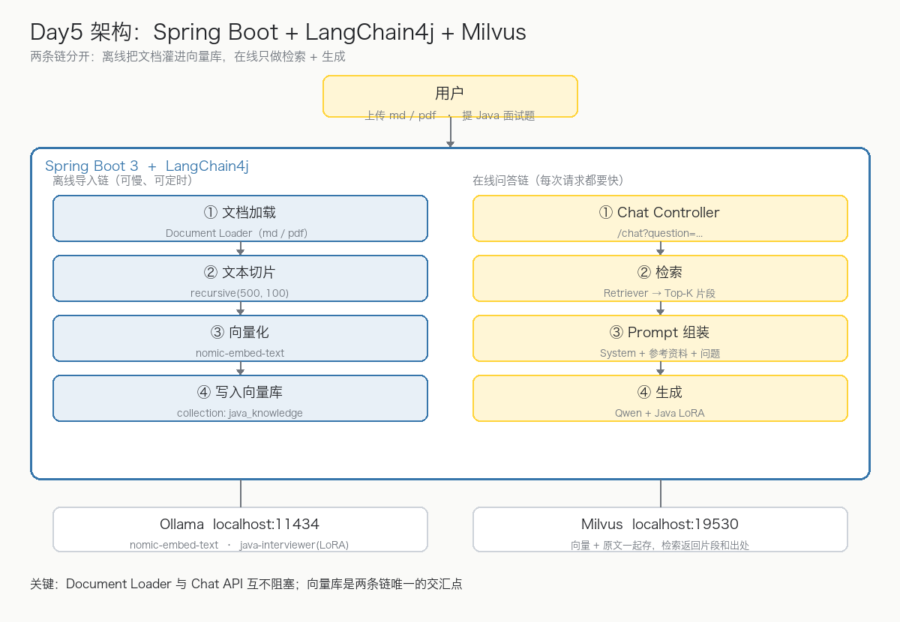
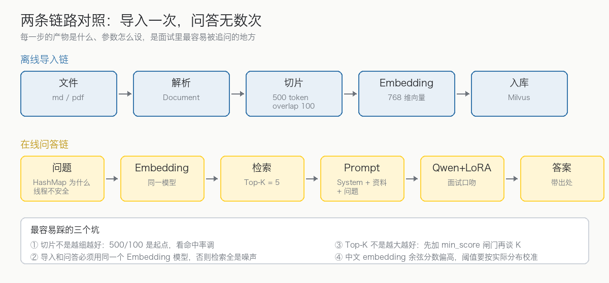

# 大模型微调实战 Day5：Spring Boot + LangChain4j + Milvus 搭 RAG Pipeline

> 写给有 Java / Spring Boot 基础、已经把 LoRA 模型接进 Ollama 的开发者。
> 今天回到你最熟悉的领域，把前四天的成果装进一个真正的 Spring Boot 工程。
> 文中架构图与流程图为本教程自制示意框图；代码块为可执行片段，真实输出请在本地环境验证。

## 一、今天要做出什么

Day1～Day3 你有了微调好的 `Qwen + Java Interview LoRA`，Day4 理解了 RAG + LoRA 的分工。今天用 Spring Boot + LangChain4j + Milvus 把它们装进一个工程，做出 **Java AI Interview Agent V3**：用户上传 `Java面试笔记.md`、`项目文档.pdf`，然后直接用 Java 面试题提问，模型基于这些资料作答。



今天最重要的一个认知是：**这是两条链，不是一条**。

| | 离线导入链 | 在线问答链 |
| --- | --- | --- |
| 触发时机 | 上传文档时，一次一条 | 用户提问，每次请求 |
| 性能要求 | 可以慢、可以定时跑 | 每次都要快（秒级） |
| 失败处理 | 记日志跳过，不影响服务 | 明确报错，绝不返回空答案 |
| 汇合点 | **Milvus 向量库** | **Milvus 向量库** |

把这两条链混在一个 Service 里写，是 RAG 工程最常见的腐烂起点——改切片参数会碰坏问答，压测问答会拖垮导入。



## 二、技术选型

| 层 | 选型 | 说明 |
| --- | --- | --- |
| 后端 | Spring Boot 3 | 你的主场 |
| AI 框架 | LangChain4j | Java 生态最成熟的 LLM 编排层 |
| 向量数据库 | Milvus | 之前已装 `milvus-lite`，端口 19530 |
| Embedding | `nomic-embed-text`（Ollama） | 768 维，本地跑不花钱 |
| 大模型 | `java-interviewer`（Qwen + Java LoRA） | Day3 的产物，Ollama 暴露 |

选型里最重要的一条纪律：**导入链和问答链必须用同一个 Embedding 模型**。两个不同的模型产出的向量不在同一个空间里，余弦相似度是随机数，检索结果全是噪声——而且这种错误不报异常，只会让答案慢慢变得「玄学」。

## 三、工程骨架与依赖

```text
java-ai-interview-agent
├── controller/   # ChatController、UploadController
├── service/      # InterviewService（问答编排）
├── rag/          # 导入链：ingest / split / embed / store
├── embedding/    # EmbeddingModel 配置
├── vector/       # Milvus EmbeddingStore 配置
├── llm/          # ChatModel 配置
└── config/       # Bean 装配
```

Maven 三个关键依赖：

```xml
<dependencies>
    <dependency>
        <groupId>org.springframework.boot</groupId>
        <artifactId>spring-boot-starter-web</artifactId>
    </dependency>
    <dependency>
        <groupId>dev.langchain4j</groupId>
        <artifactId>langchain4j-spring-boot-starter</artifactId>
    </dependency>
    <dependency>
        <groupId>dev.langchain4j</groupId>
        <artifactId>langchain4j-ollama-spring-boot-starter</artifactId>
    </dependency>
</dependencies>
```

先确认本地模型就位：

```bash
ollama list
# java-interviewer    qwen3.5:9b 的 LoRA 版
# nomic-embed-text    embedding 用
ollama serve          # 默认 http://localhost:11434
```

## 四、离线导入链：从文件到 Milvus

### 4.1 配置两个模型

`application.yml`：

```yaml
langchain4j:
  ollama:
    chat-model:
      base-url: http://localhost:11434
      model-name: java-interviewer
      temperature: 0.7
    embedding-model:
      base-url: http://localhost:11434
      model-name: nomic-embed-text
```

### 4.2 切片参数：起点，不是结论

```java
// 500 token 一片，相邻片重叠 100 token
DocumentSplitter splitter = DocumentSplitters.recursive(500, 100);
```

`recursive` 的含义和 Day4 讲的一致：优先在段落边界切，段落太长退到句子，句子太长才硬切——语义边界优先级从高到低降级。500/100 是常见起点，但**不是拍脑袋的结论**：切完要跑检索命中率验证，命中低就加大 overlap 或调小 size。

### 4.3 导入服务

```java
@Service
public class RagIngestService {

    private final EmbeddingModel embeddingModel;
    private final EmbeddingStore<TextSegment> store;

    public RagIngestService(EmbeddingModel embeddingModel,
                            EmbeddingStore<TextSegment> store) {
        this.embeddingModel = embeddingModel;
        this.store = store;
    }

    public void ingest(MultipartFile file) throws IOException {
        Document doc = Document.from(new String(file.getBytes(), StandardCharsets.UTF_8));
        EmbeddingStoreIngestor.builder()
                .documentSplitter(DocumentSplitters.recursive(500, 100))
                .embeddingModel(embeddingModel)
                .embeddingStore(store)
                .build()
                .ingest(doc);
    }
}
```

```java
@RestController
public class UploadController {

    private final RagIngestService ragService;

    public UploadController(RagIngestService ragService) {
        this.ragService = ragService;
    }

    @PostMapping("/upload")
    public String upload(@RequestParam MultipartFile file) throws IOException {
        ragService.ingest(file);
        return "success";
    }
}
```

这一步做完，`Java面试笔记.md` 就变成了 Milvus 里的一片向量：每个 chunk 一条记录，**向量 + 原文一起存**——检索时返回的是原文片段和出处，不是一串浮点数。

## 五、在线问答链：检索 + 组装 + 生成

### 5.1 Milvus 向量库

```java
@Bean
EmbeddingStore<TextSegment> milvusStore() {
    return MilvusEmbeddingStore.builder()
            .host("localhost")
            .port(19530)
            .collectionName("java_knowledge")
            .build();
}
```

### 5.2 问答服务

```java
@Service
public class InterviewService {

    private final ChatLanguageModel model;
    private final EmbeddingStore<TextSegment> store;
    private final EmbeddingModel embeddingModel;

    public InterviewService(ChatLanguageModel model,
                            EmbeddingStore<TextSegment> store,
                            EmbeddingModel embeddingModel) {
        this.model = model;
        this.store = store;
        this.embeddingModel = embeddingModel;
    }

    public String answer(String question) {
        // ① 问题向量化 → ② Milvus 检索 Top-5
        Embedding queryEmbedding = embeddingModel.embed(question).content();
        List<EmbeddingMatch<TextSegment>> matches =
                store.findRelevant(queryEmbedding, 5);

        // ③ 组装 Prompt：System + 参考资料 + 问题
        String context = matches.stream()
                .map(m -> m.embedded().text())
                .collect(Collectors.joining("\n-----\n"));
        String prompt = """
                你是严格依据参考资料作答的 Java 高级面试官。

                【参考资料】
                %s

                【问题】
                %s
                """.formatted(context, question);

        // ④ 交给 Qwen + Java LoRA 生成
        return model.generate(prompt);
    }
}
```

```java
@RestController
public class ChatController {

    private final InterviewService service;

    public ChatController(InterviewService service) {
        this.service = service;
    }

    @GetMapping("/chat")
    public String chat(@RequestParam String question) {
        return service.answer(question);
    }
}
```

### 5.3 效果

```text
GET /chat?question=ConcurrentHashMap如何扩容

→ 检索命中：concurrenthashmap.md 第 30 段（扩容迁移机制）
→ 输出：
   面试回答：JDK8 的 ConcurrentHashMap 扩容支持多线程协助迁移：
   第一，每个线程认领一段桶区间（transferIndex）……
   第二，……
   第三，……
```

注意答案里出现了**资料里才有的细节**（transferIndex 认领机制）——这就是 RAG 的价值：LoRA 给口吻和格式，资料给事实和细节。

## 六、生产上要补的四件事（今天不做，但要知道）

| 事项 | 为什么 | 今天先不做的原因 |
| --- | --- | --- |
| `min_score` 相似度阈值 | 检索不到相关资料时应直接拒答，而不是硬答 | 阈值要按真实 embedding 的分数分布校准，中文模型的余弦分数普遍偏高，0.2 这种通用值往往形同虚设 |
| 引用溯源 | 每段答案标注出自哪个文件的哪个 chunk | LangChain4j 的 `EmbeddingMatch` 自带 score 与 metadata，加一层包装即可 |
| 异步导入队列 | 大文件导入会阻塞 Tomcat 工作线程 | 演示阶段文档小，直接同步 |
| 流式输出 | 逐 token 返回，体验差距巨大 | SSE 是 Day6 Agent 化的前置，到时候一起做 |

## 七、完整调用链（面试怎么讲）

面试官问「讲讲你们 RAG 的链路」时，可以这么答：

> 用户提问后，Spring Boot 通过 LangChain4j 把问题向量化，到 Milvus 里检索 Top-K 相关片段；把检索结果和问题组装成带参考资料边界的 Prompt，发给经过 LoRA 微调的 Qwen 模型；模型结合自身能力和外部知识生成答案。文档导入是独立的离线链路：解析、切片（500/100）、向量化、入库，和问答链只共享 Milvus 这个交汇点。

```text
User → Spring Boot → LangChain4j Retriever → Milvus
     → Prompt Builder → Qwen + LoRA → Answer
```

追问「为什么不全微调进模型？」：微调改的是行为不是知识——知识会过期、更新要重训、还会伤害通用能力。RAG 让知识外置、随传随改，LoRA 只负责口吻和格式，两者各司其职（Day4 的核心结论，在这里落地）。

## 八、今天完成标准

- ✅ Spring Boot 3 工程跑起来，LangChain4j 接上 Ollama
- ✅ `/upload` 能把 md/pdf 切片向量化写进 Milvus
- ✅ `/chat` 能检索 Top-K 并组装参考资料回答
- ✅ 说清两条链的边界与交汇点
- ✅ 面试版调用链讲解过关

## 下一步 Day6

把「RAG 问答」升级成 **Java AI Interview Agent**：加入 Tools——查知识库、分析简历、自动出题、自动评分、保存错题。架构变成：

```text
User → Agent → Decision → Tool Calling → RAG / LLM → Answer
```

这一步会把 Day4 的 Tool Calling + MCP + Agent 全部串起来，你的路线也接近一个完整 AI Engineer 项目闭环。
