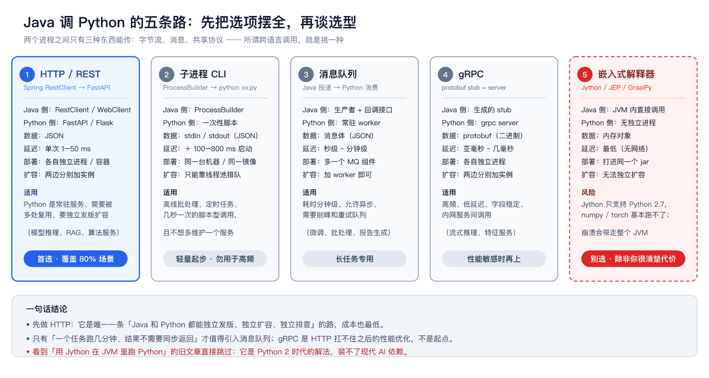
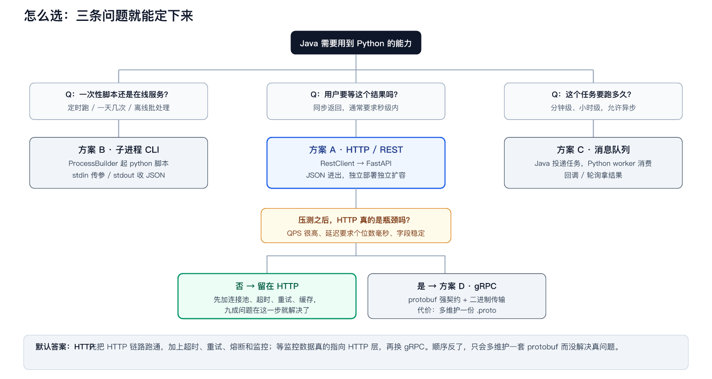
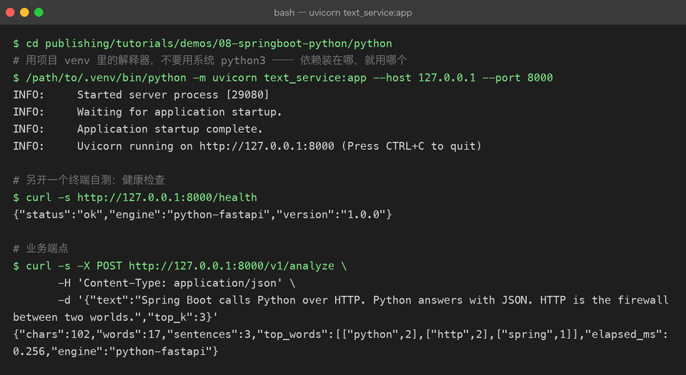
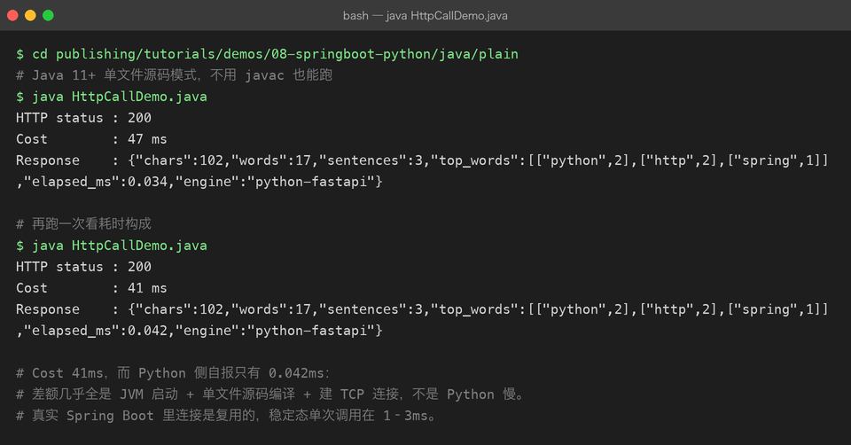
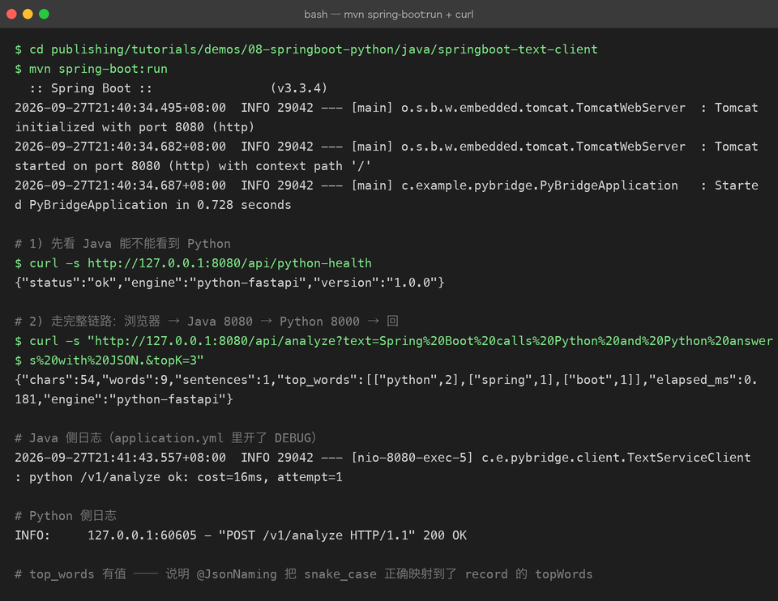
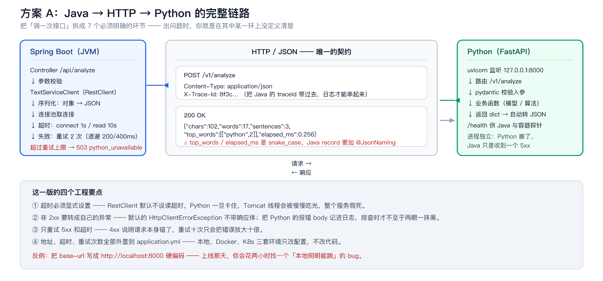
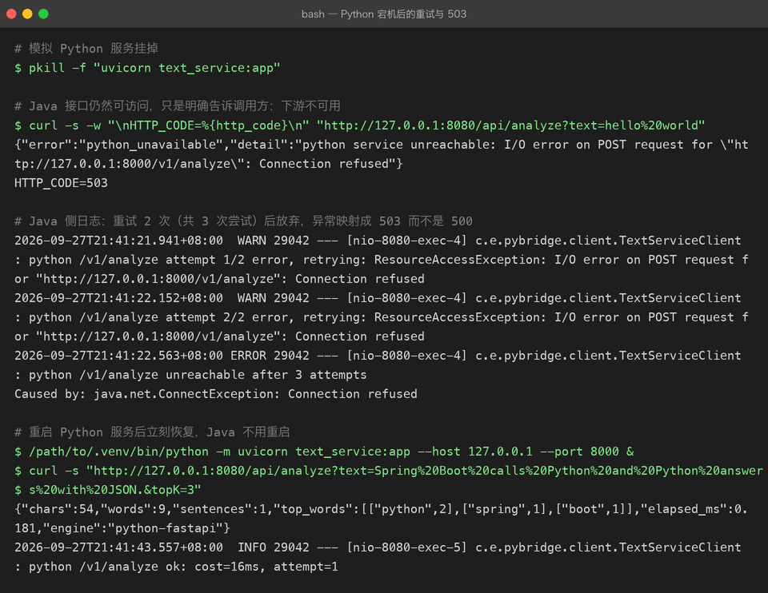
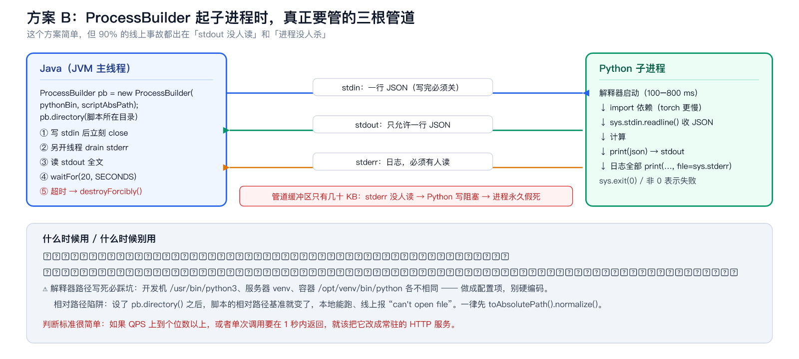
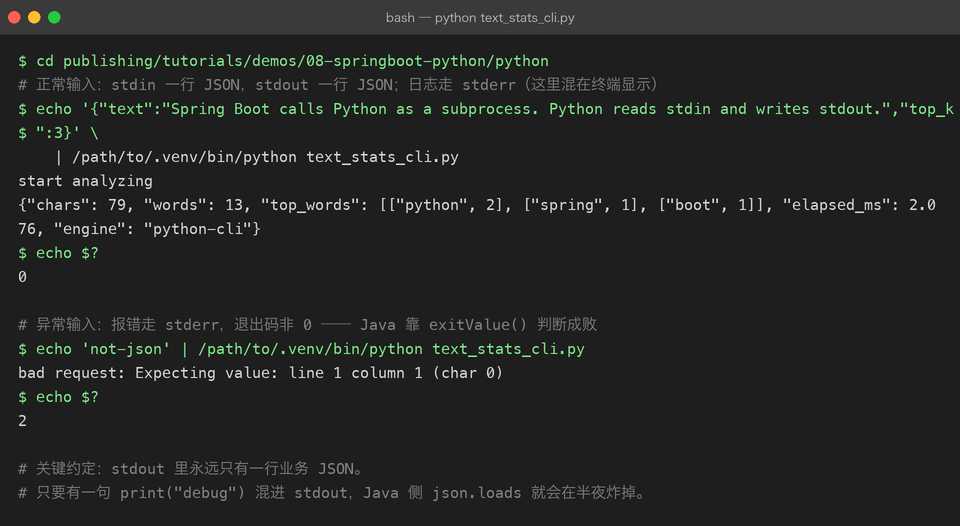
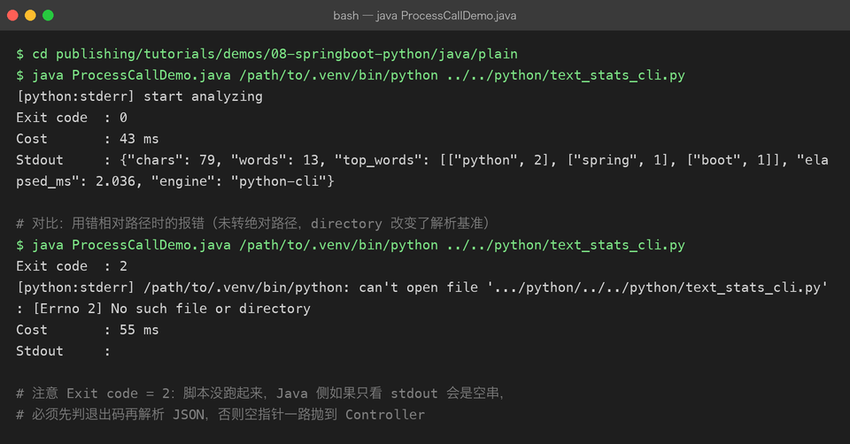

# Spring Boot 怎么调 Python：五种方案、两条真实跑通的链路、一份避坑清单

> 写给有 Java / Spring Boot 基础、想把 Python（AI 算法、模型推理、数据处理）接进 Java 系统的开发者。
> 你不需要先成为 Python 工程师，才能开始集成 —— 但你需要知道**进程之间到底怎么传数据、出错时谁负责**。
> 文中架构图与流程图为本教程自制示意框图；所有终端截图均来自本机真实运行，命令与输出可在仓库 [demos/08-springboot-python/](demos/08-springboot-python/) 目录复现。

## 一、先把结论说在前面

Java 调 Python 的本质是**两个进程之间的通信问题**，不是语言问题。两个进程之间只有三种东西能传：字节流、消息、共享协议 —— 所谓跨语言调用，就是从中挑一种，并把它守好。



| 方案 | Java 侧 | Python 侧 | 延迟 | 适用 |
| --- | --- | --- | --- | --- |
| ① HTTP / REST | RestClient / WebClient | FastAPI / Flask | 1–50 ms | 常驻服务、要复用、要独立扩容 |
| ② 子进程 CLI | ProcessBuilder | 一次性脚本 | ＋100–800 ms 启动 | 离线批处理、定时任务 |
| ③ 消息队列 | 生产者 + 回调 | 常驻 worker | 秒~分钟 | 分钟级长任务、削峰 |
| ④ gRPC | 生成的 stub | grpc server | 亚毫秒 | 高频、低延迟、字段稳定 |
| ⑤ 嵌入式解释器 | JVM 内调用 | 无独立进程 | 最低 | **别选**（见下） |

三条结论，先记下来，全文都在论证它们：

1. **默认选 HTTP**。它是唯一一条让 Java 和 Python 独立发版、独立扩容、独立排查的路，成本也最低。
2. **只有「一个任务跑几分钟、结果不需要同步返回」才值得引入消息队列**；gRPC 是 HTTP 扛不住之后的性能优化，不是起点。
3. **看到「用 Jython 在 JVM 里跑 Python」的旧文章直接跳过**：Jython 只支持 Python 2.7，numpy / torch 基本装不上，而且解释器崩溃会带走整个 JVM。

> [!NOTE]
> 本文所有代码都真实跑通过：Python 3.13 + FastAPI + uvicorn，Java 17 + Spring Boot 3.3.4（RestClient）。完整工程在本仓库 `publishing/tutorials/demos/08-springboot-python/`，你可以直接复现文中的每一段输出。

## 二、怎么选：三个问题就能定下来

选型不需要背对比表，问三个问题就够了：



1. **一次性脚本还是在线服务？** 定时跑、一天几次的 → 子进程；用户等着结果的 → 继续往下。
2. **这个任务要跑多久？** 秒级内同步返回 → HTTP；分钟级、允许异步 → 消息队列。
3. **压测之后 HTTP 真的是瓶颈吗？** 大多数系统在这一步就结束了 —— 先加连接池、超时、重试、缓存，九成问题就解决了。真的测出协议开销才换 gRPC。

顺序反了的代价很具体：先上了 gRPC，就多维护一份 `.proto`、一套代码生成流水线，而真正拖慢你的可能是 Python 侧那 3 秒的模型推理。

## 三、方案 A：HTTP（推荐，覆盖大多数场景）

### 3.1 Python 侧：把函数变成服务

用 FastAPI 把 Python 能力暴露成 HTTP 接口。下面的 demo 刻意只用标准库做文本统计，不依赖任何模型 —— 目的是让「Java → HTTP → Python」这条链路本身可跑、可观测；真实场景里把 `analyze_text()` 换成你的 embedding / 推理 / 数据处理函数即可。

```python
# python/text_service.py
import re, time
from collections import Counter
from fastapi import FastAPI
from pydantic import BaseModel, Field

app = FastAPI(title="text-service", version="1.0.0")
TOKEN_RE = re.compile(r"[A-Za-z][A-Za-z0-9_]*")

class AnalyzeRequest(BaseModel):
    text: str = Field(min_length=1, max_length=100_000)
    top_k: int = Field(default=5, ge=1, le=50)

@app.get("/health")
def health():
    # Java 侧做健康检查 / 容器探针就用这个端点
    return {"status": "ok", "engine": "python-fastapi", "version": "1.0.0"}

@app.post("/v1/analyze")
def analyze(req: AnalyzeRequest):
    started = time.perf_counter()
    words = TOKEN_RE.findall(req.text)
    counter = Counter(w.lower() for w in words)
    return {
        "chars": len(req.text),
        "words": len(words),
        "top_words": [[w, c] for w, c in counter.most_common(req.top_k)],
        "elapsed_ms": round((time.perf_counter() - started) * 1000, 3),
        "engine": "python-fastapi",
    }
```

启动与自测（注意：**用 venv 里的解释器**，依赖装在哪就用哪个）：



三个值得养成的习惯：

- **pydantic 校验入参**。`text` 超长、`top_k` 传 0 都会在入口被拦下，返回 422，而不是让脏数据走进你的模型。
- **提供 `/health`**。它同时服务两方：Java 的 `TextServiceClient` 启动检查，以及未来上容器时的 liveness probe。
- **日志用 uvicorn 自带的**，别在业务代码里 `print` 到 stdout —— HTTP 方案里 stdout 是黑盒，但日志规范同样决定你排查问题的速度。

### 3.2 先不用 Spring，验证一遍链路

上框架之前，先用 Java 标准库把链路打穿。这能证明一件事：**跨语言调用的复杂度 100% 在网络与协议上，跟框架无关**。

```java
// java/plain/HttpCallDemo.java（Java 11+ 单文件源码模式，java HttpCallDemo.java 直接跑）
HttpClient client = HttpClient.newBuilder()
        .connectTimeout(Duration.ofSeconds(3))   // 连不上要快速失败
        .build();

HttpRequest request = HttpRequest.newBuilder(URI.create("http://127.0.0.1:8000/v1/analyze"))
        .header("Content-Type", "application/json")
        .timeout(Duration.ofSeconds(10))          // 整体超时，必须设
        .POST(HttpRequest.BodyPublishers.ofString(body))
        .build();

HttpResponse<String> response = client.send(request, HttpResponse.BodyHandlers.ofString());
```



注意 `Cost 41ms` 而 Python 自报只花了 `0.042ms` —— 差额几乎全是 JVM 启动、建连和 HTTP 往返，不是 Python 慢。真实 Spring Boot 里连接是复用的，稳定态单次调用在 1–3ms。**性能问题要先归因，再动手。**

### 3.3 Java 侧：Spring Boot 客户端（RestClient）

Spring Boot 3.2+ 自带 `RestClient`，同步、流畅 API，比 `RestTemplate` 现代，比 `WebClient` 轻。工程结构：

```text
java/springboot-text-client/
├── pom.xml                                  # 只依赖 spring-boot-starter-web
└── src/main/java/com/example/pybridge/
    ├── PyBridgeApplication.java
    ├── client/
    │   ├── TextServiceClient.java           # RestClient + 超时 + 重试 + 异常映射
    │   └── PythonServiceException.java
    └── web/
        └── AnalyzeController.java           # /api/analyze、/api/python-health
```

配置先行 —— **地址、超时、重试次数全部外置**，本地、Docker、K8s 三套环境只改配置不改代码：

```yaml
# src/main/resources/application.yml
python:
  service:
    base-url: http://127.0.0.1:8000   # Docker 里改成 http://text-service:8000
    connect-timeout-ms: 1000
    read-timeout-ms: 10000
    max-retries: 2
    backoff-ms: 200
```

客户端是整篇文章最重要的一段代码。四件事是必须的，缺一件生产就会出事：

```java
@Component
public class TextServiceClient {

    private final RestClient restClient;
    private final int maxRetries;
    private final long backoffMs;

    public TextServiceClient(RestClient.Builder builder,
                             @Value("${python.service.base-url}") String baseUrl,
                             @Value("${python.service.connect-timeout-ms}") int connectTimeoutMs,
                             @Value("${python.service.read-timeout-ms}") int readTimeoutMs,
                             @Value("${python.service.max-retries}") int maxRetries,
                             @Value("${python.service.backoff-ms}") long backoffMs) {

        ClientHttpRequestFactorySettings settings = ClientHttpRequestFactorySettings.DEFAULTS
                .withConnectTimeout(Duration.ofMillis(connectTimeoutMs))
                .withReadTimeout(Duration.ofMillis(readTimeoutMs));

        this.restClient = builder
                .baseUrl(baseUrl)
                .requestFactory(ClientHttpRequestFactories.get(settings))
                .defaultStatusHandler(HttpStatusCode::isError, (request, response) -> {
                    // 非 2xx 转成自己的异常，并把 Python 的报错 body 带走，
                    // 否则默认异常里没有响应体，排查时抓瞎
                    byte[] bytes = response.getBody().readAllBytes();
                    String body = bytes.length > 0 ? new String(bytes, StandardCharsets.UTF_8) : "<empty>";
                    throw new PythonServiceException(
                            "python service error: status=" + response.getStatusCode() + ", body=" + body,
                            response.getStatusCode().value());
                })
                .build();
        this.maxRetries = maxRetries;
        this.backoffMs = backoffMs;
    }

    public AnalyzeResult analyze(String text, int topK) {
        Map<String, Object> payload = Map.of("text", text, "top_k", topK);
        int attempt = 0;
        while (true) {
            attempt++;
            long start = System.currentTimeMillis();
            try {
                AnalyzeResult result = restClient.post()
                        .uri("/v1/analyze")
                        .contentType(MediaType.APPLICATION_JSON)
                        .body(payload)
                        .retrieve()
                        .body(AnalyzeResult.class);
                log.info("python /v1/analyze ok: cost={}ms, attempt={}",
                        System.currentTimeMillis() - start, attempt);
                return result;
            } catch (PythonServiceException e) {
                // 4xx 是请求本身有问题，重试没意义，直接抛
                if (e.getStatusCode() >= 400 && e.getStatusCode() < 500) throw e;
                if (attempt > maxRetries) throw e;
                sleepQuietly(backoffMs * attempt);      // 退避：200ms、400ms
            } catch (Exception e) {
                // 连接超时 / 读超时 / DNS 失败，都属于可重试
                if (attempt > maxRetries) {
                    throw new PythonServiceException("python service unreachable: " + e.getMessage(), 503, e);
                }
                sleepQuietly(backoffMs * attempt);
            }
        }
    }

    @JsonIgnoreProperties(ignoreUnknown = true)
    @JsonNaming(PropertyNamingStrategies.SnakeCaseStrategy.class)   // 关键注解，见下文
    public record AnalyzeResult(int chars, int words, int sentences,
                                List<List<Object>> topWords,
                                double elapsedMs, String engine) {}
}
```

四个要点，展开说：

- **超时必须显式设置**。`RestClient` 默认不设读超时，Python 一旦卡住，Tomcat 工作线程会被慢慢吃光，整个 Java 服务假死 —— 这是集成 Python 后最常见的「雪崩起点」。
- **非 2xx 转成自己的异常**。默认抛出的异常不带响应体；把 Python 的报错 body 记进日志，排查时才不至于两眼一抹黑。
- **只重试 5xx 和超时**。4xx 说明请求本身错了，重试十次只会把错误放大十倍。
- **重试上限后抛 503**，而不是让 Spring 兜底成 500。下游不可用和自己的 bug 是两类告警，混在一起监控就废了。

还有一个小但致命的细节：Python 返回的是 `top_words` / `elapsed_ms`（snake_case），Java record 是 `topWords`（camelCase）。**不加 `@JsonNaming(SnakeCaseStrategy.class)`，这两个字段会静默反序列化成 null —— 不报错，只是值没了**，等你发现时它已经在线上跑了两周。

完整工程跑起来：





### 3.4 下游挂了会怎样：一次真实的故障演练

集成质量不是看「正常时返回什么」，而是看「Python 挂掉时 Java 表现如何」。把 Python 服务 kill 掉再调 Java 接口：



三个现象都符合预期：

1. Java 侧重试了 2 次（共 3 次尝试，间隔 200ms → 400ms），日志里每一步都可见；
2. 放弃后返回 **503 + `python_unavailable`**，而不是 500 —— 前端和监控可以正确分类；
3. Python 服务重启后**立刻恢复，Java 不用重启**，因为连接是按请求建立的，没有缓存坏状态。

Controller 里的异常映射只有几行，但它决定监控告警能不能正确分类：

```java
@ExceptionHandler(PythonServiceException.class)
public ResponseEntity<Map<String, Object>> onPythonError(PythonServiceException e) {
    return ResponseEntity.status(HttpStatus.SERVICE_UNAVAILABLE)
            .body(Map.of("error", "python_unavailable", "detail", e.getMessage()));
}
```

### 3.5 生产化清单

跑通只是第一步，上生产前对照这份清单：

| 项 | 做法 | 不做的后果 |
| --- | --- | --- |
| 超时 | connect 1s / read 按 P99×2 设置，全部配置化 | Python 卡住 → Tomcat 线程池耗尽 → 整个 Java 服务假死 |
| 重试 | 只重试 5xx / 超时，2 次 + 退避 | 4xx 也重试会把错误放大十倍 |
| 熔断 | Resilience4j：错误率超阈值直接快速失败 | Python 挂了，Java 还在傻等每次 10s 超时 |
| 连接池 | `ClientHttpRequestFactory` 调大 `maxConnTotal` | 高并发下建连排队，表现为「莫名其妙变慢」 |
| 健康检查 | Java 定期打 Python `/health`，失败告警 | 半小时前挂的 Python，半小时后才有人发现 |
| traceId | Java 把 MDC 里的 traceId 塞进 `X-Trace-Id` 头 | 一次请求跨两个进程，日志对不上，排查靠猜 |
| 模型冷启动 | 启动后预热一次请求；read-timeout 按首请求放宽 | 第一个用户请求必然超时，之后恢复正常 |
| 监控 | 记录每次调用的耗时与结果分布，按 `engine`/端点打点 | 没有基线，性能退化无人知晓 |

> [!WARN]
> 最常被硬编码的是 `base-url`。本地写 `http://localhost:8000`，上容器环境Python 在另一个容器里，localhost 就永远指向 Java 自己 —— 你会花两小时找一个「本地明明能跑」的 bug。**从第一行代码起就把它放进配置文件。**

## 四、方案 B：子进程（ProcessBuilder）

Python 不是所有能力都值得做成常驻服务。定时任务、离线批处理、一天跑几次的脚本，用 `ProcessBuilder` 起子进程就够了：Java 写 stdin、读 stdout，用 JSON 交换数据。



### 4.1 Python 侧：stdin 进，stdout 出

```python
# python/text_stats_cli.py
def main() -> int:
    raw = sys.stdin.readline()
    if not raw.strip():
        print("empty stdin", file=sys.stderr)
        return 2                                  # 非 0 退出码 = 失败
    try:
        payload = json.loads(raw)
    except json.JSONDecodeError as exc:
        print(f"bad request: {exc}", file=sys.stderr)
        return 2

    print("start analyzing", file=sys.stderr)     # 日志走 stderr，不污染 stdout
    print(json.dumps(analyze(payload), ensure_ascii=False))   # 唯一一行业务输出
    return 0
```

三条约定，缺一条线上必踩坑：

1. **stdout 只允许有一行业务 JSON** —— `print()` 调试日志必须走 stderr；
2. **任何异常都以非零退出码退出** —— Java 靠 `exitValue()` 判断成败；
3. **用 `sys.stdin.readline()` 读**，不要 `input()`，避免交互提示阻塞。



### 4.2 Java 侧：把管道管好

```java
// java/plain/ProcessCallDemo.java（节选，完整版含注释）
Path scriptPath = Path.of(script).toAbsolutePath().normalize();  // 相对路径陷阱，见下文
ProcessBuilder pb = new ProcessBuilder(pythonBin, scriptPath.toString());
pb.directory(scriptPath.getParent().toFile());
pb.redirectError(ProcessBuilder.Redirect.PIPE);

Process process = pb.start();

// ① 异步 drain stderr，防止管道缓冲区打满导致子进程阻塞
ExecutorService drain = Executors.newSingleThreadExecutor();
drain.submit(() -> { /* 读 errorStream 并打日志 */ });

// ② 写 stdin（一行 JSON），写完立刻关闭，否则 Python 的 readline() 会一直等
try (BufferedWriter writer = new BufferedWriter(
        new OutputStreamWriter(process.getOutputStream(), StandardCharsets.UTF_8))) {
    writer.write(payload);
    writer.newLine();
}

// ③ 读 stdout，④ 带超时等待，⑤ 超时就杀
String stdout = new String(process.getInputStream().readAllBytes(), StandardCharsets.UTF_8);
boolean finished = process.waitFor(20, TimeUnit.SECONDS);
if (!finished) process.destroyForcibly();
```



三个必须守住的规矩：

- **必须 `waitFor(timeout)`** —— 否则 Python 死循环会把 Java 线程永久挂住；
- **stderr 必须有人读** —— 管道缓冲区只有几十 KB，Python 写 stderr 阻塞，进程就假死了，而 Java 这边表现为「读不到结果」；
- **用完 `destroyForcibly()`** —— 超时不杀进程，僵尸进程会慢慢耗尽机器资源。

截图里还有一个真实踩坑：没转绝对路径时，`pb.directory()` 改变了相对路径的解析基准，Python 报 `can't open file`、退出码 2 —— 这就是「本地能跑、线上找不到脚本」的最常见原因。**一律先 `toAbsolutePath().normalize()`。**

### 4.3 什么时候该放弃子进程

✅ 适合：定时任务、离线批处理、一天几次的数据脚本、本机小工具 —— 频率低，起进程的开销（100–800ms，import torch 更慢）可以接受。

❌ 不适合：在线请求链路。每秒起一次 Python 进程，光解释器启动就能把 QPS 打回个位数，CPU 和内存也会被反复 fork 吃满。

判断标准很简单：**如果 QPS 上到个位数以上，或者单次调用要在 1 秒内返回，就把它改成常驻的 HTTP 服务。**

## 五、方案 C / D：消息队列与 gRPC，什么时候才轮到它们

### 消息队列（方案 C）

当调用从「一问一答」变成「扔个任务就走」，HTTP 就不合适了：任务要跑几分钟，HTTP 连接撑不住，重试还可能造成重复执行。这时候引入 MQ（RabbitMQ / Kafka / Redis Stream 都行）：

- Java 侧：`spring-boot-starter-amqp`，投递任务消息后立即返回任务 ID；
- Python 侧：常驻 worker 消费队列，跑完把结果写回数据库或回调接口；
- 前端拿任务 ID 轮询或走 WebSocket —— **「提交」和「取结果」是两个接口，不是一个请求**。

它带来的新代价也要认：消息体成为新的契约（要有版本号）、消费要幂等（重试必然发生）、多了一个 MQ 组件要运维。**为分钟级任务付这些代价是值的，为 2 秒的任务是浪费。**

### gRPC（方案 D）

HTTP + JSON 的开销主要在两处：文本序列化和连接管理。当 Python 服务是**高频、低延迟、字段稳定**的内网调用（流式推理、特征服务），gRPC 的 protobuf + HTTP/2 多路复用能把单次调用压到亚毫秒：

```protobuf
// text.proto —— 契约先行，两边各自生成代码
service TextService {
  rpc Analyze (AnalyzeRequest) returns (AnalyzeResponse);
}
message AnalyzeRequest { string text = 1; int32 top_k = 2; }
message AnalyzeResponse { int32 chars = 1; int32 words = 2; repeated WordCount top_words = 3; }
```

代价是每次改字段都要重新生成两侧代码、走一遍发版流程。**它是 HTTP 扛不住之后的优化，不是起点。**

## 六、部署：base-url 在三套环境里怎么变

| 环境 | Python 在哪 | Java 的 `base-url` | 注意 |
| --- | --- | --- | --- |
| 本地开发 | 本机 8000 端口 | `http://127.0.0.1:8000` | 两个终端分别起服务 |
| Docker Compose | 同一网络里的 `text-service` 容器 | `http://text-service:8000` | 用服务名，不用 localhost |
| K8s | 独立 Deployment + Service | `http://text-service.prod.svc:8000` | 配 liveness/readiness 探针指向 `/health` |

Docker Compose 的最小形态：

```yaml
services:
  text-service:
    image: text-service:1.0.0          # python:3.13-slim + pip install -r req.txt
    healthcheck:
      test: ["CMD", "curl", "-f", "http://localhost:8000/health"]
      interval: 10s
  java-app:
    image: java-app:1.0.0
    environment:
      PYTHON_SERVICE_BASE_URL: http://text-service:8000
    depends_on:
      text-service:
        condition: service_healthy
```

Python 的依赖必须锁定（`requirements.txt` 写死版本），Java 镜像里**不装 Python**——两个世界只在网络上握手，这是整个方案能长期维护的前提。

## 七、避坑清单（按踩坑频率排序）

1. **超时不设**：RestClient 默认无读超时，Python 一卡，Java 线程池被慢慢吃光。
2. **`base-url` 硬编码**：换环境必炸，写进 `application.yml`。
3. **snake_case 静默 null**：Python 返回 `top_words`，Java record 叫 `topWords`，不加 `@JsonNaming` 就是 null，不报错。
4. **4xx 也重试**：请求本身错了，重试只会放大错误。
5. **stdout 混入 `print`**：子进程方案里一句 debug 输出就能让 `json.loads` 在半夜炸掉，调试日志一律走 stderr。
6. **stderr 无人读**：管道缓冲区几十 KB，写满即假死。
7. **相对路径陷阱**：`pb.directory()` 会改变相对路径基准，脚本一律转绝对路径。
8. **解释器路径写死**：开发机 `/usr/bin/python3`、服务器 venv、容器 `/opt/venv/bin/python` 各不相同，做成配置项。
9. **依赖漂移**：Python 侧不锁版本，某天 `pip install` 拉到新版，行为悄悄变了。写死 `requirements.txt`。
10. **模型冷启动**：加载模型的首个请求可能要几十秒，预热 + 单独放宽首请求超时，否则每天早上的第一个用户永远超时。

## 八、10 分钟自测

拿本文的 demo 自查，全部通过再谈生产：

```text
[ ] uvicorn 起服务，curl /health 返回 ok
[ ] curl -X POST /v1/analyze，非法入参返回 422
[ ] java HttpCallDemo.java 打印 200 和 JSON
[ ] kill 掉 Python 后，Java 接口返回 503（不是 500），日志有重试记录
[ ] 重启 Python，Java 不重启即恢复
[ ] echo '{...}' | python text_stats_cli.py 输出一行 JSON，退出码 0
[ ] echo 'not-json' | python text_stats_cli.py 退出码非 0，报错在 stderr
[ ] java ProcessCallDemo.java 打印退出码 0 与 JSON
```

本文所有代码与运行输出在本仓库的位置：

```text
publishing/tutorials/demos/08-springboot-python/
├── python/
│   ├── text_service.py          # 方案 A：FastAPI 服务
│   └── text_stats_cli.py        # 方案 B：stdin/stdout 脚本
├── java/
│   ├── plain/HttpCallDemo.java      # 纯 Java HttpClient（无框架）
│   ├── plain/ProcessCallDemo.java   # 纯 Java ProcessBuilder
│   └── springboot-text-client/      # Spring Boot 3.3 完整工程（RestClient + 重试 + 503）
└── out/                             # 文中终端截图的原始命令与输出
```
