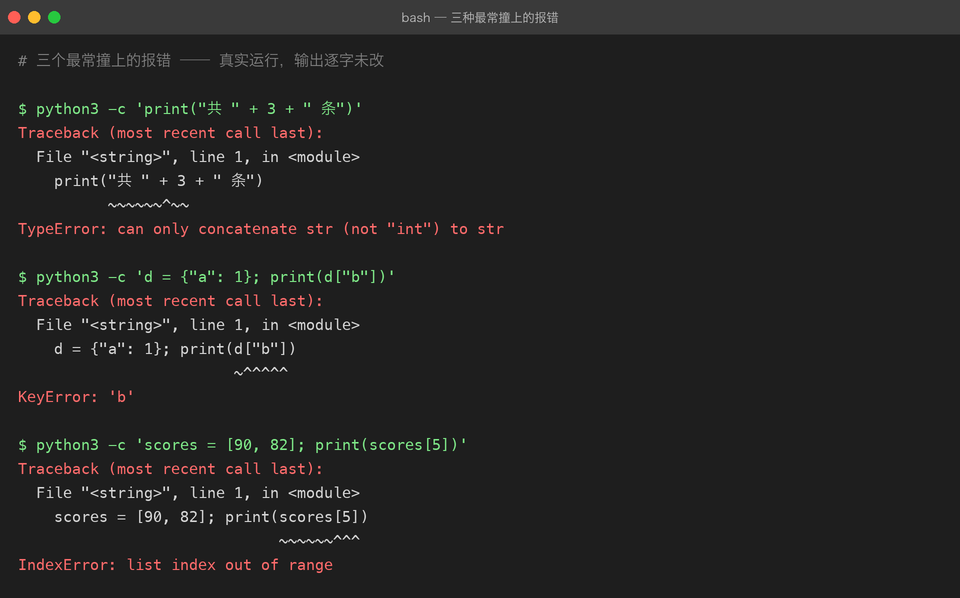

# 练手方法：怎么练才不是「抄代码」

> 这份文档和具体某个项目无关，但比任何一个项目都重要。
> 上级目录：[练手项目总览](README.md)

## 一个残酷的观察

看完一段代码觉得「懂了」，和合上电脑自己写出来，中间隔着一整个太平洋。

**看懂了**只是「识别」——大脑在比对模式，很轻松。**写出来**需要「生成」——从空白处造出结构，很累。而编程能力只长在后者身上。

所以本目录里每个项目的 README 都**不是**可以顺着敲下来的教程。它们的结构是：

```
你要做的东西  →  先看结果（真实截图）  →  你要学到的知识点  →  怎么跑  →  关键代码拆解  →  常见坑  →  验收标准  →  进阶挑战
```

「关键代码拆解」和「常见坑」是**卡住之后再看**的，不是一开始就照着抄的。

## 三遍法

同一个练习做三遍，每次的目的完全不同：

| 遍数 | 做法 | 目的 |
|---|---|---|
| **第一遍** | 照着要求写，允许看参考实现。目标是**跑起来** | 建立「这东西长什么样」的手感 |
| **第二遍** | 隔两三天，**关掉参考实现**，从空文件开始重写 | 把「认得」变成「写得出来」 |
| **第三遍** | 自己改需求（见每个项目的「进阶挑战」） | 证明你理解了结构，而不是记住了字符 |

**只有第三遍才算真的练了。** 前两遍是必要成本，但不是成果。

如果你时间有限，宁可把**一个项目做三遍**，也不要把六个项目各做一遍。

## 卡住的时候怎么办

先看一张图——这是真实跑出来的三条报错，**逐字未改**：



先别读细节，只看关键：**这三条的最后一行，都已经把「什么错」说清楚了。**

- `TypeError: can only concatenate str (not "int") to str` → 你把字符串和数字相加了
- `KeyError: 'b'` → 字典里没有 `'b'` 这个键
- `IndexError: list index out of range` → 列表只有 2 个元素，你取了第 6 个

按这个顺序试，不要直接跳到第 5 步：

1. **读完整条报错**，从最后一行往回读。Python 的 traceback 最后一行是「什么错」，倒数第二组是「在哪一行」。
2. **看类型**。`TypeError: 'NoneType' object is not subscriptable` 意思是「你以为是个 dict，其实是 None」——问题在更早的地方，不在报错那一行。
3. **二分定位**。在中间插一句 `print(type(x), x)`，把范围砍一半。
4. **写最小复现**。新建一个 10 行的文件，只保留出问题的那段逻辑。**十有八九在这一步你就发现问题了**——这是最高效的一招。
5. 实在不行再看参考实现。看的时候**只找出问题的那一段**，别顺手把整个文件读完。

> 反直觉但真实：**调试花的时间不是浪费，是主要收获。** 顺着教程敲一遍什么都不会发生，只有卡住又爬出来才会留下东西。

## 怎么算「练会了」

三道自检题，都要能回答「是」：

- [ ] **不看代码**，能在 10 分钟内重写出核心逻辑（不用逐字一致，能跑通即可）
- [ ] 能**跟别人讲清楚**为什么这么写——比如「为什么 SQL 要用 `?` 占位符」「为什么 404 要自己抛」
- [ ] 能**改动需求**：给它加一个原本没有的小功能，而不破坏现有结构

只要有一项是否，就还没到「练会」的程度。这时候不要急着进入下一个项目。

## 用 Git 记录你的练习

每个项目建议这么开：

```bash
cd python-practice
git checkout -b practice/01-todo-cli     # 自己的练习分支
# 在这里写你自己的版本，不要动参考实现
git add . && git commit -m "feat(01): 我的待办清单 v1"
```

好处有两个：一是**能看到自己第二遍、第三遍的差异**（比任何笔记都直观）；二是万一改坏了，`git checkout .` 就回到上一个能跑的版本。

> 本仓库的参考实现都在 `main` 分支上。你在自己的分支上练习，跑不动了随时 `git checkout main -- python-practice/01-todo-cli` 拿回参考版对照。

## 每个练习至少写一个测试

哪怕只有三行：

```python
def test_add_then_list():
    store = Store(Path(":memory:"))   # 或者用 tmp_path
    store.add("买牛奶")
    assert len(store.items) == 1
```

理由不是「工程规范」，而是**测试是你唯一能自动验证「我没改坏」的手段**。没有测试的话，你每次改代码都得手动把整个流程点一遍——很快就会烦到不点了，然后某天发现三个功能全坏了。

`01-todo-cli` 的进阶挑战 1 和 `04-fastapi-blog` 的 `test_api.py` 就是两个层次的范例。

## 关于「问 AI」

这个时代最大的陷阱是：**让 AI 把代码写好，你只是复制粘贴**。那样你会得到能跑的项目，和零增长的能力。

几种问法，效果差别巨大：

| 问法 | 效果 |
|---|---|
| ❌「帮我写一个待办清单」 | 得到代码，失去练习 |
| ⚠️「这段代码为什么报 `KeyError`」 | 学到知识点，但容易变成「AI 帮我修」 |
| ✅「我自己写完了，帮我挑出设计上的问题」 | 高质量反馈 + 自己动手 |
| ✅「我想用 BFS 爬取，但不确定队列怎么去重，我的做法是……对吗」 | 带着方案去验证 |

**先自己写出一版（哪怕很烂），再让 AI 挑问题。** 这一条能挡住 90% 的「学习幻觉」。

## 六个项目的推荐顺序

严格按难度递增走，不要跳：

```
01 命令行待办清单   ●○○  1 个周末   变量/列表/字典/文件/命令行
02 Excel 报表自动化 ●●○  2–3 天     pandas/清洗/聚合/Excel/绘图
03 网站内容爬虫     ●●○  2–3 天     请求/解析/翻页/重试/异常
04 FastAPI 博客 API ●●○  1 周       路由/校验/状态码/依赖注入/测试
05 AI 命令助手      ●●●  1–2 周     调用 LLM API/多轮/流式
06 RAG 知识库问答   ●●●  2–3 周     切块/向量化/检索/生成/评测
```

01–04 在本目录里可以直接跑；05、06 的完整实现已经在本仓库的 `projects/` 层，本目录只给指路和自测路线。

**01 和 02 之间有一条隐形的分界线**：01 只用标准库，02 开始引入第三方库。跨过这条线之后，「读官方文档」会变成你最主要的学习方式——所以 01 刻意让你先把 Python 本身吃透。
