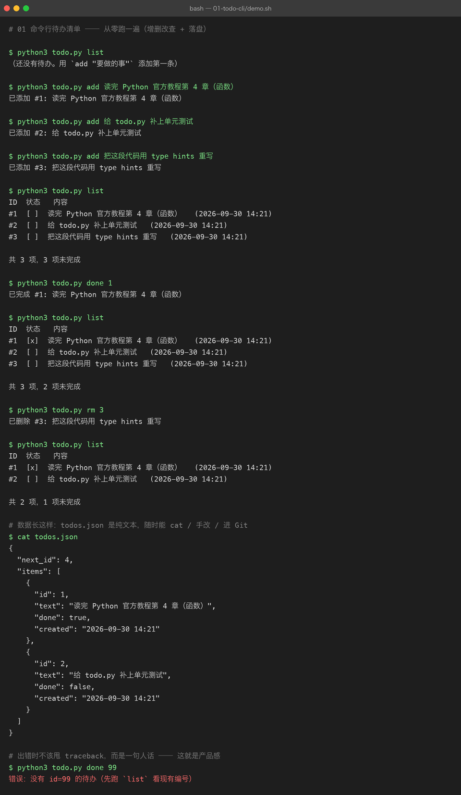

# 01 命令行待办清单

> **难度** ●○○ 入门 ｜ **预计** 1 个周末 ｜ **依赖** 无（纯标准库）
> 上级目录：[练手项目总览](../README.md)

## 你要做的东西

一个在终端里跑的待办清单：**增 / 删 / 改（标记完成）/ 查**，数据存本地 JSON 文件，关掉终端再打开还在。

听起来简单，但它一次性覆盖了 Python 入门阶段最容易「看会了但写不出」的四件事：

1. **数据结构** —— 列表（`list`）+ 字典（`dict`）+ 自定义对象（`dataclass`）怎么组合
2. **文件读写** —— 把内存里的对象序列化成 JSON 存盘，再读回来
3. **命令行入口** —— `argparse` 做子命令，而不是靠 `sys.argv[0]` 硬猜
4. **错误处理** —— 用户输错 id 时给一句人话，而不是甩一堆 traceback

> 为什么第一个项目刻意**不用任何第三方库**：框架会替你处理掉上面大部分细节（FastAPI 帮你解析参数、pandas 帮你读文件）。先用标准库把它们亲手做一遍，之后再用框架，你才知道框架到底帮你做了什么——这是本仓库 `projects/` 里 10 个大项目反复强调的态度。

## 先看结果

下面这张图是 `demo.sh` **真实跑出来的**（不是画的，也不是手截的）：



一屏里发生了三件事：

- **增删改查全流程**：`add` 三条 → `list` → `done 1` 打勾 → `rm 3` 删除。注意每次操作后列表的「共 N 项，M 项未完成」都在正确变化。
- **数据落地**：`cat todos.json` 打出真实文件内容——你能看到 `next_id` 和 `items` 的结构，这就是「内存对象 → 磁盘文本」的往返结果。
- **报错也是输出的一部分**：最后一行 `todo.py done 99` 故意输了个不存在的编号，程序**没有崩**，而是打印 `错误：没有 id=99 的待办（先跑 list 看现有编号）`。退出码是 `1`，可以被 shell 脚本判断。

## 你要学到的 Python

| 知识点 | 在本项目里落在哪 |
|---|---|
| `dataclass` | `Item` 类，自动生成 `__init__` / `__repr__` / `__eq__` |
| `list` / `dict` 组合 | `Store.items` 是 `list[Item]`，落盘时转成 `list[dict]` |
| `pathlib.Path` | 所有文件路径操作，比 `os.path` 的字符串拼接可读得多 |
| 文件读写 + `encoding` | `path.read_text(encoding="utf-8")`，中文不乱码的关键 |
| `json` 序列化 | `json.dumps(...)` / `json.loads(...)`，以及 `ensure_ascii=False` |
| `argparse` 子命令 | `add` / `list` / `done` / `rm` 四个子命令 + `--file` 全局参数 |
| 自定义异常 | `TodoError`，区分「用户输错」与「程序 bug」 |
| 退出码 | `main()` 返回 `int`，`raise SystemExit(main())` |
| `from __future__ import annotations` | 让老版本 Python 也能写 `list[Item]` 这种注解 |

## 怎么跑起来

```bash
cd python-practice/01-todo-cli

python3 todo.py list                              # 看当前列表（首次是空的）
python3 todo.py add "读完 Python 官方教程第 4 章"   # 新增
python3 todo.py done 1                            # 标记完成
python3 todo.py rm 1                              # 删除
python3 todo.py --file /tmp/x.json list           # 换个数据文件（方便多套待办）
```

想复现上面那张截图，跑演示脚本即可（它会在结束时清理自己产生的 `todos.json`）：

```bash
bash demo.sh                 # 看输出
bash demo.sh > assets/run.txt   # 存原始输出（截图就是从它渲染的）
```

## 代码结构

```
01-todo-cli/
├── todo.py         # 全部实现（~200 行，含注释）
├── demo.sh         # 可复现演示：跑一遍完整流程并打印
├── assets/
│   ├── run.txt             # demo.sh 的真实输出（截图的原素材）
│   └── term-01-todo-cli.png
└── README.md       # 本文件
```

`todo.py` 内部只分三层，刻意做薄：

```
argparse 解析参数  →  Store（业务 + 落盘）  →  Item（一条数据）
     ↑ 只管打印人话        ↑ 只管读写文件          ↑ 只是个容器
```

分层的意义：**`Store` 不打印任何东西、`main()` 不碰任何文件**。所以你可以直接给 `Store` 写单元测试，不需要模拟终端输入输出——这正是「进阶挑战」里的第 1 题。

## 关键代码拆解

**① 为什么用 `TodoError` 而不是直接 `raise Exception`**

```python
class TodoError(Exception):
    """用户级错误：打印一句话即可，不需要 traceback。"""
```

在 `main()` 里统一兜底：

```python
try:
    ...
except TodoError as exc:
    print(f"错误：{exc}", file=sys.stderr)
    return 1          # ← 退出码 1，脚本里可以 if 判断
```

代码里其他地方出现意料之外的异常（比如真有 bug），就会照常抛出堆栈——**该炸的炸，该讲人话的讲人话**，这个边界感比「全都 try 住」重要得多。

**② 落盘时为什么必须 `ensure_ascii=False`**

```python
self.path.write_text(
    json.dumps(data, ensure_ascii=False, indent=2) + "\n", encoding="utf-8"
)
```

`json.dumps` 默认会把中文转义成 `\u5f85\u529e`。计算机没意见，但你 `cat` 出来就完全看不懂了。加上 `ensure_ascii=False` + `encoding="utf-8"`，文件里才是原样的中文。

**③ 读文件时把两种「异常情况」分开**

```python
if not self.path.exists():
    return                      # 文件不存在 = 全新开始，不是错误
try:
    raw = json.loads(self.path.read_text(encoding="utf-8"))
except json.JSONDecodeError as exc:
    raise TodoError(f"{self.path} 不是合法 JSON（{exc.msg} @ 第 {exc.lineno} 行）...") from exc
```

「没数据」和「数据坏了」是两回事。前者静默放过，后者必须让用户知道——而且要把 `lineno` 带上，不然用户根本不知道该改哪。

## 常见坑

| 坑 | 现象 | 怎么破 |
|---|---|---|
| 忘了 `encoding="utf-8"` | 在 Windows 上中文变乱码 / 报 `UnicodeDecodeError` | 所有 `read_text` / `write_text` 都显式写编码 |
| 每次操作都重开文件且没 `save()` | 程序退出后数据全没了 | 每处修改状态的末尾都调 `self.save()` |
| 用 `os.path.join` 拼字符串路径 | 可读性差、Windows 分隔符问题 | 用 `pathlib.Path`，`Path("a") / "b.json"` |
| 删除列表元素时遍历 `for i in range(len(...))` | 索引越界 / 漏删 | 用 `list.remove(obj)` 或倒序删 |
| `done` 一个已完成的项 | 状态没变化，用户以为没生效 | 显式报 `早就完成了`，而不是静默成功 |

## 验收标准（做完自检）

- [ ] `add` 后立刻 `list` 能看到新条目，编号递增且不会复用已删除的编号
- [ ] 关掉终端重新打开，`list` 数据仍在（说明真的落盘了）
- [ ] `done 99` / `rm 99` 输入不存在的编号时，打印人话错误且退出码为 1（`echo $?` 验证）
- [ ] `todos.json` 里中文是可读的原文，不是 `\uXXXX`
- [ ] 手动把 `todos.json` 改坏（删掉一个花括号），程序报「不是合法 JSON」而不是崩溃

## 进阶挑战（做完再往上加，别跳）

1. **补单元测试** —— 给 `Store` 写 `unittest`：新增后 `len(items)` 变化、`find` 找不到时抛 `TodoError`、落盘再读回内容一致。测试要能 `python3 -m unittest` 直接跑。
2. **加 `--json` 输出模式** —— `list --json` 输出机器可读的 JSON，方便被别的脚本消费。体会「同一个数据，两种渲染」。
3. **加截止日期与排序** —— `add "写周报" --due 2026-10-07`，`list` 按截止日期排序，过期的标红。
4. **加 `edit` 子命令** —— 修改某条待办的文字。
5. **中文对齐** —— 现在列表里中文和英文混排时列是对不齐的（中文字符在等宽字体里占两格）。想办法修好它（提示：`unicodedata.east_asian_width`）。

> 做完挑战 1 之后，你就具备了给后面几个项目写测试的基础——`04-fastapi-blog` 会直接用 `pytest`。
