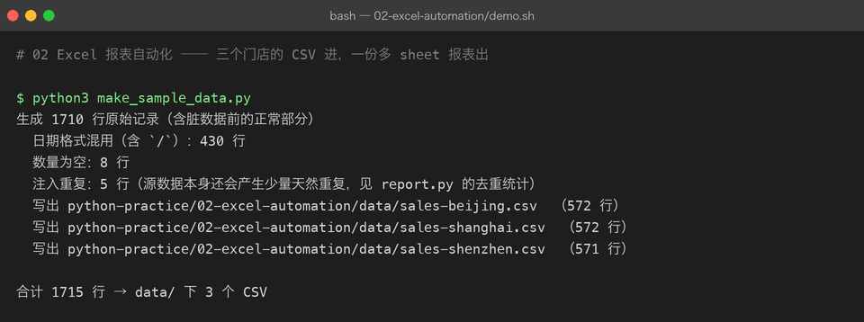
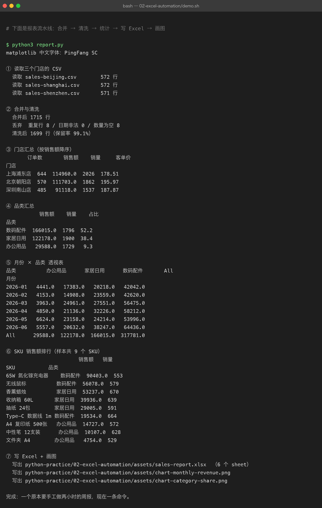
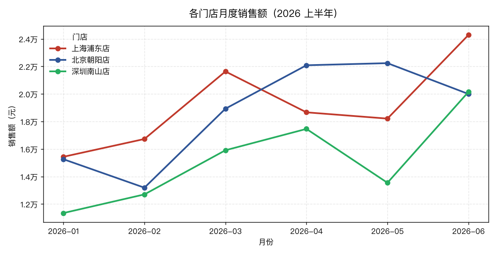
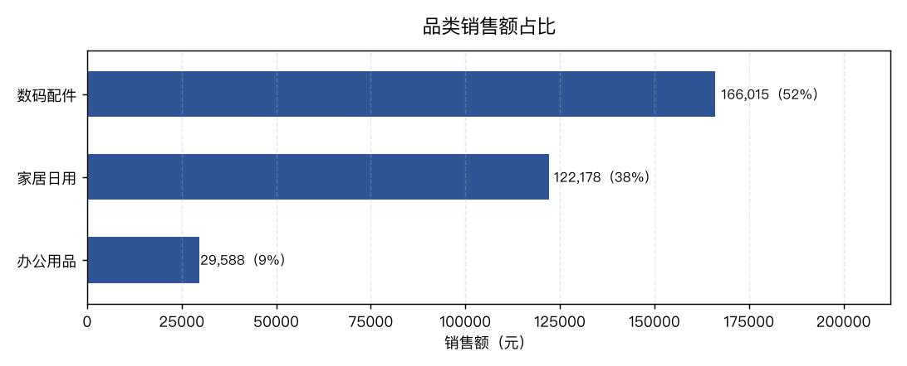

# 02 Excel 报表自动化

> **难度** ●●○ 进阶 ｜ **预计** 2–3 天 ｜ **依赖** pandas、openpyxl、matplotlib
> 上级目录：[练手项目总览](../README.md)

## 你要做的东西

三家门店各自导出一份 CSV，你要把它们变成**一份可以直接发出去的多 sheet 报表**：

```
data/sales-beijing.csv  ┐
data/sales-shanghai.csv ├─→ 合并 → 清洗 → 统计 → assets/sales-report.xlsx（6 个 sheet）
data/sales-shenzhen.csv ┘                              └→ 两张图（折线 + 条形）
```

这就是「每周一手工复制粘贴两小时」这件事的标准解法。它的价值不在技术难度，而在于**从此以后这个活不需要人**——这才是自动化。

## 先看结果

**第一步：造数据**（顺手埋了三处真实的脏数据，见下）



**第二步：报表流水线**（合并 → 清洗 → 统计 → 写 Excel → 画图）



注意图里这几行，它们是这个项目真正教你的东西：

- `合并后 1715 行` → `丢弃 重复行 8 / 日期非法 0 / 数量为空 8` → `清洗后 1699 行（保留率 99.1%）`
  **每一步丢了多少行都必须打印出来。** 报表自动化最致命的 bug 不是报错，而是「悄悄少了几百行」而没人发现。
- `日期非法 0` —— 源数据里 430 行用的是 `2026/01/26` 这种斜杠格式，靠 `pd.to_datetime(..., format="mixed")` 全部救回来了。
- `月份 × 品类` 透视表最后一行/列是 `All`，这是 `pivot_table(margins=True)` 自动加的小计。

报表本身长这样（`assets/sales-report.xlsx`，6 个 sheet）：

| sheet | 内容 | 行 × 列 |
|---|---|---|
| `清洗后明细` | 全部可用交易，销售额列带红绿色阶 | 1700 × 7 |
| `门店汇总` | 订单数 / 销售额 / 销量 / 客单价，按销售额降序 | 4 × 5 |
| `品类汇总` | 销售额 / 销量 / 占比 | 4 × 4 |
| `月份×品类` | 透视表（带 All 小计） | 8 × 5 |
| `SKU 排行` | 全部 9 个 SKU 的销售额排名 | 10 × 4 |
| `月份×门店` | 画折线图用的数据源 | 7 × 4 |

两张图（也都是脚本现场画出来的，不是手绘）：





## 你要学到的 Python / pandas

| 知识点 | 在本项目里落在哪 |
|---|---|
| `pd.read_csv` | 读三个 CSV，注意 `encoding="utf-8-sig"`（带 BOM） |
| `pd.concat` | 把三张结构相同的表纵向拼成一张 |
| `pd.to_datetime(..., format="mixed")` | 处理混排日期格式（真实数据的头号坑） |
| `drop_duplicates` / `dropna` / `to_numeric(errors="coerce")` | 清洗三件套 |
| 派生列 | `df["revenue"] = df["qty"] * df["unit_price"]`、`dt.to_period("M")` |
| `groupby().agg(命名聚合)` | 一次算出订单数/销售额/销量/客单价 |
| `pivot_table(margins=True)` | 二维透视 + 自动小计 |
| `ExcelWriter` 多 sheet | 一个文件写 6 个表 |
| openpyxl 二次加工 | 冻结首行、表头配色、列宽自适应、数字格式、色阶 |
| matplotlib 中文字体 | 不设字体就全是「豆腐块」方框 |
| 固定随机种子 | `random.Random(42)` 让数据可复现 |

## 怎么跑起来

```bash
cd python-practice/02-excel-automation

# 装依赖（第一次）
python3 -m venv .venv && source .venv/bin/activate
pip install -r ../requirements.txt

python3 make_sample_data.py    # 生成 data/*.csv
python3 report.py              # 生成 assets/sales-report.xlsx 与两张图

bash demo.sh                   # 或者一次跑完上面两步，输出就是截图里的内容
```

## 代码结构

```
02-excel-automation/
├── make_sample_data.py   # 造数据（固定 seed=42，可复现）+ 注入三类脏数据
├── report.py             # 主流程：合并→清洗→统计→写 Excel→画图
├── demo.sh               # 可复现演示脚本
├── data/                 # 三份样本 CSV（入库，作为证据）
├── assets/               # 报表 xlsx、两张图、终端截图、原始运行输出 run.txt
└── README.md
```

## 关键代码拆解

**① 为什么脏数据要「故意埋」**

真实项目里，`df.drop_duplicates()` 这行代码你写完不知道对不对——因为真实数据可能本来就没重复。所以这里**主动注入**了 5 行完全重复、8 行数量为空、430 行斜杠日期：

```python
for r in rng.sample(rows, 8):
    r["qty"] = ""           # 数量为空
for r in rng.sample(rows, 5):
    rows.append(dict(r))    # 完全重复
```

跑完你能对着 `丢弃 重复行 8 / 数量为空 8` 验证你的清洗逻辑真的生效了。**能验证，才叫会了。**

**② 清洗顺序有讲究**

```python
df["date"] = pd.to_datetime(df["date"], format="mixed", errors="coerce")  # 先转类型
df = df.dropna(subset=["date"])                                          # 再丢坏的
df = df.drop_duplicates()                                                # 后去重
df["qty"] = pd.to_numeric(df["qty"], errors="coerce")                    # 空值变 NaN
df = df.dropna(subset=["qty"])
```

先转类型再去重，是因为 `"6"` 和 `6` 在 pandas 眼里不是同一个值——如果先去重，类型不一致的「重复行」会漏网。这类顺序问题只有真跑过才记得住。

**③ 中文字体：不做这一步，图全是方块**

```python
installed = {f.name for f in font_manager.fontManager.ttflist}
for name in ("PingFang SC", "Hiragino Sans GB", "Heiti SC", "Arial Unicode MS"):
    if name in installed:
        plt.rcParams["font.sans-serif"] = [name]
        plt.rcParams["axes.unicode_minus"] = False   # 负号别变方块
        break
```

`axes.unicode_minus = False` 这一行最容易被忽略：字体设对了中文能显示，但坐标轴上的负号仍然会是方块——因为它用的是另一套数学符号字形。

**④ 列宽要用「显示宽度」而不是「字符数」**

```python
def disp_width(text: str) -> int:
    return sum(2 if unicodedata.east_asian_width(ch) in "WF" else 1 for ch in text)
```

`len("门店")` 是 2，但在 Excel 里它占 **4 格宽**。直接用 `len()` 算列宽，中英混排的表就会挤成一团。

**⑤ pandas 管数据，openpyxl 管颜面**

pandas 的 `to_excel` 只能写内容，写不了颜色/列宽/冻结窗格。所以流程是「pandas 写完 → openpyxl 打开再加工」：

```python
with pd.ExcelWriter(XLSX, engine="openpyxl") as writer:
    ...
wb = load_workbook(XLSX)     # 重新打开
ws.freeze_panes = "A2"       # 冻结首行
...
wb.save(XLSX)
```

## 常见坑

| 坑 | 现象 | 怎么破 |
|---|---|---|
| 读带 BOM 的 CSV 没指定编码 | 第一列列名变成 `\ufeffdate`，`df["date"]` 报 KeyError | `encoding="utf-8-sig"` |
| 日期格式混排 | `to_datetime` 抛 `ValueError` 或整列变 NaT | `format="mixed"` 或先 `str.replace("/", "-")` |
| `dropna` 把整个数据集清空 | 有一列全空，`dropna()` 不传 subset 会删掉所有行 | 永远写 `dropna(subset=[...])` |
| 在循环里 `df.append(row)` | pandas 3.x 已删除该方法，直接 AttributeError | 先收集到 list，最后 `pd.concat` 一次 |
| `pivot_table` 默认 `aggfunc="mean"` | 销售额算成了平均值（少了一个数量级） | 显式写 `aggfunc="sum"` |
| matplotlib 中文乱码 | 标题全是 □□□ | 设置 `font.sans-serif` |
| 图表纵轴刻度写成 `.0f` | 1.5 万显示成「2万」，刻度全一样 | 保留一位小数 |

## 验收标准（做完自检）

- [ ] `report.py` 打印的「丢弃 重复行 / 数量为空」与 `make_sample_data.py` 报告的注入数量对得上
- [ ] `assets/sales-report.xlsx` 有 6 个 sheet，每个 sheet 首行冻结、表头是深蓝底白字
- [ ] 三个门店的销售额相加（`114960 + 111703 + 91118 = 317781`）= 透视表里 `All` 行的总计
- [ ] 两张图里的中文正常显示，没有方块
- [ ] 删掉 `data/` 目录重跑 `demo.sh`，输出与截图完全一致（可复现性）

## 进阶挑战

1. **加一列「环比」** —— 每个门店当月销售额相对上月的增长百分比，正增长标红、负增长标绿（中国习惯）。
2. **换成从 Excel 读** —— 把输入从 CSV 换成 `.xlsx`（`pd.read_excel`），并处理「一份文件里多个 sheet」的情况。
3. **加自动邮件** —— 报表生成后用 `smtplib` 发出去（练习异常处理与超时重试）。**注意**：不要把邮箱密码写进代码，用环境变量。
4. **性能对比** —— 把样本量放大到 100 万行，对比 `iterrows()` 逐行处理与向量化操作的耗时差（提示：会差几个数量级）。
5. **写测试** —— 给 `load_and_clean()` 写 `pytest`：构造一小段已知数据，断言清洗后的行数与销售额。这也是 `04-fastapi-blog` 里要用的技能。
