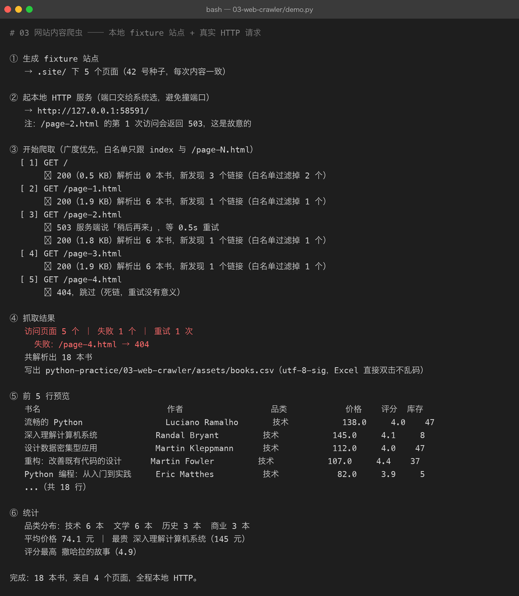

# 03 网站内容爬虫

> **难度** ●●○ 进阶 ｜ **预计** 2–3 天 ｜ **依赖** requests、beautifulsoup4
> 上级目录：[练手项目总览](../README.md)

## 你要做的东西

爬一个多页网站，把页面里的结构化数据抽出来存成 CSV：

```
① 起本地 fixture 站点          →  .site/（5 个页面，18 本书）
② 广度优先爬取                  →  发真实 HTTP 请求，跟站内链接翻页
③ 解析 HTML（CSS 选择器）        →  抽字段：书名 / 作者 / 品类 / 价格 / 评分 / 库存
④ 存 CSV（utf-8-sig）           →  assets/books.csv
```

取到一个页面不难，**难的是把它做成一个不会出事的东西**。这个项目真正练的是下面这些工程细节。

## 一个前提：为什么不爬真网站

练习爬虫有两个理由不要拿真网站当靶子：

1. **不可复现** —— 人家明天改版，你今天写的 `soup.select(".book")` 就全废了。文档里的截图、数字、结论全部都作废。
2. **不礼貌 / 有风险** —— 练习性质的高频请求是给对方服务器添麻烦；而且真站点的反爬策略会让你学到的是「对抗」而不是「工程」。

所以这里用 `make_fixture_site.py` **自己造了一个站点**（固定种子 42，永远长这样），并且**刻意注入了两类故障**：

| 注入的故障 | 在哪 | 用来验证什么 |
|---|---|---|
| `/page-2.html` 的第 1 次请求返回 **503** | `serve.py` | 重试 + 退避逻辑真的生效 |
| 最后一页的「下一页」指向不存在的 **`/page-4.html`** | `make_fixture_site.py` | 404 的处理（**不能重试**，重试一万次也还是 404） |

这两类故障在真实项目里 100% 会遇到，但平时你没法按需复现。**能主动造出 bug，才能证明你防住了它。**

## 先看结果



一屏里把这些事都说清楚了：

- **`[ 3] GET /page-2.html` → `↩ 503 服务端说「稍后再来」，等 0.5s 重试` → `✓ 200`**
  这就是重试逻辑的可视化。注意退避是**翻倍**的（0.5s → 1s → 2s），不是死循环猛打。
- **`[ 5] GET /page-4.html` → `⊘ 404，跳过（死链，重试没有意义）`**
  4xx 不重试，5xx 才重试——这个区分是新手最容易搞错的。
- **`新发现 3 个链接（白名单过滤掉 2 个）`**
  首页有 5 个链接（3 个列表页 + about + 首页自身），白名单只放行 `/page-N.html`，`about.html` 被挡在外面。**爬虫不设边界，迟早爬到别人的地盘上。**
- **`访问页面 5 个 ｜ 失败 1 个 ｜ 重试 1 次`** —— 数字对得上：index + page-1/2/3 成功，page-4 失败。
- **`共解析出 18 本书`** —— 与 fixture 里定义的 18 本完全一致。**这个数字必须对得上**，否则说明有卡片解析失败被静默吞掉了。

抓到的数据（`assets/books.csv`，可直接用 Excel 打开）：

| 书名 | 作者 | 品类 | 价格 | 评分 | 库存 |
|---|---|---|---|---|---|
| 流畅的 Python | Luciano Ramalho | 技术 | 138.0 | 4.0 | 47 |
| 深入理解计算机系统 | Randal Bryant | 技术 | 145.0 | 4.1 | 8 |
| 设计数据密集型应用 | Martin Kleppmann | 技术 | 112.0 | 4.0 | 47 |
| …（共 18 行） | | | | | |

## 你要学到的 Python

| 知识点 | 在本项目里落在哪 |
|---|---|
| `requests.Session` | 复用 TCP 连接 + 统一设置请求头 |
| `timeout=(连接, 读取)` 元组 | 不设超时 = 网络一卡程序永久挂住 |
| 状态码分类处理 | 2xx 成功 / 4xx 别重试 / 5xx 与 429 才重试 |
| 指数退避 | `delay *= 2`，别把对方打死 |
| `BeautifulSoup.select` | CSS 选择器抽字段，比正则稳健得多 |
| `urljoin` | 相对链接 → 绝对链接 |
| BFS + `seen` 去重 | 图遍历，防止爬进死循环 |
| 白名单正则 | `^/(?:page-\d+\.html)?$` 限定可爬范围 |
| 响应编码 | `resp.text` 会猜错编码，中文变乱码 |
| `dataclass` → CSV | `asdict()` 直接得到一个可写 CSV 的 dict |
| `http.server` 线程化 | 用标准库起一个可控的服务来做实验 |
| `unicodedata.east_asian_width` | 终端里中英混排对齐 |

## 怎么跑起来

```bash
cd python-practice/03-web-crawler

# 装依赖
python3 -m venv .venv && source .venv/bin/activate
pip install -r ../requirements.txt

python3 demo.py            # 一条命令跑完：生成站点 → 起服务 → 爬 → 存 CSV
```

> 为什么这个项目用 `demo.py` 而不是 `demo.sh`：起服务要挑动态端口、跑完还要关掉，用 Python 的线程比 shell 里 `&` + `kill` 干净得多。

想自己动手摸（推荐）：

```bash
python3 make_fixture_site.py          # 生成 .site/
python3 serve.py                      # 前台起服务，默认 8123
# 另开一个终端：
curl --noproxy '*' http://127.0.0.1:8123/page-1.html | head -20
python3 crawler.py --base http://127.0.0.1:8123/ --out assets/books.csv
```

> `--noproxy '*'` 是本机踩过的坑：装了代理软件后，`curl` 访问 `127.0.0.1` 也会被代理吃掉。代码里对应的处理是 `session.trust_env = False`。

## 代码结构

```
03-web-crawler/
├── make_fixture_site.py   # 生成 .site/（固定 seed，含 1 个死链注入）
├── serve.py               # 托管 .site/ + 对 /page-2.html 注入 503
├── crawler.py             # 爬虫本体：fetch / parse_books / extract_links / crawl
├── demo.py                # 串起全流程（输出就是截图）
├── .site/                 # 生成的 fixture 站点（gitignore，可随时重建）
├── assets/                # books.csv + 终端截图 + run.txt
└── README.md
```

## 关键代码拆解

**① 只信 `resp.text` 会得到乱码**

实践中第一版就是踩了这个坑：输出里全是 `æµçç Python`。

```python
def decode_body(resp: requests.Response) -> str:
    ctype = resp.headers.get("Content-Type", "").lower()
    if "charset=" in ctype:
        return resp.text
    return resp.content.decode(resp.apparent_encoding or "utf-8", errors="replace")
```

原因：HTTP 响应头如果**没有声明 `charset`**，`requests` 会按 RFC 默认的 **ISO-8859-1** 去解 `resp.text`，中文自然全烂。正确做法是要么看响应头、要么看 HTML 里的 `<meta charset>`、要么让 `charset_normalizer` 探测一遍。

> 顺带一个工程习惯：自己的服务端应该老老实实发 `Content-Type: text/html; charset=utf-8`。这个例子里 `http.server` 没发，正好当了反面教材。

**② 什么该重试，什么不该**

```python
RETRY_STATUS = {429, 500, 502, 503, 504}   # 服务端「暂时」不行 → 值得重试
...
if resp.status_code in RETRY_STATUS and attempt < MAX_RETRY:
    time.sleep(delay); delay *= 2          # 指数退避
    continue
# 404 / 403 落到这里，直接返回 —— 它不会因为你多问几次就出现
```

**③ 白名单比黑名单安全**

```python
ALLOW_RE = re.compile(r"^/(?:page-\d+\.html)?$")
...
if parsed.netloc != host or not ALLOW_RE.match(parsed.path):
    skipped += 1        # 外站 / 白名单外，一律不跟
```

黑名单（「除了 xxx 都能爬」）永远会漏；白名单（「只有 xxx 能爬」）漏不掉。

**④ 解析失败必须吵出来**

```python
except (AttributeError, ValueError) as exc:
    log(f"    ⚠ 跳过一张卡片（{type(exc).__name__}: {exc}）")
    continue
```

最危险的不是抛异常，是**安静地跳过**——你拿到 17 本书，却以为站上只有 17 本。所以这里既不崩溃、也不静默，而是打一条 `⚠` 日志，再配合最后的「共 18 本」对账。

## 常见坑

| 坑 | 现象 | 怎么破 |
|---|---|---|
| 不设 `timeout` | 某个请求卡住，程序永远不返回 | `timeout=(3, 10)` |
| `resp.text` 猜错编码 | 中文变 `æµç` | 看 `Content-Type` 或 `apparent_encoding` |
| 跟着代理走 | 访问 `127.0.0.1` 报 ConnectionError | `session.trust_env = False` |
| 用正则解析 HTML | 一个标签属性变化就全崩 | `BeautifulSoup` + CSS 选择器 |
| 不做 URL 去重 | 两个页面互链 → 无限循环 | `seen: set` |
| 请求之间不 sleep | 被限流/封 IP | `time.sleep(delay)`，起步 0.2s |
| 用 `len()` 对齐中文表格 | 列全歪 | `east_asian_width` 算显示宽度 |
| 把 `robots.txt` 当空气 | 违反站点规则 | `urllib.robotparser`（见进阶挑战 4） |

## 验收标准（做完自检）

- [ ] `demo.py` 输出里能看到 `503 → 重试 → 200` 这一整条重试路径
- [ ] 输出里能看到 `/page-4.html → 404`，并且**没有**对它重试
- [ ] `共解析出 18 本书`，与 fixture 定义的 18 本一致（少一本就说明解析漏了）
- [ ] `assets/books.csv` 用 Excel 直接打开中文不乱码
- [ ] 输出里的书名/作者/品类三列在终端里是对齐的（中英混排）

## 进阶挑战

1. **并发爬取** —— 用 `concurrent.futures.ThreadPoolExecutor` 同时爬 5 个页面，对比耗时。注意：并发时**礼貌间隔要按域名整体控制**，不能每线程各睡各的。
2. **断点续爬** —— 记录已爬过的 URL 到 JSON，中断后重跑不重复抓。
3. **翻页通用化** —— 现在靠 `page-\d+.html` 这个正则。改成解析「下一页」按钮的 `rel="next"` 或文本，让它能适配别的站。
4. **加 robots.txt 检查** —— 用 `urllib.robotparser` 在爬之前先问「我能不能爬这个路径」。
5. **存进 SQLite** —— 把 CSV 换成 `sqlite3`，重复运行用 `INSERT OR REPLACE` 幂等更新。
6. **写测试** —— 给 `parse_books()` 写 `pytest`：塞一段固定 HTML，断言解析出 6 本书、字段值正确。这是最实用的测试类型（不依赖网络）。
