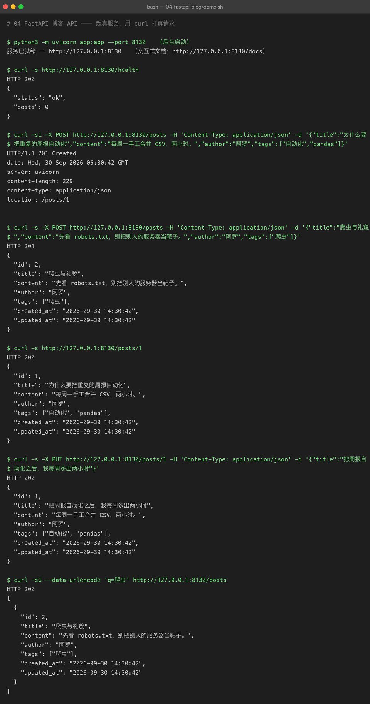
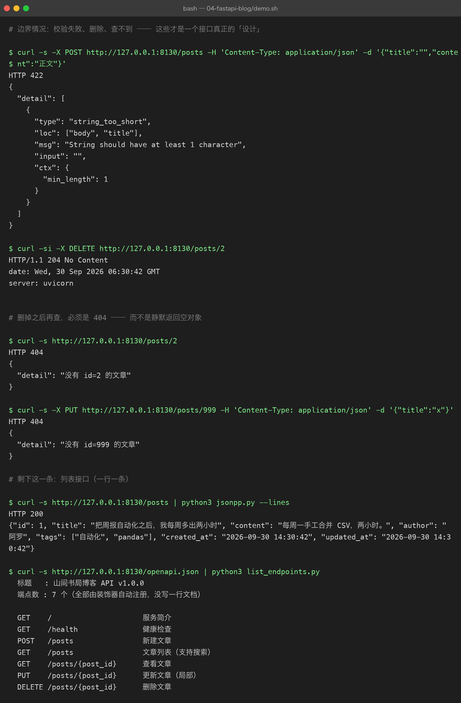
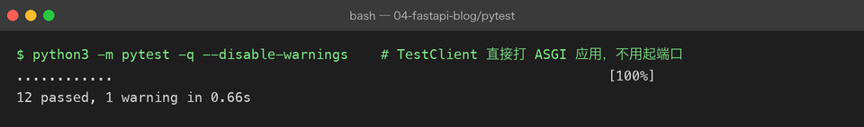

# 04 FastAPI 博客 API

> **难度** ●●○ 进阶 ｜ **预计** 1 周 ｜ **依赖** fastapi、uvicorn、pytest
> 上级目录：[练手项目总览](../README.md)

## 你要做的东西

一个 REST 风格的博客 API：文章的**增删改查 + 搜索 + 参数校验 + 自动文档 + 单元测试**。

对写 Java 的人来说这个项目最舒服——**它和你熟悉的那套东西几乎一一对应**，只是代码量少一个数量级：

| Spring Boot | FastAPI（本项目） |
|---|---|
| `@RestController` | `app = FastAPI(...)` |
| `@GetMapping("/posts/{id}")` | `@app.get("/posts/{post_id}")` |
| `@PathVariable Long id` | `def read(post_id: int)` ← **类型即校验** |
| `@RequestBody @Valid PostDTO` | `def create(payload: PostCreate)` |
| `@ResponseStatus(HttpStatus.CREATED)` | `status_code=201` |
| `throw new ResponseStatusException(404)` | `raise HTTPException(404, ...)` |
| `@Autowired PostRepository` | `store: PostStore = Depends(get_store)` |
| `@PostConstruct` / `@PreDestroy` | `lifespan` 异步上下文管理器 |
| springdoc + Swagger UI（要加依赖） | `/docs`（**自带**，不用引任何东西） |
| `@SpringBootTest` + MockMvc | `TestClient(app)` |
| JPA / MyBatis | 这里用标准库 `sqlite3`（**故意不上 ORM**） |

## 先看结果

**截图 A：主线流程**（起真服务 → 增 → 查 → 改 → 搜）



几个值得盯住的点：

- **`HTTP/1.1 201 Created` + `location: /posts/1`**
  创建成功不只是返回 201，还要用 `Location` 头告诉客户端「新资源在哪儿」。这是 REST 的约定，很多教程会漏掉。
- **`$ curl -sG --data-urlencode 'q=爬虫' ...`**
  第一次写这个 demo 时，我直接写 `curl ".../posts?q=爬虫"`，uvicorn 回了 `Invalid HTTP request received.`——**URL 里的中文必须 percent-encode**，`-G --data-urlencode` 就是干这个的。
- **`PUT` 只传了 `title`，返回体里 `content` / `author` / `tags` 原封不动**
  这证明后端做的是**局部更新**（`PATCH` 语义），而不是「用默认值把没传的字段覆盖掉」。这是新手最容易写错的地方。

**截图 B：边界情况 + 自动文档**



- **`HTTP 422` + 结构化的 `detail`**
  空标题不是 500，也不是 400，而是 **422 Unprocessable Content**，并且告诉你是哪个字段（`loc: ["body","title"]`）因为什么原因（`string_too_short` / `min_length: 1`）失败。**你没写一行校验代码**——这就是 pydantic + 类型注解的回报。
- **`HTTP/1.1 204 No Content`**：删除成功不返回 body（也不该返回）。
- **删掉之后再查 → `HTTP 404` + `{"detail": "没有 id=2 的文章"}`**
  注意这个 404 是**你自己 `raise`** 的。如果不写这段判断，接口会对不存在的 id 返回 `200 null`——这是最典型的 REST 设计错误。
- **最后一段：`openapi.json` 里列出 7 个端点，标题、summary 全在**
  这些不是手写的文档，是装饰器自动注册的。所以 `/docs` 页面永远和代码同步——**不会过期**。

**测试**（`pytest -q`，12 个用例）



`TestClient` 直接打 ASGI 应用，**不需要真的监听端口**，所以 12 个用例 0.66 秒跑完。

## 你要学到的 Python

| 知识点 | 在本项目里落在哪 |
|---|---|
| 类型注解 + pydantic 校验 | `PostCreate` / `PostUpdate` 的 `Field(...)` 约束 |
| 装饰器路由 | `@app.get` / `@app.post` / `@app.put` / `@app.delete` |
| 依赖注入 | `Depends(get_store)`，对应 Spring 的 `@Autowired` |
| `lifespan` 生命周期 | 启动时建连接、关闭时释放 |
| HTTP 状态码语义 | 201 + Location / 204 / 404 / 422 |
| `HTTPException` | 把业务判断映射成协议层错误 |
| 参数校验（query） | `Query(default=20, ge=1, le=100)` |
| `sqlite3` 参数化查询 | `execute(sql, (a, b))`，**不拼字符串** |
| 上下文管理器 | `with TestClient(app) as c` 触发 lifespan |
| pytest 参数化 | `@pytest.mark.parametrize` 一次测 4 种非法输入 |
| `include_router` 之外的自动文档 | `/openapi.json` 是真数据源，不是渲染图 |

## 怎么跑起来

```bash
cd python-practice/04-fastapi-blog

# 装依赖
python3 -m venv .venv && source .venv/bin/activate
pip install -r ../requirements.txt

# 起服务（--reload 会改代码自动重启，开发时很香）
python3 -m uvicorn app:app --reload --port 8130
# 浏览器打开 http://127.0.0.1:8130/docs ← 可以直接在页面上点按钮发请求

# 跑测试
python3 -m pytest -q

# 跑演示（会自己起服务、打一轮请求、最后关掉）
bash demo.sh
```

> 本机如果用 `curl` 访问 `127.0.0.1` 遇到代理问题，加 `--noproxy '*'`。演示脚本里已经带了。

## 代码结构

```
04-fastapi-blog/
├── app.py            # 路由 + pydantic 模型 + 依赖注入（≈ Controller + DTO）
├── store.py          # SQLite 数据访问（≈ Repository），所有 SQL 只在这里出现
├── test_api.py       # 12 个 pytest 用例
├── jsonpp.py         # 把 curl 返回的 JSON 美化打印（不转义中文）
├── list_endpoints.py # 从 openapi.json 里读端点清单
├── demo.sh           # 起服务 + curl 打一轮 + 关服务（输出就是截图）
└── assets/           # 截图 + run.txt + tests.txt（原始输出都入库）
```

## 关键代码拆解

**① 校验是「声明」出来的，不是「if 出来」的**

```python
class PostCreate(BaseModel):
    title: str = Field(min_length=1, max_length=120, description="标题，1~120 字")
    content: str = Field(min_length=1, description="正文，不能为空")
    tags: list[str] = Field(default_factory=list, max_length=TAGS_MAX)
```

写下这些约束之后，FastAPI 自动帮你：请求体不是合法 JSON → 422；`title` 是空串 → 422；`tags` 有 6 个 → 422。**而且 `/docs` 页面上的参数说明也是从这些 Field 生成的。**

对比一下手写 Java 的样子：`@NotBlank @Size(min = 1, max = 120) private String title;`——思路完全一样，区别只在 FastAPI 把「校验」和「文档」都绑在同一处声明上。

**② 404 是你自己抛的**

```python
post = store.get(post_id)
if post is None:
    raise HTTPException(status_code=404, detail=f"没有 id={post_id} 的文章")
```

**不写这个判断，接口就会返回 `200 null`。** 这不是「能用」，这是错的——客户端无法区分「这个 id 不存在」和「存在但是空的」。

**③ SQL 永远用占位符**

```python
self._conn.execute(
    "INSERT INTO posts (title, content, author, tags, created_at, updated_at)"
    " VALUES (?, ?, ?, ?, ?, ?)",
    (title, content, author, json.dumps(tags, ensure_ascii=False), now, now),
)
```

`?` 占位符 + 参数元组。**绝不要**写成：

```python
f"INSERT INTO posts (title) VALUES ('{title}')"   # ← 注入漏洞，别这么写
```

后者只要有人把标题写成 `'); DROP TABLE posts; --`，你的表就没了。

**④ 局部更新要显式判断「传了没有」**

```python
fields: dict[str, object] = {}
if title is not None:
    fields["title"] = title
...
if fields:
    assignments = ", ".join(f"{k} = ?" for k in fields)
    self._conn.execute(f"UPDATE posts SET {assignments} WHERE id = ?", (*fields.values(), post_id))
```

这里 `f"{k} = ?"` 里拼的是**列名**，而且列名来自代码里写死的白名单（不来自用户输入），所以安全。**拼列名和拼值是两回事**——值必须走参数。

**⑤ 测试用例之间必须互不干扰**

```python
@pytest.fixture()
def client():
    with TestClient(app) as c:
        c.app.state.store.clear()   # 每个用例从干净的表开始
        yield c
```

不写 `clear()` 的话，`test_create_returns_201_and_location` 里断言的 `id == 1` 会在别人先跑过之后变成 `id == 2`——这种「单独跑能过、一起跑就挂」的测试最恶心。

## 常见坑

| 坑 | 现象 | 怎么破 |
|---|---|---|
| 忘了返回 404 | 不存在的 id 返回 `200 null` | `raise HTTPException(404, ...)` |
| SQL 字符串拼接 | 注入漏洞 | `?` 占位 + 参数元组 |
| `sqlite3` 跨线程 | 报 `SQLite objects created in a thread...` | `check_same_thread=False`（练习级够用） |
| URL 带中文 | uvicorn 回 `Invalid HTTP request received.` | `curl -G --data-urlencode 'q=中文'` |
| 测试互相污染 | 单独跑过、一起跑挂 | autouse fixture 里清表 |
| 在 import 时才读环境变量 | 测试改不动 DB 路径 | 必须在 `import app` **之前**设 `BLOG_DB` |
| 用 `json.tool` 看响应 | 中文变 `\uXXXX` | 自己写 3 行 `ensure_ascii=False` |

## 验收标准（做完自检）

- [ ] `curl -si -X POST /posts` 返回 **201**，响应头里有 `location: /posts/N`
- [ ] 空标题提交返回 **422**，且 `detail[0].loc == ["body","title"]`
- [ ] `PUT /posts/{id}` 只传 `title` 时，响应体里的 `content` 不变
- [ ] 删除返回 **204** 且无响应体；删除后再查返回 **404**
- [ ] `GET /posts?limit=0` 返回 **422**（`ge=1` 生效）
- [ ] 浏览器打开 `/docs` 能看到 7 个端点，且可以直接点「Try it out」发请求
- [ ] `pytest -q` 全绿（12 个用例）

## 进阶挑战

1. **加分页响应体** —— 现在分页信息放在 `X-Total-Count` 响应头里。改成返回 `{"total": n, "items": [...]}`，并解释两种设计的取舍。
2. **加用户与鉴权** —— 引入 `Authorization: Bearer <token>`，只有作者本人能改/删自己的文章（练习 `Depends` 链式依赖）。
3. **换成 SQLAlchemy** —— 体会 ORM 帮你省了什么，又藏起了什么（尤其是 N+1 查询）。
4. **加数据库迁移** —— 用简单的 `user_version` 或者 `alembic` 管理表结构变更。
5. **加限流** —— 用内存计数器限制每 IP 每分钟的写请求数，返回 429。
6. **补齐测试** —— 现在没测并发和超长输入。加上 `title` 长度 121 的边界用例、以及 `limit=101` 的 422 用例。
7. **打包成镜像** —— 写 `Dockerfile`（`python:3.13-slim` + `uvicorn`），把 `blog.db` 用 volume 挂出来。
