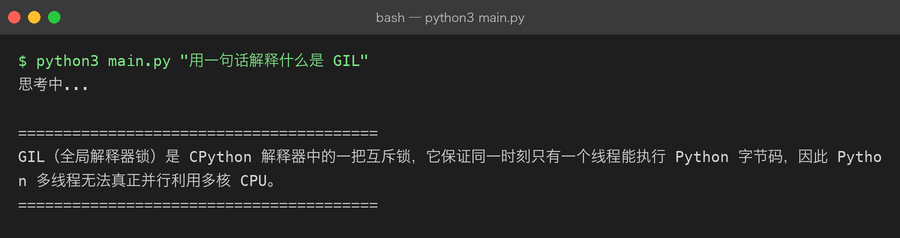

# 05 AI 命令助手

> **难度** ●●● 挑战 ｜ **预计** 1–2 周 ｜ **依赖** `requests`（或官方 SDK）
> 上级目录：[练手项目总览](README.md)

## 这一页是「指路牌」，不是教程

这个项目**本仓库已经完整做过了**，就在 [`projects/01-python-ai-cli/`](../projects/01-python-ai-cli/README.md)。

之所以在这里再列一次：它是前四个练手项目之后**自然的下一个台阶**——前面四个都在跟「确定的东西」打交道（文件、表格、HTML、数据库），而这一个第一次要跟**不确定的模型输出**打交道。这个转折值得单独标出来。

## 要做的东西

一个命令行里的 AI 助手，分三步递进：

| 步骤 | 目标 | 难点 |
|---|---|---|
| ① **单轮问答** | `ai "用一句话解释什么是注意力机制"` → 打印回答 | 发 HTTP 请求、处理 API Key、读懂返回的 JSON 结构 |
| ② **多轮对话** | 记住上下文，能追问 | 消息列表的拼接与截断（token 上限） |
| ③ **流式输出** | 回答一个字一个字蹦出来 | SSE / `stream=True`、逐块解码、`flush=True` |

第 ③ 步是分水岭：做完之后你会突然明白 ChatGPT 网页上那个「打字机效果」到底是怎么实现的——**它不是什么动画，就是边收边打印。**

第 ① 步做完的样子（下图来自本仓库 `projects/01` 的真实运行，不是示意图）：

一行命令进、一段回答出——中间是真实的 HTTP 请求、真实的计费、真实的 1~3 秒等待。这跟前面四个项目最大的差别是：**你无法预知它下一秒会输出什么。**

## 为什么它排在「挑战」难度

不是因为代码难，而是因为**没有标准答案**：

- 模型返回的是一段自由文本，你得决定怎么解析、怎么兜底
- 它可能超时、可能限流、可能因为余额不足直接 400
- 同样的输入，两次输出不一样——**你的测试不能再断言「等于什么」**

前四个项目里，`python3 -m pytest` 说绿就是绿。这里你需要换一套判断标准（见 [`projects/08-fine-tuning/`](../projects/08-fine-tuning/README.md) 里关于评估的思路）。

## 顺着走

- 项目主页：[`projects/01-python-ai-cli/README.md`](../projects/01-python-ai-cli/README.md)
- 关键里程碑：
  - [09-http-api.md](../projects/01-python-ai-cli/milestones/09-http-api.md) —— 先用标准库把 HTTP 请求打通（不急着上 SDK）
  - [10-real-llm-api.md](../projects/01-python-ai-cli/milestones/10-real-llm-api.md) —— 接真实大模型 API
- 代码在 [`projects/01-python-ai-cli/src/`](../projects/01-python-ai-cli/src/)

## 如果你想自己从零再写一遍（推荐）

参照实现摆在旁边最容易变成「抄」。建议的练法：

1. **先不看 `src/`**，只照 09/10 两个里程碑的要求，自己写一个能跑通单轮问答的版本（30 行就够）。
2. 跑通了再打开 `src/` 对照——重点看差异：别人的错误处理、超时设置、Key 的读取方式和你有什么不同。
3. **加一个 `projects/01` 里没有的功能**，比如：
   - `--json` 输出模式，方便被别的脚本消费
   - 本地缓存同一个问题（同一天问同样的问题不重复花钱）
   - `--system` 参数自定义系统提示词
   - 把对话历史存进 SQLite，支持 `ai --continue` 继续上次的话题

第 3 步才是真正把你和「跟着教程走过一遍」区分开的地方。

> **凭据提醒**：Key 只走环境变量，不要写进代码或提交到 Git。本仓库的 `projects/01-python-ai-cli/src/.env.example` 是模板。
