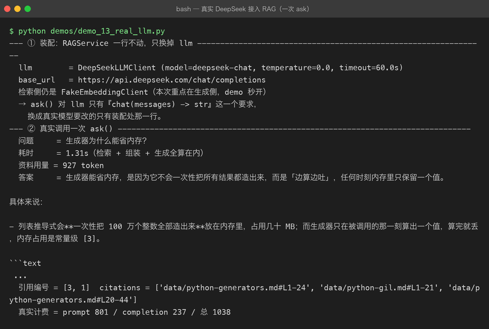

# 06 RAG 知识库问答

> **难度** ●●● 挑战 ｜ **预计** 2–3 周 ｜ **依赖** 向量库 + embedding + LLM
> 上级目录：[练手项目总览](README.md)

## 这一页是「指路牌」，不是教程

这个项目**本仓库也已经完整做过了**，就在 [`projects/04-rag/`](../projects/04-rag/README.md)（含 17 个里程碑）。

它在练手序列里是**终点站**：前五个项目各自练一块能力，这一个把它们全串起来——而且串起来的这条链子，就是当下 AI 应用最核心的架构。

## 要做的东西

「文档问答」：扔进去一堆文档，然后能用自然语言提问，答案基于文档内容且**能给出出处**。

拆开看是五个环节，每个都能单独出问题：

```
① 文档切块  chunking      →  切多大？按段落还是按固定长度？重叠多少？
② 向量化    embedding     →  一次调多少条？超长文本怎么办？维度多少？
③ 存入向量库 vector store →  选哪个库？怎么建索引？
④ 检索      retrieval     →  top-k 取几？要不要 rerank？相似度用什么度量？
⑤ 生成      generation    →  怎么拼上下文？怎么让它「只依据文档回答」？
```

跑通之后是这个样子（下图来自本仓库 `projects/04` 的真实运行：真实 embedding + 真实 DeepSeek 生成 + 引用编号 + token 计费）：



注意图里那一行 `引用编号 = [3, 1]  citations = ['data/python-generators.md#L1-24', ...]`——**答案必须能指回原文的具体位置**。做不到这一点，就只是「套了个壳的聊天机器人」。

## 为什么它是最难的一个

因为它有**三层叠加的困难**：

1. **每一环都可能出错**：检索没捞到相关内容，生成再强也白搭；切块切碎了，检索必然捞不准。
2. **反馈信号很弱**：模型给出了一个流畅、自信、**完全错误**的答案时，你从输出上根本看不出来。
3. **评分很贵**：判断「答得对不对」要调模型打分，比跑单测贵几个数量级。

所以这个项目真正的产出不是「一个能聊天的界面」，而是**一套能证明它没瞎编的评测**——这正是 `projects/04-rag` 里花了最多篇幅的地方。

## 顺着走

- 项目主页：[`projects/04-rag/README.md`](../projects/04-rag/README.md)
- 值得按顺序读的里程碑：
  - [02-chunking.md](../projects/04-rag/milestones/02-chunking.md) —— 切块策略
  - [03-embedding.md](../projects/04-rag/milestones/03-embedding.md) —— 向量化
  - [05-retrieval.md](../projects/04-rag/milestones/05-retrieval.md) / [07-rerank.md](../projects/04-rag/milestones/07-rerank.md) —— 检索与重排
  - [09-rag-pipeline.md](../projects/04-rag/milestones/09-rag-pipeline.md) —— 全链路串起来
  - [10-rag-evaluation.md](../projects/04-rag/milestones/10-rag-evaluation.md) —— **怎么证明它没瞎编**

## 冷启动路线（如果你从零开始）

不建议一上来就搭完整系统。以这个顺序连滚带爬：

| 阶段 | 目标 | 验收 |
|---|---|---|
| 1 | 硬编码 3 个字符串，调用 embedding API，打印出向量 | 看懂 `[0.013, -0.021, ...]` 是什么 |
| 2 | 手算两个向量的余弦相似度（不用向量库） | 相似的句子分数明显更高 |
| 3 | 塞进向量库，`query` 出 top-3 | 能捞到相关片段 |
| 4 | 把 top-3 拼进 prompt，调 LLM 让它「只依据材料回答」 | 问一个材料里没有的问题，它会说不知道 |
| 5 | 加 rerank | 第一名的质量肉眼可见变好 |
| 6 | 做一套评测集（20 个问题 + 标准答案） | **能算出命中率和正确率** |

到第 6 步你才算真的会了。前 5 步只是「跑通」。

> 想搞清「为什么模型会一本正经地胡说」，可以看基础理论层的
> [第 08 章 对齐与 RLHF](../llm-fundamentals/08-alignment-rlhf.md) 与
> [第 07 章 解码与推理](../llm-fundamentals/07-decoding-and-inference.md)。
> RAG 只是缓解手段，不是解药——这句话值得在做完评测之后回头再看一遍。
