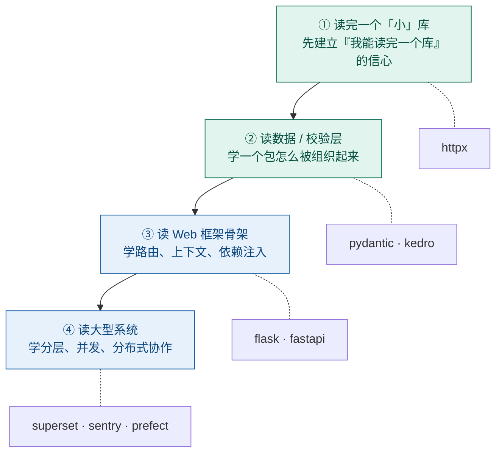
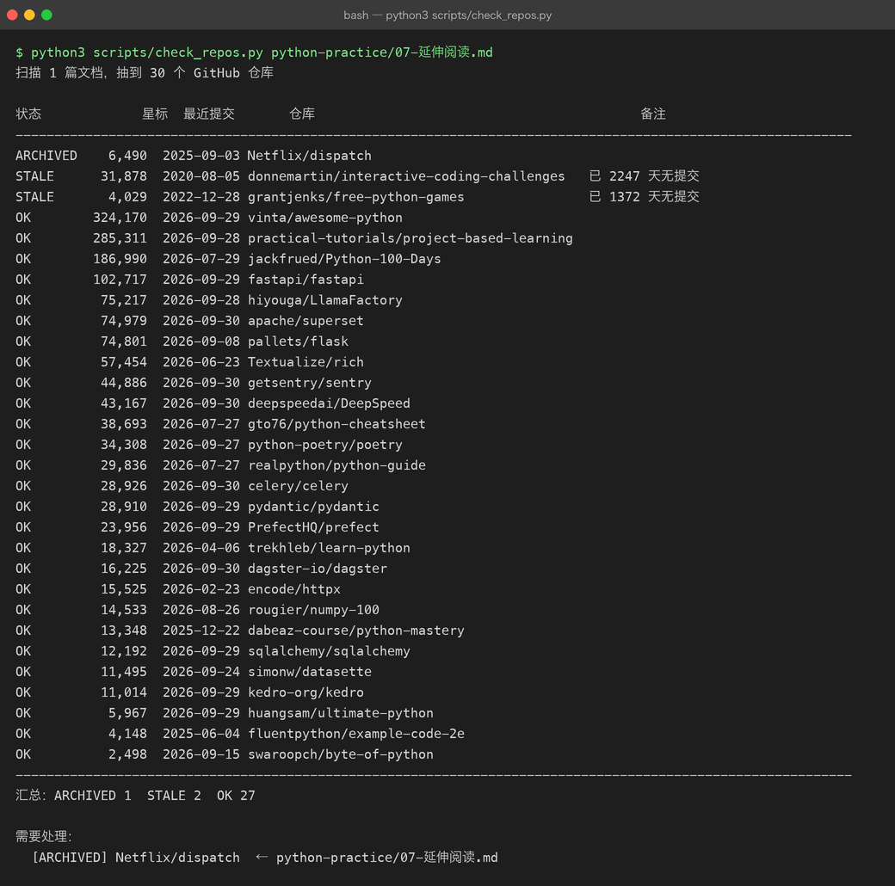

# 07 · 延伸阅读：从「会写 Python」到「读得懂生产代码」

> **这一篇不是教程，是一张书单加一套读法。**
> 读完它不会让你多会一个语法，但能帮你省下几个月——因为绝大多数人卡住的地方，
> 不是「不知道学什么」，而是「一直在学入门，从不读成品」。
>
> 文中的星标数与最近提交日期，全部由 [`scripts/check_repos.py`](../scripts/check_repos.py)
> 在写作当天现场抓取（见 [7.6](#76-这份清单怎么维护) 的真实运行截图），没有一个是凭印象填的。

---

## 7.1 先纠正一个误区

你在搜索引擎里搜「Python 学习项目」，会得到几百个清单。它们大多在回答同一个问题：
**「我该怎么入门 Python」**。

但这个问题对你已经不成立了。你是 Java 后端，`for` / `if` / `class` / 异常 / 集合这些概念早就有了，
Python 只是换了一套拼写方式。语言本身的语法密度并不高，两三周就能写顺。

真正拉开差距的是另外两件事：

| 差距来源 | 具体表现 | 怎么补 |
|---|---|---|
| **惯用法（idiomatic）** | 你在写「用 Python 语法的 Java」——满屏 `for i in range(len(x))`、到处 `getXxx()`、拿 `class` 当唯一抽象手段 | 读 [7.2](#72-补系统性只挑-12-个)，重点学推导式 / 生成器 / 协议 / 上下文管理器 |
| **工程化** | 写得出脚本，但不知道一个「包」怎么分层、怎么做可选依赖、怎么设计可测的接口 | 读 [7.3](#73-读生产代码四阶梯)，从小的生产库开始读源码 |

所以下面两块：**7.2 补系统性（挑 1–2 个就够）**，**7.3 读生产代码（重点）**。

---

## 7.2 补系统性：只挑 1–2 个

> 别把这张表当待办清单。**从里面挑 1 个做完，胜过 5 个都收藏。**

| 仓库 | 星标 | 最近提交 | 一句话 | 适合谁 |
|---|---|---|---|---|
| **[`dabeaz-course/python-mastery`](https://github.com/dabeaz-course/python-mastery)** | 13.3k | 2025-12-22 | David Beazley 的进阶课：生成器、装饰器、描述符、迭代器协议、元编程、协程 | **最推荐**。有 Java 背景的人读它收益最大——它回答的正是「Python 为什么没有 Java 那套东西」 |
| [`jackfrued/Python-100-Days`](https://github.com/jackfrued/Python-100-Days) | 187.0k | 2026-07-29 | 中文，100 天从语法到 Web / 数据分析 / AI | 想要一份**中文路线图**时看它。缺点是偏教学，代码不是生产级——**当目录用，别当范本抄** |
| [`huangsam/ultimate-python`](https://github.com/huangsam/ultimate-python) | 6.0k | 2026-09-29 | 单文件，从语法到工程实践逐条覆盖 | 拿它当**自查清单**：逐条问自己「这条我会不会」。有不会的就地补 |
| [`rougier/numpy-100`](https://github.com/rougier/numpy-100) | 14.5k | 2026-08-26 | 100 道 numpy 练习（带答案） | 你只要碰数据就必须刷。向量化思维是 Python 数据方向的分水岭 |
| [`fluentpython/example-code-2e`](https://github.com/fluentpython/example-code-2e) | 4.1k | 2025-06-04 | 《Fluent Python》第 2 版配套代码 | 工具书性质。**按需查，不要通读** |
| [`trekhleb/learn-python`](https://github.com/trekhleb/learn-python) | 18.3k | 2026-04-06 | 按主题切分的可运行代码示例集 | 遇到不确定的语法点时当速查 |
| [`swaroopch/byte-of-python`](https://github.com/swaroopch/byte-of-python) | 2.5k | 2026-09-15 | 面向完全零编程基础的书 | 你是 Java 背景，**可以跳过** |
| [`gto76/python-cheatsheet`](https://github.com/gto76/python-cheatsheet) | 38.7k | 2026-07-27 | 一页纸速查表 | 贴在手边，别当教材读 |
| [`vinta/awesome-python`](https://github.com/vinta/awesome-python) | 324.2k | 2026-09-29 | 「我想做 X，该用哪个库」的答案 | **索引不是教材**。解决问题时来查 |
| [`practical-tutorials/project-based-learning`](https://github.com/practical-tutorials/project-based-learning) | 285.3k | 2026-09-28 | 按项目组织的教程索引 | 同上，索引性质。本仓库 [`python-practice/`](README.md) 的前四个项目就是这类东西的「已跑通版」 |

**两个已经停滞的**（脚本实测判定为 `STALE`，见 [7.5](#75-避坑清单都是脚本当场抓出来的)）：

| 仓库 | 星标 | 最近提交 | 情况 |
|---|---|---|---|
| [`donnemartin/interactive-coding-challenges`](https://github.com/donnemartin/interactive-coding-challenges) | 31.9k | 2020-08-05 | 已 **2247 天**无提交（六年多），题目仍可用但无人维护 |
| [`grantjenks/free-python-games`](https://github.com/grantjenks/free-python-games) | 4.0k | 2022-12-28 | 已 **1372 天**无提交（近四年）。学语法可以，别指望更新 |

另有一个**仍在维护、但内容偏旧**的：[`realpython/python-guide`](https://github.com/realpython/python-guide)（29.8k，2026-07-27 仍有提交）——质量高，但部分章节停留在 Python 3.6 时代，按需查即可，别当主线。

---

## 7.3 读生产代码：四阶梯

**顺序不能乱。** 直接打开 Django 或 Superset，你看到的只会是一屏 `import` 和元类，然后关掉——
这跟「用一本字典学英语」是同一个错误。



### 阶梯 1–3：先读这些

| 仓库 | 星标 | 最近提交 | 读它学什么 | 你的 Java 对照 |
|---|---|---|---|---|
| [`encode/httpx`](https://github.com/encode/httpx) | 15.5k | 2026-02-23 | **一个完整库的分层**：传输层 / 编解码 / 异常体系 / 超时 / 重试插件。规模小、边界清晰，是「能读完」的第一个目标 | OkHttp / HttpClient |
| [`pydantic/pydantic`](https://github.com/pydantic/pydantic) | 28.9k | 2026-09-29 | **「类型即校验」怎么实现**：元类如何从注解推出 schema、校验失败如何定位到字段。还混了 Rust 扩展，能看到真实场景的 Python + Rust 协作 | Bean Validation / Lombok |
| [`pallets/flask`](https://github.com/pallets/flask) | 74.8k | 2026-09-08 | **框架骨架**：核心只有几千行。路由表怎么建、`request` 上下文与 `g` 怎么做到「不用传参也能拿到」 | Servlet Filter 链 / ThreadLocal |
| [`fastapi/fastapi`](https://github.com/fastapi/fastapi) | 102.7k | 2026-09-29 | **依赖注入与自动文档**：从函数签名反推出请求模型和 OpenAPI schema。你在 [`python-practice/04`](04-fastapi-blog/README.md) 用过它，回头看实现最省力 | Spring `@Autowired` + Swagger |

> **注意仓库地址**：`tiangolo/fastapi` 现在会 302 跳到 `fastapi/fastapi`（换过 org）。
> 旧链接还能打开，但引用时应写新地址。这类「悄悄搬家」是本页 [7.5](#75-避坑清单都是脚本当场抓出来的) 常客。

### 阶梯 4：读「系统」而不是「库」

| 仓库 | 星标 | 最近提交 | 读它学什么 |
|---|---|---|---|
| [`getsentry/sentry`](https://github.com/getsentry/sentry) | 44.9k | 2026-09-30 | Django 写的真实产品：多租户隔离、限流、事件处理流水线。看一个「真的有人在用」的系统怎么分层 |
| [`apache/superset`](https://github.com/apache/superset) | 75.0k | 2026-09-30 | 大型 Flask 应用怎么分模块；前后端如何协作；插件化图表体系 |
| [`PrefectHQ/prefect`](https://github.com/PrefectHQ/prefect) | 24.0k | 2026-09-29 | 编排引擎：状态机、任务依赖、重试与超时语义。**对照你熟悉的 Quartz / Spring Batch 读** |
| [`celery/celery`](https://github.com/celery/celery) | 28.9k | 2026-09-30 | 分布式任务队列：broker / worker / result backend 三段式设计 |
| [`python-poetry/poetry`](https://github.com/python-poetry/poetry) | 34.3k | 2026-09-27 | 依赖解析算法与锁文件。**对照 Maven 的依赖收敛问题** |
| [`simonw/datasette`](https://github.com/simonw/datasette) | 11.5k | 2026-09-24 | 一个人的项目能有多干净。**可读性最佳样本**，适合学「怎么把代码写成别人愿意读的样子」 |
| [`kedro-org/kedro`](https://github.com/kedro-org/kedro) | 11.0k | 2026-09-29 | 一个包如何用强 CI、Click 插件机制、可选依赖撑起可扩展性 |
| [`Textualize/rich`](https://github.com/Textualize/rich) | 57.5k | 2026-06-23 | 终端渲染，以及 `__rich__` 这种「协议式接口」——Python 版的 `toString()` 但更灵活 |
| [`sqlalchemy/sqlalchemy`](https://github.com/sqlalchemy/sqlalchemy) | 12.2k | 2026-09-29 | ORM 内核：表达式树怎么编译成 SQL。**对照 JPA / Hibernate** |
| [`dagster-io/dagster`](https://github.com/dagster-io/dagster) | 16.2k | 2026-09-30 | 数据资产编排的另一种设计取向（对比 Prefect 看差异） |

---

## 7.4 怎么读（这节最重要）

前面都是「读什么」，这一节是「怎么读」。**方法不对，读了等于没读。**

1. **用你已经在用的库当教材。**
   不要挑陌生的。你的 [`python-practice/`](README.md) 里 `pytest`、`requests`、`FastAPI`、`pandas` 都在跑——
   就读它们，你有真实的疑问可以驱动阅读。**带着问题读源码，效率是漫无目的读的十倍。**

2. **顺序固定：README 的 "Why" → `tests/` → 实现。**
   - README 先看「为什么会有这个东西、它跟替代方案的区别」；
   - 然后读 **测试文件**——测试是最好的使用文档，它把「怎么用」和「边界在哪」都写清楚了；
   - 最后才挑一个你踩过坑的功能，顺着实现读下去。

3. **一次只跟一条链路。**
   比如「一个请求在 `httpx` 里从 `get()` 到字节流经历了什么」。
   不要试图同时搞懂整个库，那必然会失败。

4. **别追求读完。**
   读完 Flask 核心算毕业；读完 Django 不现实，也不需要。
   读源码的目标是**建立判断力**——知道设计问题大概会落在哪一层，而不是背下实现。

5. **读到能改它，才算读懂。**
   和 [`00-how-to-practice.md`](00-how-to-practice.md) 里说的是一回事：
   最小的验证动作是给这个库提一个 issue、修一个 typo、加一个测试。
   你有 Java 工程经验，这一步比语法学习更能证明你的工程能力。

---

## 7.5 避坑清单（都是脚本当场抓出来的）

网上流传的清单普遍有三类腐烂，**下面每一条都是 `check_repos.py` 实测结果，不是转述**：

**① 已归档**——仓库还开着，但已变成只读，不再接受任何提交。

| 仓库 | 星标 | 状态 |
|---|---|---|
| [`Netflix/dispatch`](https://github.com/Netflix/dispatch) | 6.5k | **2025-09-03 已归档**（read-only）。它是事件管理平台，多篇中文清单仍在推荐 |

**② 已停滞**（脚本判为 `STALE`：超过 540 天无提交）——还在，但没人维护了。学语法可以，别指望它跟上新版本：

| 仓库 | 星标 | 最近提交 | 已停止更新 |
|---|---|---|---|
| [`donnemartin/interactive-coding-challenges`](https://github.com/donnemartin/interactive-coding-challenges) | 31.9k | 2020-08-05 | 六年多（2247 天） |
| [`grantjenks/free-python-games`](https://github.com/grantjenks/free-python-games) | 4.0k | 2022-12-28 | 近四年（1372 天） |

**③ 已搬家**——旧地址 302 跳转，引用旧地址会让人以为你过时了：

| 旧地址 | 实际地址 |
|---|---|
| `tiangolo/fastapi` | [`fastapi/fastapi`](https://github.com/fastapi/fastapi) |
| `hiyouga/LLaMA-Factory` | [`hiyouga/LlamaFactory`](https://github.com/hiyouga/LlamaFactory) |
| `microsoft/DeepSpeed` | [`deepspeedai/DeepSpeed`](https://github.com/deepspeedai/DeepSpeed) |

**④ 星标 ≠ 学习价值。**
`vinta/awesome-python`（324k）和 `practical-tutorials/project-based-learning`（285k）
是本页星标最高的两个，但它们是**索引**。索引用来查，不用来学——
真正适合当教材的 `dabeaz-course/python-mastery` 只有 13.3k 星。

---

## 7.6 这份清单怎么维护

推荐清单是最容易腐烂的东西：**库会归档、会搬家、会进维护模式，而你写下的那行链接永远不会自己变。**

所以本仓库加了一个脚本 [`scripts/check_repos.py`](../scripts/check_repos.py)，
把这件事变成一次可复现的运行。它从文档里抽出所有 GitHub 链接，逐个探测：

| 探测项 | 手段 | 为什么要看 |
|---|---|---|
| 是否可访问 | 仓库首页 HTTP 状态 | 排除 404 |
| 星标数 | 首页 `repo-stars-counter-star` | 给出「有多少人在用」的量级 |
| 是否归档 | 首页内嵌 JSON 的 `"isArchived":true` | 归档 = 官方宣布不再维护 |
| 是否搬家 | 首页是否 302 到别的地址 | 避免引用过时地址 |
| 最近提交 | `commits.atom`（Atom feed，公开不限流） | 判断是否名存实亡 |
| 是否声明维护模式 | 首页内嵌 README 里的 "maintenance mode" | 有些库不归档但明确不接新功能了 |
| **取不到 vs 真的没有** | 网络失败（`NET`）与 404（`DEAD`）分开报 | 连扫几十个仓库会被限流，**不能把「被拒连」写成「仓库已死」**——那是最容易发生的假消息 |

**它不需要 GitHub API token**——匿名 API 每小时只有 60 次，扫不完一个仓库。
所以它改抓公开页面与 Atom feed，你可以随时自己跑：

```bash
python3 scripts/check_repos.py                        # 扫全仓库
python3 scripts/check_repos.py llm-fundamentals       # 只扫某个目录
python3 scripts/check_repos.py --json repos.json      # 导出机器可读结果
python3 scripts/check_repos.py --strict               # 有死链/归档/搬家则退出码 1
python3 scripts/check_repos.py --delay 1.5            # 被 GitHub 限流时放慢（症状是整站 502）
```

真实运行结果：



---

## 7.7 自查问题

读完这一篇，你应该能回答：

1. 为什么「Python 学习项目清单」对 Java 背景的人价值有限？你该补的是哪两种能力？
2. 读源码为什么建议从 `httpx` 这种小库开始，而不是从 Django 开始？
3. 判断一个开源库「还能不能读」，除了看星标还应该看哪几个信号？
4. 你的 `python-practice/` 里已经装了哪些库？挑一个，找出它的 `tests/` 目录，用 5 分钟回答「它的核心接口有几个」。

> 下一站：Python 之后要往大模型走，教程 / 微调 / Agent 开发方向的资源清单见
> [`llm-fundamentals/12-tutorials-and-agent.md`](../llm-fundamentals/12-tutorials-and-agent.md)。

---

[← 返回练手项目总览](README.md) · [返回仓库首页](../README.md)
