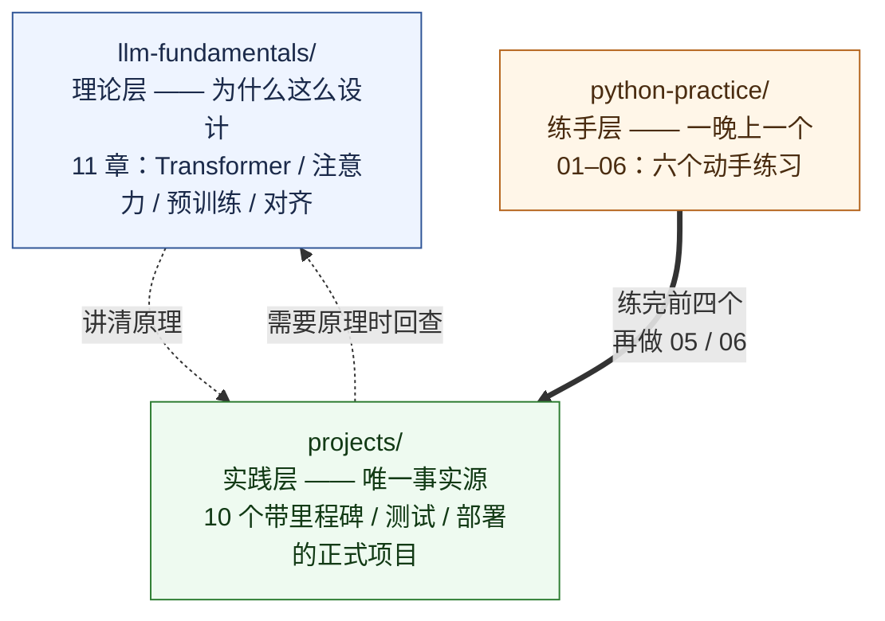

# Python 练手项目

从零开始的六个 Python 动手练习，**按难度递进**，每个都能在一个周末到几周内独立做完。

> **定位**：这是仓库的**练手层**——小而完整的单文件级练习，目标是「一晚上能跑通一个」。
> `projects/` 是**实践层**：10 个有里程碑、有测试、有部署的正式项目。
> `llm-fundamentals/` 是**理论层**：讲原理。
> 三层的关系见下方「本仓库的三层结构」。

<table>
<tr><td width="50%">

**01 命令行待办清单** · 入门 · 1 个周末

增删改查 + 文件保存。练变量、列表、字典、文件读写。

</td><td width="50%">

**02 Excel 报表自动化** · 进阶 · 2–3 天

用 pandas 批量合并、统计、生成图表，替换重复劳动。

</td></tr>
<tr><td>

**03 网站内容爬虫** · 进阶 · 2–3 天

requests + 解析 HTML，采集数据存 CSV。练 HTTP 与异常处理。

</td><td>

**04 FastAPI 博客 API** · 进阶 · 1 周

REST 接口 + 数据校验 + 自动文档。Java 开发者会倍感亲切。

</td></tr>
<tr><td>

**05 AI 命令助手** · 挑战 · 1–2 周

调用 LLM API 实现问答 → 多轮对话 → 流式输出。

</td><td>

**06 RAG 知识库问答** · 挑战 · 2–3 周

文档切块 → 向量化 → 检索 → 生成。AI 应用最核心的架构。

</td></tr>
</table>

## 目录

| # | 项目 | 难度 | 预计 | 代码 | 一句话 |
|---|---|---|---|---|---|
| 01 | [命令行待办清单](01-todo-cli/README.md) | ●○○ 入门 | 1 个周末 | ✅ 本目录可跑 | 用标准库把「增删改查 + 落盘」走一遍 |
| 02 | [Excel 报表自动化](02-excel-automation/README.md) | ●●○ 进阶 | 2–3 天 | ✅ 本目录可跑 | pandas 合并/清洗/透视/写报表/画图 |
| 03 | [网站内容爬虫](03-web-crawler/README.md) | ●●○ 进阶 | 2–3 天 | ✅ 本目录可跑 | requests + BeautifulSoup + 重试 + 存 CSV |
| 04 | [FastAPI 博客 API](04-fastapi-blog/README.md) | ●●○ 进阶 | 1 周 | ✅ 本目录可跑 | REST CRUD + 校验 + 自动文档 + 测试 |
| 05 | [AI 命令助手](05-ai-command-assistant.md) | ●●● 挑战 | 1–2 周 | → [`projects/01`](../projects/01-python-ai-cli/README.md) | 接 LLM API：问答 → 多轮 → 流式 |
| 06 | [RAG 知识库问答](06-rag-qa.md) | ●●● 挑战 | 2–3 周 | → [`projects/04`](../projects/04-rag/README.md) | 切块 → 向量化 → 检索 → 生成 → 评测 |

05 和 06 的完整实现在 `projects/` 层已经存在，本目录**不重复实现**，只给指路牌和冷启动路线——避免出现两套平行知识。

## 先看看长什么样

四个能跑的项目，每个都配**真实运行截图**（不是示意图、不是占位图，输出可复现）：

**01 命令行待办清单** —— 增删改查 + 落盘 + 人话报错


**03 网站内容爬虫** —— 真实 HTTP 请求、503 重试、404 跳过、白名单过滤


**04 FastAPI 博客 API** —— 起真服务、curl 打真请求、看真状态码


02 的两张图表和报表截图见 [该项目 README](02-excel-automation/README.md)。

## 先读这个

**[练手方法：怎么练才不是「抄代码」](00-how-to-practice.md)**

看完能省你几十个小时。里面的核心结论就三条：

1. 看懂了 ≠ 写得出来。**关掉参考实现重写一遍**，才算练过。
2. 卡住时先读完整条报错、写最小复现，**别第一时间去问 AI**。
3. 每个项目**至少写一个测试**——它是你唯一能自动验证「我没改坏」的手段。

## 快速开始

```bash
cd python-practice

# 01 不需要任何依赖，现在就能跑
python3 01-todo-cli/todo.py add "读完练手方法那篇"

# 02/03/04 需要第三方库，建一个虚拟环境
python3 -m venv .venv && source .venv/bin/activate
pip install -r requirements.txt

cd 02-excel-automation && bash demo.sh     # → assets/sales-report.xlsx + 两张图
cd ../03-web-crawler   && python3 demo.py  # → assets/books.csv
cd ../04-fastapi-blog  && bash demo.sh     # → 起服务 + 打一轮 HTTP；另有 pytest
```

每个项目的 README 里都有「怎么跑起来」和「验收标准」两节。**先按验收标准做完，再看进阶挑战。**

## 本仓库的三层结构



一句话记住分工：

- **`python-practice/`** —— 我要**会写** Python
- **`projects/`** —— 我要**做出**一个能交付的东西
- **`llm-fundamentals/`** —— 我要**搞懂**它为什么这样工作

## 每个项目的统一约定

为了保证你跑出来的东西和截图里一致，四个项目都遵循同一套做法：

| 约定 | 说明 |
|---|---|
| **固定随机种子** | `random.Random(42)`，样本数据每次生成都一模一样 |
| **可复现的演示入口** | 每个项目有 `demo.sh` 或 `demo.py`，一条命令跑完全流程 |
| **原始输出入库** | 截图对应的原始文本存在 `assets/run.txt`，可以 diff |
| **截图由真实输出渲染** | 用 `scripts/render_terminal.py` 把 stdout 渲染成终端风格图片，**不是手截的** |
| **不打外网** | 03 用本地 `http.server` 造 fixture 站点，练习不拿别人的服务器当靶子 |
| **不硬编码凭据** | 需要 Key 的地方只读环境变量，仓库里只有 `.env.example` |

## 目录结构

```
python-practice/
├── README.md                    # 本文件
├── 00-how-to-practice.md        # 练手方法（先读这个）
├── requirements.txt             # 02/03/04 的依赖，版本已锚定
├── 01-todo-cli/                 # 入门：纯标准库
├── 02-excel-automation/         # 进阶：pandas + openpyxl + matplotlib
├── 03-web-crawler/              # 进阶：requests + BeautifulSoup
├── 04-fastapi-blog/             # 进阶：FastAPI + SQLite + pytest
├── 05-ai-command-assistant.md   # 挑战：指路 → projects/01
└── 06-rag-qa.md                 # 挑战：指路 → projects/04
```
